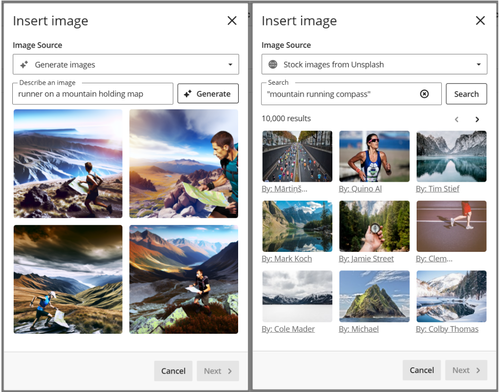
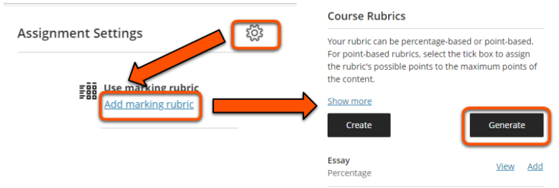

---
tags:
    - Ultra
---

# AI Design Assistant

!!! Summary

    AI Design Assistant (AI-DA) tools can help you generate content and ideas for your Ultra site, such as discussion prompts and quiz questions.

Ultra's AI tools are powered by Microsoft's Azure OpenAI Service, and underpinned by [Anthology's Trustworthy AI approach](https://www.anthology.com/trust-center/trustworthy-ai-approach). They are a core Ultra feature (so are therefore available for use at no additional cost) and have been approved for use in teaching at the University of York.

!!! Success "Use of data"

    Content within the site and descriptions provided are not shared back to the AI training model. In other words, your data does not leave the site and remains secure in our UoY environment.

In addition to the AI content generator tools in this guide, there is also a standalone [AI conversation tool](../ultra/ai-conversation.md) where students can directly interact with an AI persona.

See our [general guide to Artificial Intelligence tools](../other-tools/ai.md) for more details on using AI responsibly and other AI tools available at UoY.

## Getting started

AI-DA tools are available in many items within your course, shown by the 'magic'/stars AI icon. On a larger screen, you may also see **Auto-generate [tool name]**.

We recommend exploring AI-DA tools in your personal Ultra sandpit site rather than a module site to avoid generating clutter make sure that students won't see any content until it's ready. You can then use the [Copy Content](../ultra/copy-content.md) tool to insert any materials that you want to use for teaching into your module site. ([Contact us](mailto:vle-support@york.ac.uk) if you need a sandpit site.)

## Tips for generating appropriate output

!!! ai "Using AI tools effectively"

    AI-generated content is a **starting point** for your own content development rather than a finished product. You must always **carefully check** that output is accurate and appropriate for your intended use and adapt as needed.

AI-DA tools generate content based on the site and/or item title, and any additional context that you provide. Generally, the more specific description and information you can provide, the more likely the content is to be relevant and appropriate to your needs.

Ways you can provide context:

- Enter a **title** for the item before you use the AI-DA tools. 
- Enter a **Description**: key words, general task requirements, module information etc. 
- For most features, you can **Select course items** that contain relevant content, such as Documents or uploaded lecture slides.
 
- For most AI-DA tools, you can adjust the **complexity level** of generated content. Levels most relevant to University of York contexts are:
    - 7: Undergraduate (C/I level) [the default setting]
    - 8: Undergraduate (I/H level)
    - 9: Masters
    - 10: PhD
- For some tools there are additional options such as **Cognitive Level** or **Question Type** to select the format of generated content.
- Not happy with the output? You can further tweak the Description and other settings and generate again, and also edit and adapt content once added to the site.

Further tips on using specific tools effectively are given below.

## AI-DA content generation tools

This section summarises key tool features and considerations for applying them in your teaching at UoY. For more detail and video demonstrations, see [Blackboard Help's guide to AI-DA](https://help.blackboard.com/Learn/Instructor/Ultra/Course_Content/Create_Content/AI_Design_Assistant)

### Task prompts

AI-DA can generate prompts for **Discussions**, **Assignments** and **Journals**. The output is very similar for the three task types.

!!! ai "Using the task prompt generators effectively"

    Task prompts may be most useful for exploring ideas for assessments and project work, as tasks suggested are often more in-depth or time-consuming than appropriate for weekly or formative tasks.

Prompts can be aligned to **cognitive levels** based on Bloom's Taxonomy:

- Apply
- Analyse
- Evaluate
- Create

Steps to generate task prompts:

1. Create a new Discussion, Journal or Assignment, or open an existing one.
2. Click the **magic AI icon** in the top right. On a larger screen you'll also see **Auto generate [item name]**.
3. Define the task:
    - Enter a **Description** and/or **Select course items** to help generate more relevant content.
    - Select the **Desired cognitive level**, or choose *Inspire me!* for a mix of levels.
    - Adapt other settings to your needs.
4. Click **Generate**.
5. Review the generated content and select which prompt to keep. If you want to keep more than one prompt, copy/paste it into another document.
8. Click **Add to Course**.
9. Check content for appropriacy and edit or adapt as needed.

??? Abstract "Discussion prompts: interface and examples of generated content"

    **Description:** choosing and applying navigation techniques

    **Select course items**: 1 selected

    **Desired cognitive level**: Inspire me!

    **Complexity:** level 7/10

    **Generate discussion title**: Yes

    **Content generated:**

    - *Navigational Challenges in Fell Running*. Reflect on a time when you faced a complex navigational challenge during a fell running expedition. Share your experience with your peers, detailing the techniques you used to overcome the challenge. Encourage responses that include a diagram or a work-related experience to illustrate your scenario and approach for solving it. *Cognitive level: Apply*
    - *Innovative Navigation Approaches*. Propose a new, innovative navigation technique that could benefit fell runners facing challenging terrains. Justify the effectiveness of your proposed technique based on your understanding of existing navigation methods. Involve a reference list in your response to support your argument with credible sources. *Cognitive level: Evaluate*
    - *Navigation Decision-Making Process*. Describe a scenario where you had to make a critical navigation decision during a fell running race. Discuss the factors that influenced your decision-making process and the outcome of your choice. Include a real-life experience or an interview from a fellow runner to provide diverse perspectives on navigating tough situations. *Cognitive level: Create*
 
### Test questions

AI-DA can generate questions within a [Test](../ultra/test.md) or Question Bank (a set of questions that can be used to draw a random subset from and/or in multiple Tests). This could be helpful to efficiently create informal knowledge checks and practice quizzes to supplement weekly module content.

!!! ai "Using the question generator effectively"

    All questions **must** be checked very carefully to ensure they are correct and appropriate for your intended use.

There are a range of question types available:

- Essay (free text response of any length)
- Fill in the Blank
- Matching
- Multiple Choice
- True/False

See our Test Guide for details of [how to auto-generate Test questions using AI-DA](../ultra/test.md#auto-generate-questions-with-ai).

### Learning Modules

[Learning Modules](../ultra/folder-learning-module.md) are containers for organising site content. AI-DA can generate Learning Module titles, descriptions and images.

!!! ai "Using the Learning Module generator effectively"

    Your departmental template has a pre-built structure, so **in most cases you will not need to generate further Learning Modules**. Make sure to use your provided template structure.

See our Learning Modules & Folders guide for details of [how to auto-generate Learning Modules using AI](../ultra/folder-learning-module.md#generate-learning-modules-images-with-ai).

### Images

AI-DA can generate images and automatically search for copyright-compliant photographs on Unsplash. You can use this feature wherever you can add an image via the text editor.

You can also generate images in Copilot and upload them to the site directly.

!!! ai "Using the image generator effectively"

    AIDA uses the item title to generate or search for images. These may not fit the image you want, so enter your own description to return more relevant images.

Steps to generate or search for images:

1. Open a Document or other item with a text editor and click the **Image icon**.
2. Click **Upload from Device** to open the source selection menu.
3. To create images, click **Generate images**. The tool automatically generates images based on the item title, or you can **Describe an image** then click **Generate**.
4. To search for photographs, click **Stock images from Unsplash**. The tool automatically enters search terms based on the item title, or you can enter your own terms then click **Search**.
5. Select an image to include and click **Next**.
6. Set the zoom or aspect ratio as needed and click **Next**.
7. Adjust the **Display name** (ie. file name) as needed. Provide appropriate **ALT text** or mark the image as decorative. Leave the **File Options** as *View and download*.
8. Click **Save**.

??? Abstract "Images: interface and examples of generated content"

    Option 1. Generate images
    
    **Describe an image:** runner on a mountain holding map

    **Images generated:** four square images in a hyper-realistic style, all clearly AI generated but relevant to the description. Each has a single runner in Lake District-esque mountain terrain holding a map. One runner has an elongated arm and one has a very large map, but all could reasonably be used.

    ---

    Option 2. Stock images from Unsplash

    **Search terms:** mountain running compass

    **Search results:** 9 images shown on first page (of 10,000 results). None are particularly relevant to the combined search terms: one shows a compass held up in front of pine trees, five show mountain scenes but no people, and three show other types of runners.

### Marking rubrics

A marking rubric is a grid of criteria aligned to different performance levels. They can be attached to [Ultra Assignments](../ultra/assignment-set-up.md) to promote consistency and streamline marking and feedback. You can create a marking rubric yourself, or AI-DA can generate one as a starting point or to speed up your rubric development.

!!! ai "Using the Marking Rubric generator effectively"

    This tool is best used to generate broadly the content you need, which you can tweak manually in the rubric editor. The more detailed the description provided, the less manual editing will be needed.

Steps to generate a marking rubric:

1. Create or open an exising Assignment.
2. Click **Settings/cog icon** to open teh full settings panel, then scroll down and click **Add marking rubric**.
3. Under Course Rubrics, click **Generate**.
 
4. Define the rubric:
    - Enter a suitable **Description**, eg. which assessment type and the criteria to include. You can't select course items for this feature.
    - Select a suitable **Rubric type** (usually *Percentage range* is most appropriate)
    - Set the **Complexity** level and adjust the number of **Columns** and **Rows** as needed (default is 4x4).
5. Click **Generate**.
6. Review the generated rubric content. If needed, repeat steps 4-7 to refine the output.
7. Click **Continue**.
8. Check and edit content or settings as necessary (eg. rubric title, criteria weighting, performance level labels and cutoffs, descriptor wording).

??? Abstract "Marking rubrics: interface and examples of generated content"

    **Description**: Presentation about applying a navigation technique. Criteria to include: Understanding of technique, quality of explanation, presentation materials, presentation skills

    **Rubric type**: Percentage range

    **Complexity**: level 7/10

    **Columns**: 5 (possible range: 2-5)

    **Rows**: 4 (possible range: 2-7)

    **Content generated:**

    Only some of the rubric is visible on this screen, but the user can scroll to review the rest of the content.

    - Criteria: *Understanding of technique*. 30% of total mark.
        - Exceptional (80-100%): Demonstrates an exceptional understanding of the navigation technique by applying advanced methods.
        - Highly Competent (60-80%): Shows a highly competent understanding of the navigation technique with clear application.
        - *other levels not visible*
    - Criteria: *Quality of explanation*. 25% of total mark.
        - Exceptional (80-100%): Provides an in-depth and insightful explanation of the technique, covering advanced aspects thoroughly.
        - Highly Competent (60-80%): Gives a clear and detailed explanation of the technique, addressing key aspects effectively.
        - *other levels not visible*
    - Criteria: *Presentation materials*. % of total mark not visible
        - Exceptional (80-100%): *description not visible*
        - Highly Competent (60-80%): *description not visible*
        - *other levels not visible*

You can also combine the AI-DA rubric generator with an iterative GenAI tool such as [Google Gemini](https://www.york.ac.uk/it-services/tools/google-gemini/) to further streamline rubric development. For example, in this webinar exert, guest speaker Anne-Gaelle Colom from the University of Westminster describes how she combined the rubric generator and ChatGPT to efficiently produce a bespoke rubric for a specialised assessment task.

<iframe src="https://york.cloud.panopto.eu/Panopto/Pages/Embed.aspx?id=c8188a53-8557-46b8-9072-b22501139f90&autoplay=false&offerviewer=true&showtitle=true&showbrand=true&captions=false&interactivity=all" height="405" width="720" style="border: 1px solid #464646;" allowfullscreen allow="autoplay" aria-label="Panopto Embedded Video Player" aria-description="Webinar: The Bb AI Design Assistant - ChatCPT &amp; Marking Rubric generator, Anne-Gaelle Colom" ></iframe>
[Webinar extract: Streamlining rubric creation with AI, Anne-Gaelle Colom](https://york.cloud.panopto.eu/Panopto/Pages/Viewer.aspx?id=c8188a53-8557-46b8-9072-b22501139f90) (11 mins 12 secs, UoY log-in required)

## Automating repetitive tasks

AI-DA doesn't automate repetitive tasks such as updating multiple due dates. However, there are other Ultra features that may be useful:

- [Batch Edit](../ultra/batch-edit.md): change due dates, set release conditions and delete items in bulk
- [Copy Content](../ultra/copy-content.md): copy items from within the current site or from another site
- [Upload Test questions](../ultra/test.md#upload-questions-from-file): upload existing Test questions from a .csv file