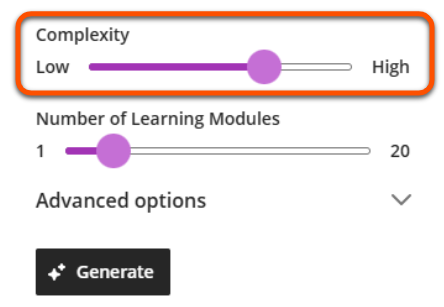
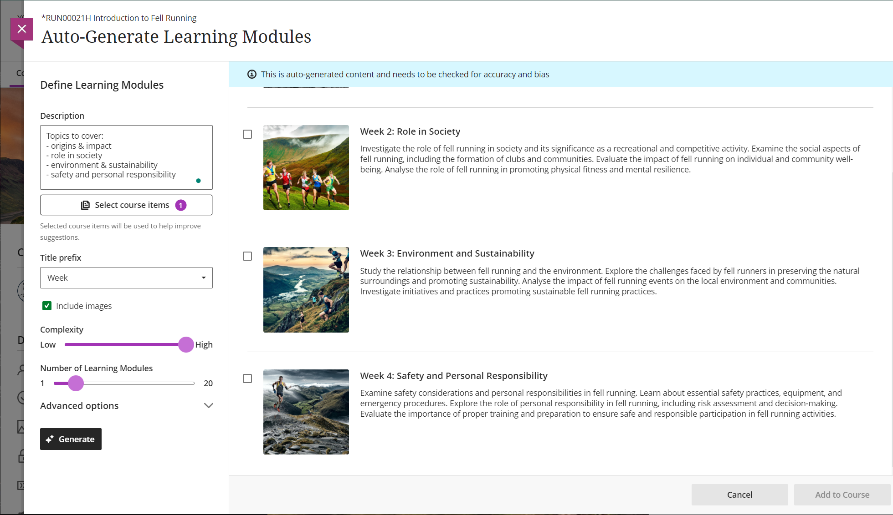

---
tags:
    - Ultra
---

# AI Design Assistant

!!! Summary

    AI Design Assistant (AI-DA) tools can help you generate content and ideas for your Ultra site, such as discussion prompts and quiz questions.

Ultra's AI-DA tools are powered by Microsoft's Azure OpenAI Service, and underpinned by [Anthology's Trustworthy AI approach](https://www.anthology.com/trust-center/trustworthy-ai-approach). They have been approved for use in teaching content at the University of York. 

## General AI-DA tips

magic icon - can see on many page types

### Getting better output

!!! Warning

    AI-generated content is a starting point for your own content development. It is not a finished product, and must always be carefully checked for accuracy and appropriacy.

The quality of the content generated by AI-DA tools depends on the information provided. Generally, the more specific context you can provide, the more likely the content is to be useful for you.

Improve the output by:

- Entering a **Description**: key words, general task requirements, module information etc. 
- **Selecting course items** (eg. uploaded lecture slides) that contain relevant content
 

### Complexity level

Most AI-DA tools have a slider to adjust the complexity of generated content.

Levels most relevant to University of York contexts are:

- 7: Undergraduate (C/I level) [the default setting]
- 8: Undergraduate (I/H level)
- 9: Masters
- 10: PhD 

## AI-DA content generation tools
This section summarises key tool features and considerations for applying them in your teaching at UoY. For more detail and video demonstrations, see [Blackboard Help's guide to AI-DA](https://help.blackboard.com/Learn/Instructor/Ultra/Course_Content/Create_Content/AI_Design_Assistant)

**TO DO Include doc with text-based version of screenshots/examples
**
### Task prompts

AI-DA can generate prompts for Discussions, Assignments and Journals. The output is very similar for the three task types.

Generate tasks are usually quite complex, or require a lot of time investment from students - a bit more involved than weekly formative tasks perhaps, but could be useful for generating ideas for assessments and project work.

Cognitive level

include examples (hidden?)

Using effectively: probably want to include and then adapt as needed (eg. maybe remove more time-consuming components)
 
### Test questions

- Test
- Question Bank - can be used in multiple tests, or use to draw a random set of questions from  bv

### Learning Modules

[Learning Modules](../ultra/folder-learning-module.md) are containers for organising site content.

!!! Note

    LMs included in your departmental template - in most cases you will not need to generate further ones. You must use your template structure.

Tips for using this tool effectively:

- Content is generated based on the site name and the context provided; a clear description or selecting a relevant document will help generate more relevant output.
- Check content for appropriacy. If needed, edit or adapt after the Learning Module is added to the course.

Steps:

1. In a relevant location in the Course Content Area, click the **plus icon**, then **Auto-Generate Modules**. In an empty site, just click Auto-Generate Modules.
2. Provide module information in the **Description** box (eg. description copy/pasted from Module Catalogue) and/or Select course items (eg. a Module Overview page).
3. Adapt complexity and other settings to your needs and click **Generate**
4. Review the suggested course structure provided by the AI and select which Learning Modules to keep (you can edit them later).
5. Click **Add to Course**.
 

??? tip "Learning Modules"

    [Learning Modules](../ultra/folder-learning-module.md) (LMs) are containers for organising site content. The AI-DA Learning Module tool generates titles and descriptions with optional images.

    !!! Note

        LMs included in your departmental template - in most cases you will not need to generate further ones. You must use your template structure.

    Tips for using this tool effectively:

    - Content is generated based on the site name and the context provided; a clear description or selecting a relevant document will help generate more relevant output.
    - Check content for appropriacy. If needed, edit or adapt after the Learning Module is added to the course.

    Steps:

    1. In a relevant location in the Course Content Area, click the **plus icon**, then **Auto-Generate Modules**. In an empty site, just click Auto-Generate Modules.
    2. Provide module information in the **Description** box (eg. description copy/pasted from Module Catalogue) and/or Select course items (eg. a Module Overview page).
    3. Adapt complexity and other settings to your needs and click **Generate**
    4. Review the suggested course structure provided by the AI and select which Learning Modules to keep (you can edit them later).
    5. Click **Add to Course**.
     

### Images

### Marking rubrics

Add in webinar recording

## AI conversations: student interaction

- socratic questioning
- role play

## Automating repetitive tasks

AI-DA can't perform repetitive tasks for you, such as updating multiple due dates. However, there are other Ultra features that might be useful for these tasks:

- [Batch Edit](../ultra/batch-edit.md): change due dates, set release conditions and delete items in bulk
- [Copy Content](../ultra/copy-content.md): copy items from within the current site or from another site