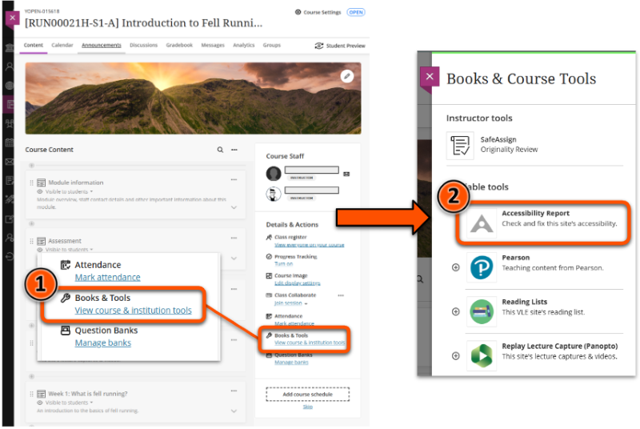
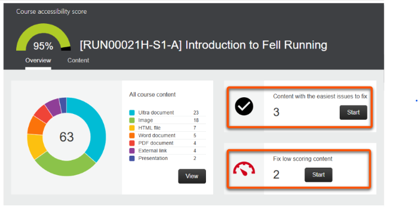
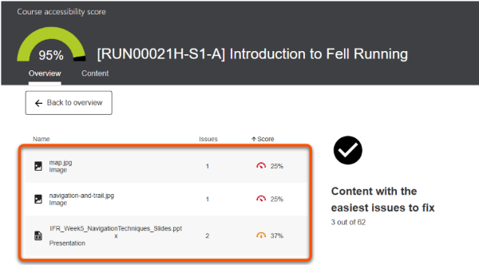
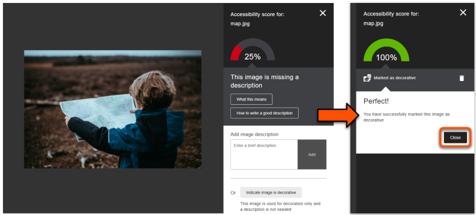
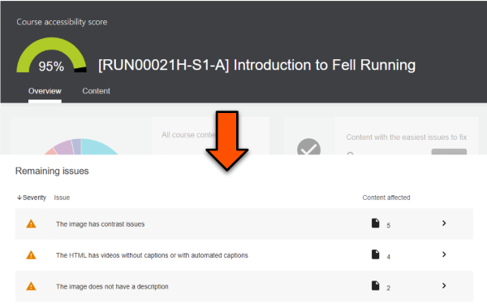
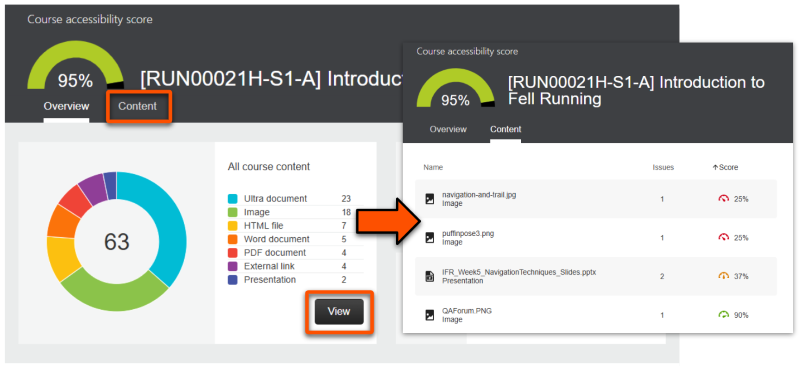

---
search:
  exclude: true
---

<!-- ---
tags:
    - Accessibility
    - Ultra
---
-->

# Accessibility report
!!! Summary

    A site-wide accessibility report to help staff identify and fix issues in their content.

!!! principle "Relevant [VLE site design principles](../ultra/site-design-principles.md)"

    - 3.4 Essential: Site and materials content is accessible.
    - 3.6 Essential: Links and materials titles describe the destination or content.
    - 3.7 Essential: Direct, descriptive links are given to open embedded content (eg. video, Padlet or Xerte objects) in full screen.

## Overview and example

The accessibility report gives a site-wide overview of content accessibility, pulling together the accessibility scores awarded to each item by the [Ally accessibility checker](../ultra/ally-tool.md#accessibility-checker). It can be used to identify common accessibility issues and specific items that need fixing.

The case study below demonstrates how to access and use the accessibility report:

??? case-study "Case study: Using accessibility reports to enhance module VLE sites"

    Carol Robinson explains how Ally Accessibility Reports are systematically used in the Department of Sociology to improve the accessibility of their module VLE sites.

    Carol firstly demonstrates how to use the accessibility report within a site, then describes the departmental process for using the report to check and improve content accessibility.

    Watch their presentation:<iframe src="https://york.cloud.panopto.eu/Panopto/Pages/Embed.aspx?id=0a415c36-45cd-4717-8b03-b2a600c8d2f6&autoplay=false&offerviewer=true&showtitle=false&showbrand=false&captions=false&interactivity=all" height="405" width="720" style="border: 1px solid #464646;" allowfullscreen allow="autoplay" aria-label="Panopto Embedded Video Player" aria-description="Carol Robinson  - Using accessibility reports to enhance module VLE sites" ></iframe>

    [Using accessibility reports to enhance module VLE sites (Panopto viewer)](https://york.cloud.panopto.eu/Panopto/Pages/Viewer.aspx?id=0a415c36-45cd-4717-8b03-b2a600c8d2f6) (8 mins 18 secs, UoY log-in required)

    See the [full case study for more details and the transcript](../training/case-studies/sociology-robinson.md).
    You can also browse our [full set of case studies](../training/case-studies/index.md).

## Access the report

To open the site-wide accessibility report:

1. Under *Details & Actions*, click **Books & Tools / View course & institution tools**.
2. On the *Books & Courses Tools panel*, select **Accessibility Report**.
 
3. This opens the report overview page showing:
    - overall site accessibility score (out of 100%)
    - a breakdown of the item types within the course content
    - two quick start points: content that is easiest to fix and content with the lowest score
 

## Using the report to improving site content

!!! ai "Using automated tools effectively"

    The Ally accessibility checker may not identify all issues within content, so treat this report as a **starting point** for your accessibility considerations.

!!! Tip

    See our guide to the [Ally accessibility checker](../ultra/ally-tool.md#accessibility-checker) for more details on what content is checked and how to make improvements using each item's accessibility feedback page.

We recommend starting with one of the options on the overview page:

- *Content with easiest issues to fix*: issues that are quick and easy to fix; your quick wins
- *Fix low-scoring content*: more severe issues; may take longer to fix, but likely to have a bigger impact on improving accessibility

For either option:

1. Click **Start** on your preferred option.
 
2. On the list of relevant items, select an item to fix. By default this is sorted with the lowest scoring individual item at the top.
 
3. On the item's accessibility feedback page (opened in a new tab), use the guidance to fix the issue, then click **Close**.
 
4. Back on the list of items, repeat until all issues are fixed.

You can also access individual content items via two more detailed lists: 

- *Remaining issues*: an issue-by-issue a list on the overview page that collate items with the same problem. You can sort this by severity or the number of items affected. This could be useful to efficiently target particular issues, eg. add ALT text for all images without description.
 
- *Content: a full list of items in the site, showing file type, file name, number of issues and individual item score. Access via the **Content tab** or the **View button** on the content overview panel.
 

## Other tips to improve your site's accessibility

- Make sure that all site content is up to date and **remove old and hidden files and content** from your site. You may see an immediate improvement in your accessibility score! You can access old materials in the previous year's site, so they don't need to be retained in new sites.
- **Use your departmental template structure and key documents**. This gives broad consistency across sites and is key to help students navigate content easily across all their modules. 
- **Name your content consistently**. Use a consistent name format that clearly tells users what the file or page content is without having to open it.