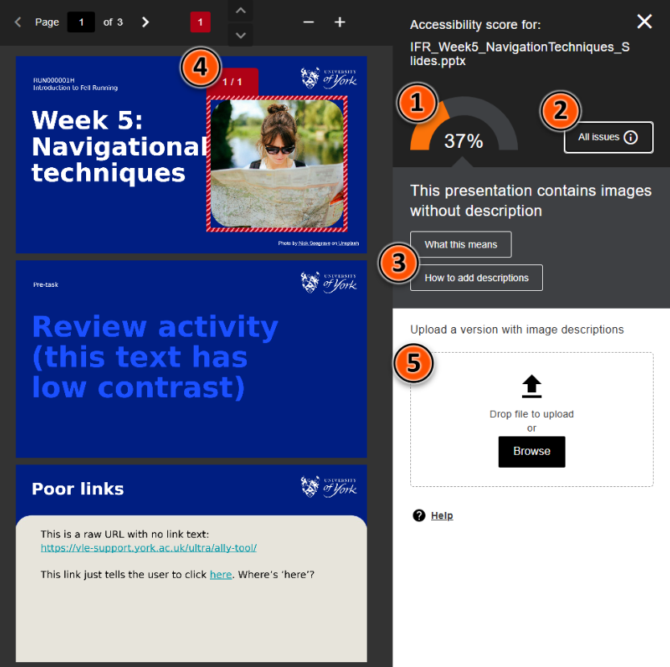

# Ally: accessibility tool

!!! Summary

    Ally is a built-in accessibility tool for content created within or uploaded to Ultra sites.

!!! principle "Relevant [VLE site design principles](../ultra/site-design-principles.md)"

    - 3.4 Essential: Site and materials content is accessible.

<!-- https://youtu.be/8VnGfbw0DXQ 

<iframe width="560" height="315" src="https://www.youtube.com/embed/8VnGfbw0DXQ?si=NvZsSFrrOnvbvKCV" title="YouTube video player" frameborder="0" allow="accelerometer; autoplay; clipboard-write; encrypted-media; gyroscope; picture-in-picture; web-share" allowfullscreen></iframe> -->

The Ally tool has two accessibility functions:

- **Accessibility checker**

    ---

    - generates an accessibility score for content items
    - identifies key accessibility issues and suggests improvements
    - summarises all issues in a site-wide accessibility report
    - only available for staff

- **Alternate format generator**

    ---

    - gives option to convert content to a range of other formats
    - helps users access materials in a way that works for them
    - available for staff and students

## Content types processed

!!! Tip 

    The relevant Ally icons appear on the content item once processing is complete. This may take up to a few minutes, depending on the complexity and amount of content.

Ally automatically processes various types of site content, including:

=== "Uploaded files"

    Ally processes files uploaded as standalone content items or within Ultra Documents, includes text, images, tables and other content within the file. 
    
    Key file types processed:
    
    - Microsoft Word (*.docx*)
    - Microsoft PowerPoint (*.pptx*)
    - PDF (*.pdf*)

    The Ally icons appear alongside the file name:
    
    

=== "Images"

    Ally assigns accessibility scores for various image types including *.png*, *.jpg*, *.jpeg* and *.gif* formats. These can be uploaded as standalone content items or within an Ultra Document.
    
    Alternate formats are not available for images. 

    The accessibility score icon appears alongside the file name for standalone images, and overlaid on images within Ultra Documents under the three dots editing icon. Hover over this area to show a higher contrast background.
    
    

=== "Ultra Documents (aka. VLE content page)"

    [Documents](../ultra/documents.md) are the main page type to present your site materials. Ally processes various content within Documents:
    
    - content added in a Content block (the text editor): text, images, files, YouTube videos etc.
    - content uploaded in an Image or File block
    - not processed: other embedded content, eg. Xerte or Padlet objects

    Ally icons relating to content directly added to the Document are shown in the heading bar. The accessibility score icon may take a few seconds to appear and is only shown in *Edit mode*.
    
    Uploaded files and images display their own Ally icons.
    
    

## Accessibility checker

!!! Warning

    Ally may not be able to identify all accessibility issues within content, so the accessibility checker should be used as a starting point for your accessibility considerations.

### Accessibility score

Ally assigns content items an accessibility score in percentage format.

The accessibility score icon displayed on items within your site gives a quick measure of content accessibility.

<figure markdown class="no-margin">

<figcaption>Accessibility score icon</figcaption>
</figure>

| Accessibility score | Details of issues | Actions |
| ----- | ----- | ----- |
| Low (0-33%) | Severe and/or numerous issues found | Must be improved |
| Medium (34-66%) | Less severe and/or slightly fewer issues found | Must be improved |
| High (67-99%) | Some minor issues found | Possible to improve | 
| Perfect (100%) | No issues identified, but some may be present | May be possible to improve |

Get more information by interacting with the accessibility score icon:

- hover over it to show the qualitative rating.
- click it to open detailed accessibility feedback.

### Accessibility feedback

The accessibility feedback page gives more detail on how the item's accessibility score was generated and how to fix the issues identified.

1. Review the numeric accessibility score
2. Address the issue shown.
3. Repeat for other issues as necessary.
4. For files: upload the corrected file. 

1. Review the specific accessibility score given at the top of the page. This gives a combined measure of the severity of issues identified for this item; lower scores are more problematic.
2. By default, the most severe issue is listed under the accessibility score. 
click All issues to show all identified issues. Click to focus on an issue.
review panel shows where the issue is located within the content. use the arrows to move through different instances of teh same issue.
Make changes in the file and reupload. For a Document you can edit content directly in the review panel.

May not pick up all issues: for example, here Ally could not identify the poor links ofn slides 3 - raw URL and 'click here' instead of descriptive link

page includes:

1. a numerical accessibility score
2. *All issues* button: details of accessibility issues identified
3. explanation of the current issue and guidance on how to fix it
4. the current issue highlighted within the content
4. a quick upload option for corrected files

## Download alternate formats

!!! Tip

    The alternate formats feature is also available to students.

Blah blah blah

<figure markdown class="no-margin">

<figcaption>Alternate formats icon</figcaption>
</figure>

formats available
how to download

## Site accessibility report

To open the site accessibility report:

1. Under *Details & Actions*, click **Books & Tools / View course & institution tools**.
2. On the new panel, select **Accessibility Report**.
 

Tips to improve your site's accessibility score:

## Other accessibility checkers

There are various accessibility checkers available for specific content types.

- microsoft, grackle for Google etc.

--- 

As an instructor on your vle course site, you will see coloured dials called Accessibility Scores and an alternative format download symbol to the right of your content. 

Your students will not see the accessibility score; they will only see the alternative format symbol.

1. Be careful showing your vle course site in a lecture - turn on student view to hide accessibility scores.
2. Read about accessibility scores and what they mean.
3. Select each accessibility score dial icon to open the feedback panel.
4. Having worked through the guidance to improve your file, you can re-upload the content in the feedback panel. This will update your score.
    a. The feedback panel below shows a pdf with areas highlighted in red boxes that need action to improve accessibility. A panel on the right contains guidance on how to improve these files and allows you to directly upload the fixed file after corrections.

Text editor
The text editor in Blackboard has a checker built-in too. 
When editing an item, click the dial top right of the text editor to see guidance. This checker tells you if there is poor contrast on text, if tables don’t have header rows, if images don’t have alt text etc. 

# Course accessibility reports

Below is an embedded video showing how to set up Groups in Ultra. Alternatively, you can [open the video in a new browser tab](https://youtu.be/HRZTV2KlGHE). 

<!-- PASTE YOUTUBE EMBED (should look like this:) --><iframe width="560" height="315" src="https://www.youtube.com/embed/HRZTV2KlGHE?si=84h-2kUfu7-tLgCc" title="YouTube video player" frameborder="0" allow="accelerometer; autoplay; clipboard-write; encrypted-media; gyroscope; picture-in-picture; web-share" allowfullscreen></iframe>

## About the reports

Access the site report by going to Books & Tools (in the **Details &  Actions** menu), then Accessibility Report.
The course accessibility report shows the 
overall course accessibility score, 
the distribution of course content by content type and 
the list of all issues that have been identified in the course. 

You may want to remove all hidden, old files completely from your course site - you may see an immediate improvement in your course site score! As course sites are rolled over each year, old material can be retrieved from last year’s site. Leave yourself a note on your current site to check older sites for any material that you may wish to recycle in future years.

The instructor can choose to start fixing the content by “Content that’s easiest to fix” or “Content with most severe issues” depending on the content in the course. The instructor can easily see a list of which content items in their course have been flagged with an issue, and is able to jump directly into the instructor feedback from the report. This should make working through the remediation of multiple items a bit faster.

The course accessibility report provides the ability to sort by severity, issue name, number of issues identified and accessibility score. 

Note that you should still use a human-centred approach to organising your course structure and provide meaningful ways of navigating the content in your course vle site.
What content does Ally check?
Find out what content Ally checks.

Core Ally Guidance:

- [Student Ally Guidance](https://docs.google.com/document/d/1c296bnkMAP058YXv8eBlHA8Cu6f3Ul3OOhyk3lo9dfw/edit) (findable via [our central student help pages](https://subjectguides.york.ac.uk/learning-tech/accessibility))
- [Staff Ally Guidance](https://docs.google.com/document/d/1oDokxj1Fcfw_CmxOTTT6yOT-CCvZrNAgM3IsVVGE1Is/edit?usp=sharing)
- [Ally Guidance from Blackboard Anthology](https://help.blackboard.com/Ally/Ally_for_LMS) (the supplier).