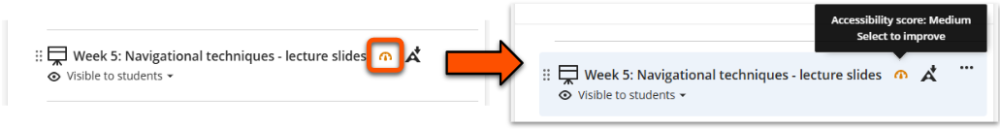

# Ally: accessibility tool

!!! Summary

    Ally is a built-in accessibility tool for content created within or uploaded to Ultra sites.

!!! principle "Relevant [VLE site design principles](../ultra/site-design-principles.md)"

    - 3.4 Essential: Site and materials content is accessible.
    - 3.6 Essential: Links and materials titles describe the destination or content.
    - 3.7 Essential: Direct, descriptive links are given to open embedded content (eg. video, Padlet or Xerte objects) in full screen.

<!-- https://youtu.be/8VnGfbw0DXQ 

<iframe width="560" height="315" src="https://www.youtube.com/embed/8VnGfbw0DXQ?si=NvZsSFrrOnvbvKCV" title="YouTube video player" frameborder="0" allow="accelerometer; autoplay; clipboard-write; encrypted-media; gyroscope; picture-in-picture; web-share" allowfullscreen></iframe> -->

The Ally tool has two accessibility functions:

- **Accessibility checker**

    ---

    - generates an accessibility score for content items
    - identifies key accessibility issues and suggests improvements
    - summarises all issues in a site-wide accessibility report
    - only available for staff

- **Alternate format generator**

    ---

    - gives option to convert content to a range of other formats
    - helps users access materials in a way that works for them
    - available for staff and students

## Content types processed

!!! Tip 

    The relevant Ally icons appear on the content item once processing is complete. This may take up to a few minutes, depending on the complexity and amount of content.

Ally automatically processes various types of site content, including:

=== "Uploaded files"

    Ally processes files uploaded as standalone content items or within Ultra Documents, includes text, images, tables and other content within the file. 
    
    Key file types processed:
    
    - Microsoft Word (*.docx*)
    - Microsoft PowerPoint (*.pptx*)
    - PDF (*.pdf*)

    The Ally icons appear alongside the file name:
    
    

=== "Images"

    Ally assigns accessibility scores for various image types including *.png*, *.jpg*, *.jpeg* and *.gif* formats. These can be uploaded as standalone content items or within an Ultra Document.
    
    Alternate formats are not available for images. 

    The accessibility score icon appears alongside the file name for standalone images, and overlaid on images within Ultra Documents under the three dots editing icon. Hover over this area to show a higher contrast background.
    
    

=== "Ultra Documents (aka. VLE content page)"

    [Documents](../ultra/documents.md) are the main page type to present your site materials. Ally processes various content within Documents:
    
    - processed directly: content added in a Content block (the text editor): text, images, files, YouTube videos etc.
    - processed separately: content uploaded in an Image or File block has its own Ally icons. They must be checked or downloaded in alternate formats separately.
    - not processed: other embedded content, eg. Xerte or Padlet objects

    Ally icons relating to content directly added to the Document are shown in the heading bar. The accessibility score icon may take a few seconds to appear and is only shown in *Edit mode*.
    
    

## Accessibility checker

!!! ai "Using automated tools effectively"

    The Ally accessibility checker is a **starting point** for your accessibility considerations, as it may not be able to identify all accessibility issues within content. For more details, see [Step 4](#step-4-final-check-for-unidentified-issues) below.

Document content (text editor)( nicon - updates as you edit content)

### Accessibility score

Ally assigns content items an accessibility score in percentage format.

The accessibility score icon displayed on items within your site gives a quick measure of content accessibility.

<figure markdown class="no-margin">

<figcaption>Accessibility score icon</figcaption>
</figure>

| Accessibility score | Details of issues | Actions |
| ----- | ----- | ----- |
| Low (0-33%) | Severe and/or numerous issues found | Must be improved |
| Medium (34-66%) | Less severe and/or slightly fewer issues found | Must be improved |
| High (67-99%) | Some minor issues found | Possible to improve | 
| Perfect (100%) | No issues identified, but some may be present | May be possible to improve |

Get more information by interacting with the accessibility score icon:

- hover over it to show the qualitative rating.
- click it to open detailed accessibility feedback.

!!! Tip

    For Ultra Documents, the accessibility score only considers issues in content added directly within a Content block (ie. with the text editor). Uploaded files and images have their own accessibility score and feedback that must be addressed separately.

### Accessibility feedback

The accessibility feedback page gives more detail on how the item's accessibility score was generated and how to fix the issues identified.

Open the feedback page by clicking the accessibility score wherever it occurs, or on the Course Content page click the three dots icon then select **View Accessibility Score**.

#### Step 1: Review the numeric accessibility score

The score panel appears at the top of the page. The numeric accessibility score gives a combined measure of the severity of issues identified for this item. Lower scores are more problematic.

#### Step 2: Address the highlighted issue

The **issue panel** appears under the score, containing:
    
- a brief description of the issue (eg. "This presentation contains images without description")
- *What this means* button: to show more details on what the issue is and why it's important to fix it
- *How to...* button: to show guides on how to fix the issue in various content formats

The **review panel** highlights the affected content within the item. You can scroll through the item or use the up/down arrows in the top bar to review all affected content.

Edit the content item to improve the accessibility:

- *Uploaded files*: update content in the the original file. Download this from the site if needed.
- *Ultra Documents*: update content directly within the review panel or issue panel. The accessibility score will update as you edit.

#### Step 3: Repeat for further issues as necessary

By default, the issue panel shows the most problematic issue first, but there may be others that also need to be addressed.

1. Click the **All issues** button in the score panel.
2. Select the next identified issue in the list.
3. Repeat Step 2 to address this issue.
4. Repeat Step 3 until all identified issues are addressed.

MOVE INTO A SEPARATE EXAMPLE SECTION

#### Step 4: Final check for unidentified issues

!!! Warning

    Ally can't identify accessibility issues that depend on context, such as appropriate descriptive text for links and file titles.

Ally may not identify all accessibility issues in a content item, so also make sure to do your final own check for any remaining issues that may be present in your content.

Here are some issues that Ally can't currently identify:

??? Abstract "Common unidentified issue: non-descriptive link text"

    

    

    Link text is the part of the link that displays for users to click. This must describe the destination content or reason for using the link.

    However, Ally generally can't identify if a link isn't appropriately descriptive. For example, here Ally did not identify the poor raw URL or *click here* links.
    

    
    

    **Why use descriptive link text**:

    - Assistive technology can isolate links, so descriptive link text is needed for these to make sense without the surrounding text
    - Descriptive links are better integrated with the text and so are more readable for all users
    
    **How to write descriptive link text**:
    
    - Describe where the link goes or the reason for using it, eg: *Guide to the Ally accessibility tool* or *Give us feedback on Ultra*
    - Don't paste a raw URL without link text, eg: *https://vle-support.york.ac.uk/ultra/ally-tool/*
    - Don't use text that gives no information about the destination, eg: *Click here* or *More information*

??? Abstract "Common unidentified issue: missing direct links for embedded content"

    Direct, descriptive links should be given to open embedded content (eg. video, Padlet or Xerte objects) in full screen.

    However, Ally can't identify if an embed has an associated direct link. For example, here is didn't identify the missing link to the embedded Xerte object.

    

    **Why use direct links for embedded content**:
    
    - Being able to open the embedded content and control the size can make it easier to access for users of assistive technology and also on small screens.
    - A direct link provides a fallback incase the embed fails for any reason.
    
    **How to add direct links for embedded content**:
    
    - Add the link under the embed using the usual method for your content type.
    - Use link text that describes the embedded content, eg: *Open the embedded Padlet in full screen*

??? Abstract "Common unidentified issue: non-descriptive file names"

    Uploaded materials such as lecture slides, pre-workshop tasks etc. must have a descriptive file name. This allows users to know what the content is without opening the file.
    
    For example, *IFR_W5_Slides_Navigation* is much more helpful than *Slides* or *Week 5* - think how many of files students may have like this!

    **Why use descriptive file names**:
    
    - Descriptive file names quickly summarise the content and help users search site content and organise downloaded files easily.
    - This is helpful for all users, but is especially important for users with dyslexia or other neurodiversities and for users of assistive technologies.
    
    **How to write descriptive file names**:
    
    - Describe the content so that users don't have to open the file to know what it is. 
        - module identifier, week, materials type, summary of content etc.
        - eg: *IFR_W5_Slides_Navigation*, *IFR_W7_Seminar_Environment*
    - For uploaded files, a different display name can be shown that makes sense in the context of the page, eg: *Lecture slides* displayed within a weekly Ultra Document.
    - Use the naming format consistently for all files across the site.
    - Don't use generic titles, such as *slides* or *week 1*

#### Step 5: Save your improved content

Once you have made your edits, save your improved content:

**Uploaded files and images**:

1. Save the updated file on your device.
2. On the *Accessibility feedback page*, upload the improved file in the upload box.
3. The improved file overwrites the original file and generates an updated accessibility score.

**Ultra Documents**:

1. When you have finished updating content, click the **X icon** in the top right to close the feedback panel.
2. This returns you to the Document edit view. Click **Save**.

## Download alternate formats

!!! Tip

    The alternate formats feature is also available to students.

Blah blah blah

<figure markdown class="no-margin">

<figcaption>Alternate formats icon</figcaption>
</figure>

formats available
how to download

## Site accessibility report

To open the site-wide accessibility report:

1. Under *Details & Actions*, click **Books & Tools / View course & institution tools**.
2. On the new panel, select **Accessibility Report**.
 

Tips to improve your site's accessibility score:

## Other accessibility checkers

There are various accessibility checkers available for specific content types.

- microsoft, grackle for Google etc.

--- 

# Course accessibility reports

Below is an embedded video showing how to set up Groups in Ultra. Alternatively, you can [open the video in a new browser tab](https://youtu.be/HRZTV2KlGHE). 

<!-- PASTE YOUTUBE EMBED (should look like this:) --><iframe width="560" height="315" src="https://www.youtube.com/embed/HRZTV2KlGHE?si=84h-2kUfu7-tLgCc" title="YouTube video player" frameborder="0" allow="accelerometer; autoplay; clipboard-write; encrypted-media; gyroscope; picture-in-picture; web-share" allowfullscreen></iframe>

## About the reports

Access the site report by going to Books & Tools (in the **Details &  Actions** menu), then Accessibility Report.
The course accessibility report shows the 
overall course accessibility score, 
the distribution of course content by content type and 
the list of all issues that have been identified in the course. 

You may want to remove all hidden, old files completely from your course site - you may see an immediate improvement in your course site score! As course sites are rolled over each year, old material can be retrieved from last year’s site. Leave yourself a note on your current site to check older sites for any material that you may wish to recycle in future years.

The instructor can choose to start fixing the content by “Content that’s easiest to fix” or “Content with most severe issues” depending on the content in the course. The instructor can easily see a list of which content items in their course have been flagged with an issue, and is able to jump directly into the instructor feedback from the report. This should make working through the remediation of multiple items a bit faster.

The course accessibility report provides the ability to sort by severity, issue name, number of issues identified and accessibility score. 

Note that you should still use a human-centred approach to organising your course structure and provide meaningful ways of navigating the content in your course vle site.
What content does Ally check?
Find out what content Ally checks.

Core Ally Guidance:

- [Student Ally Guidance](https://docs.google.com/document/d/1c296bnkMAP058YXv8eBlHA8Cu6f3Ul3OOhyk3lo9dfw/edit) (findable via [our central student help pages](https://subjectguides.york.ac.uk/learning-tech/accessibility))
- [Staff Ally Guidance](https://docs.google.com/document/d/1oDokxj1Fcfw_CmxOTTT6yOT-CCvZrNAgM3IsVVGE1Is/edit?usp=sharing)
- [Ally Guidance from Blackboard Anthology](https://help.blackboard.com/Ally/Ally_for_LMS) (the supplier).