---
tags:
    - Accessibility
    - Ultra
---

# Ally: accessibility tool

!!! Summary

    The Ally tool provides an accessibility checker for content created within or uploaded to Ultra sites. It also allows users to download content in alternative formats.

    Ths guide considers Ally for individual content items. For an overall view of site accessibility, see our separate [site accessibility report guide](../ultra/ally-accessibility-report.md). 

!!! principle "Relevant [VLE site design principles](../ultra/site-design-principles.md)"

    - 3.4 Essential: Site and materials content is accessible.
    - 3.6 Essential: Links and materials titles describe the destination or content.
    - 3.7 Essential: Direct, descriptive links are given to open embedded content (eg. video, Padlet or Xerte objects) in full screen.

## Quick start

Ally has two functions for individual content items:

-   [**Accessibility checker**](#accessibility-checker)

    

    ---

    - Assigns each item an accessibility score (out of 100%).
    - The gauge icon gives a quick measure of item accessibility.
    - Click the **gauge icon** to view the issues and how to fix them.
    - Only available for staff.

- [**Alternative format generator**](#alternative-format-generator)

    

    ---

    - Allows users to download content in a range of other formats.
    - Click the **A icon** to select a format to download.
    - Available formats include tagged PDF, audio, HTML etc.
    - Available for staff and students.

Apply these functions to help make your VLE sites more accessible for your students, as demonstrated in this case study:

??? case-study "Case study: Accessible VLE sites in Ultra"

    Laura Chapman explains how Department of Environment and Geography have used the departmental template sites along with the Ally accessibility checker and alternative formats generator to maximise the accessibility of VLE sites for students.

    Watch their presentation:
    <iframe src="https://york.cloud.panopto.eu/Panopto/Pages/Embed.aspx?id=68d4ff7a-e24a-47af-90ff-b1ee0092a5ed&autoplay=false&offerviewer=true&showtitle=false&showbrand=false&captions=false&interactivity=all" height="405" width="720" style="border: 1px solid #464646;" allowfullscreen allow="autoplay" aria-label="Panopto Embedded Video Player" aria-description="Accessible VLE sites in Ultra" ></iframe>

    [Accessible VLE sites in Ultra (Panopto viewer)](https://york.cloud.panopto.eu/Panopto/Pages/Viewer.aspx?id=68d4ff7a-e24a-47af-90ff-b1ee0092a5ed) (5 mins 21 secs, UoY log-in required)

    See the [full case study for more details and the transcript](../training/case-studies/env-geog-chapman.md).
    You can also browse our [full set of case studies](../training/case-studies/index.md).

For more information on using the Ally functions, see the detailed guides below.

---

## Ally: which content types

Ally is available for:

=== "Ultra Documents (aka. VLE content page)"

    **Functions**: accessibility checker, alternative formats

    [Documents](../ultra/documents.md) are the main page type to present your site materials. Ally checks the accessibility of content within a Document:
    
    - processed directly: content added in a Content block (the text editor): text, images, files, YouTube videos etc.
    - processed separately: content uploaded in an Image or File block has its own Ally icons. They must be checked or downloaded in alternative formats separately.
    - not processed: other embedded content, eg. Xerte or Padlet objects

    Ally icons relating to content directly added to the Document are shown in the heading bar. The accessibility score icon is only shown in *Edit mode* (this may take a few seconds to appear).
    
    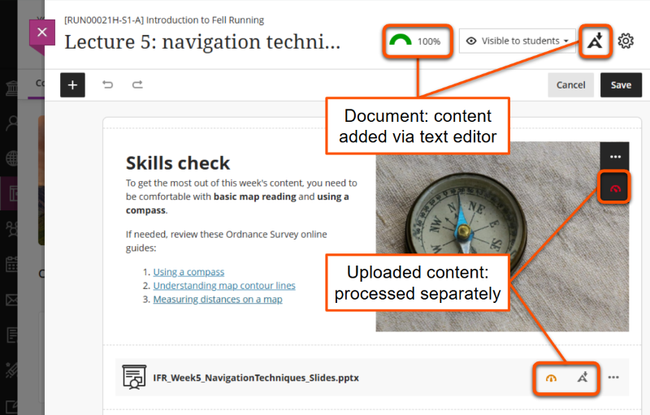

=== "Uploaded files"

    **Functions**: accessibility checker, alternative formats

    Ally processes files uploaded as standalone content items or within Ultra Documents. It will process text, images, tables and other content within the file. 
    
    Key file types processed:
    
    - Microsoft Word (*.docx*)
    - Microsoft PowerPoint (*.pptx*)
    - PDF (*.pdf*)

    Ally icons appear alongside the file name:
    
    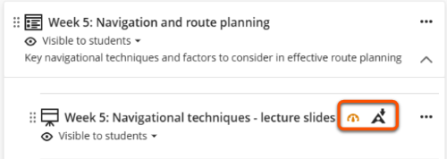

=== "Images"
    
    **Functions**: accessibility checker only

    Ally checks accessibility of various image types including *.png*, *.jpg*, *.jpeg* and *.gif* formats. These can be uploaded as standalone content items or within an Ultra Document.
    
    The accessibility score icon appears alongside the file name for standalone images, and overlaid on images within Ultra Documents under the three dots editing icon. Hover over this area to show a higher contrast background.
    
    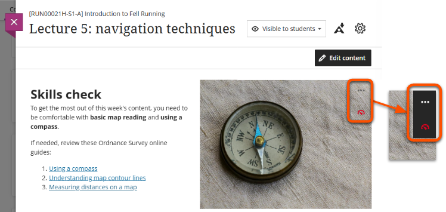

## Accessibility checker

!!! ai "Using automated tools effectively"

    The Ally accessibility checker may not identify all issues within content, so treat it as a **starting point** for your accessibility considerations.

This **staff-only** function checks content items and assigns them an **accessibility score** depending on the issues identified. Ally checks for issues including:

- missing ALT text for images
- skipped heading levels
- low text contrast
- missing headers in tables
- untagged PDFs and scanned PDFs that aren't OCR-ed

An **accessibility score icon** appears on the item with a gauge (or dial) giving a quick measure of content accessibility.

This may take up to a few minutes to appear, depending on the complexity of the content.

<figure markdown class="no-margin">
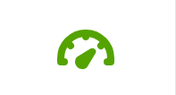
<figcaption>Accessibility score icon</figcaption>
</figure>

### Step 1: Open the accessibility feedback page

The accessibility feedback page details the issues identified and how to fix them. This can be opened in two ways:

- Click the accessibility score icon wherever it appears.
- In the Course Content area, click the three dots icon then select **View Accessibility Score**.
 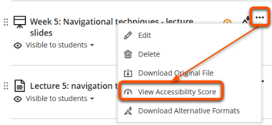

### Step 2: Review the accessibility score

The **score panel** at the top of the page shows the item's accessibility score as a percentage. 

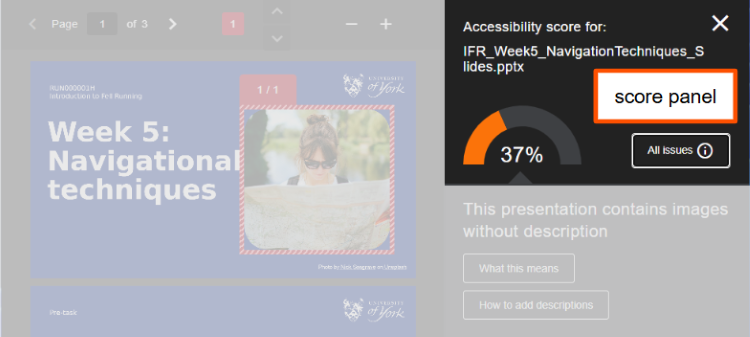

This score gives a combined measure of the severity of issues identified within the item. Lower scores reflect more problematic issues.

| Accessibility score | Details of issues | Actions |
| ----- | ----- | ----- |
| Low (0-33%) | Severe and/or numerous issues found | Must be improved |
| Medium (34-66%) | Less severe and/or slightly fewer issues found | Must be improved |
| High (67-99%) | Some minor issues found | Possible to improve | 
| Perfect (100%) | No issues identified, but some may be present | May be possible to improve |

### Step 3: Address the highlighted issue

The **issue panel** under the score shows:
    
- A brief description of the issue (eg. "This presentation contains images without description").
- *What this means* button: to show more details on what the issue is and why it's important to fix it.
- *How to...* button: to show guides on how to fix the issue in various content formats.

The **review panel** highlights the affected content within the item. Scroll through the item or use the up/down arrows in the top bar to review all affected content.

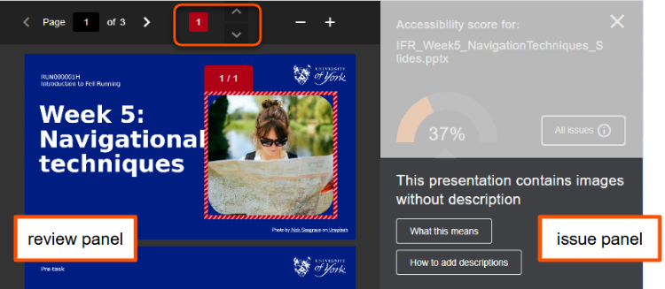

Edit the content item to improve the accessibility:

- *Uploaded files*: update content in the the original file. Download this from the site if needed.
- *Ultra Documents*: update content directly within the review panel or issue panel. The accessibility score will update as you edit.

### Step 4: Repeat for other identified issues

By default, the issue panel shows the most problematic issue first, but there may be others that also need to be addressed.

1. Click the **All issues** button in the score panel.
2. Select the next identified issue in the list and repeat steps 2 and 3.

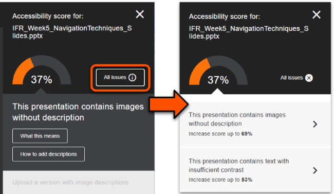

!!! Tip

    Feedback for Ultra Documents only identifies issues in content added directly within a Content block (ie. with the text editor). Any files or images within the Document have their own separate accessibility feedback.

### Step 5: Check for unidentified issues

!!! Warning

    Ally can't identify accessibility issues that depend on context, such as appropriate descriptive text for links and file titles.

Ally may not identify all accessibility issues in a content item, so do your final own check for any remaining issues.

??? Abstract "Common unidentified issue: non-descriptive link text"

    

    

    Link text is the part of the link that displays for users to click. This must describe the destination content or reason for using the link.

    However, Ally generally can't identify if a link isn't appropriately descriptive. For example, here Ally did not identify the poor raw URL or *click here* links.
    

    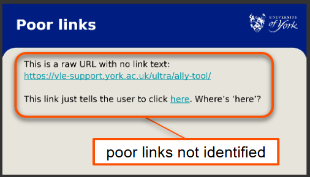
    

    **Why use descriptive link text**:

    - Assistive technology can isolate links, so descriptive link text is needed for these to make sense without the surrounding text
    - Descriptive links are better integrated with the text and so are more readable for all users
    
    **How to write descriptive link text**:
    
    - Describe where the link goes or the reason for using it, eg: *Guide to the Ally accessibility tool* or *Give us feedback on Ultra*
    - Don't paste a raw URL without link text, eg: *https://vle-support.york.ac.uk/ultra/ally-tool/*
    - Don't use text that gives no information about the destination, eg: *Click here* or *More information*

??? Abstract "Common unidentified issue: missing direct links for embedded content"

    Direct, descriptive links should be given to open embedded content (eg. video, Padlet or Xerte objects) in full screen.

    However, Ally can't identify if an embed has an associated direct link. For example, here is didn't identify the missing link to the embedded Xerte object.

    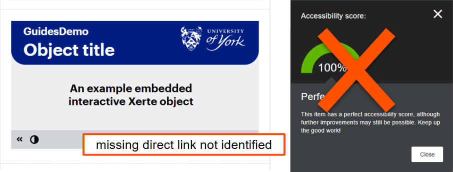

    **Why use direct links for embedded content**:
    
    - Being able to open the embedded content and control the size can make it easier to access for users of assistive technology and also on small screens.
    - A direct link provides a fallback incase the embed fails for any reason.
    
    **How to add direct links for embedded content**:
    
    - Add the link under the embed using the usual method for your content type.
    - Use link text that describes the embedded content, eg: *Open the embedded Padlet in full screen*

??? Abstract "Common unidentified issue: non-descriptive file names"

    Uploaded materials such as lecture slides, pre-workshop tasks etc. must have a descriptive file name. This allows users to know what the content is without opening the file.
    
    For example, *IFR_W5_Slides_Navigation* is much more helpful than *Slides* or *Week 5* - think how many of files students may have like this!

    **Why use descriptive file names**:
    
    - Descriptive file names quickly summarise the content and help users search site content and organise downloaded files easily.
    - This is helpful for all users, but is especially important for users with dyslexia or other neurodiversities and for users of assistive technologies.
    
    **How to write descriptive file names**:
    
    - Describe the content so that users don't have to open the file to know what it is. 
        - module identifier, week, materials type, summary of content etc.
        - eg: *IFR_W5_Slides_Navigation*, *IFR_W7_Seminar_Environment*
    - For uploaded files, a different display name can be shown that makes sense in the context of the page, eg: *Lecture slides* displayed within a weekly Ultra Document.
    - Use the naming format consistently for all files across the site.
    - Don't use generic titles, such as *slides* or *week 1*

### Step 6: Save your improved content

**Uploaded files and images**:

1. Save the updated file on your device.
2. On the *Accessibility feedback page*, upload the improved file in the upload box.
3. The improved file overwrites the original file and generates an updated accessibility score.

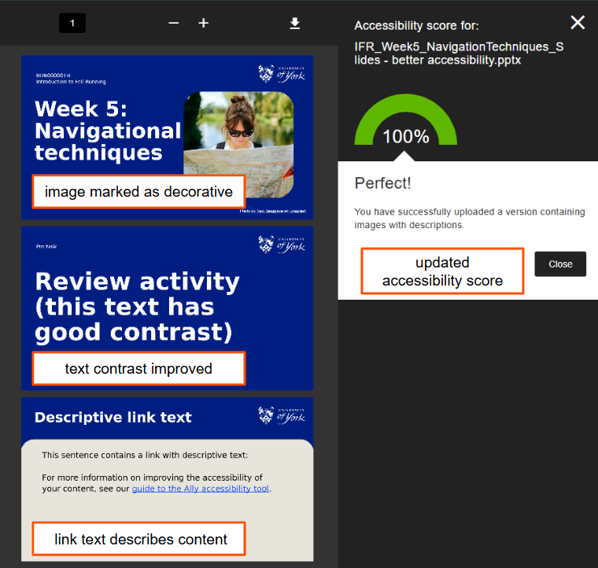

**Ultra Documents**:

1. When you have finished updating content, click the **X icon** in the top right to close the feedback panel.
2. This returns you to the Document edit view. Click **Save**.

### Other accessibility checkers

There are also various other platform-specific accessibility checkers available. The checkers below are approved for use at UoY:

- [Grackle Docs](https://www.york.ac.uk/it-services/tools/grackle-docs/): for Google Docs, Slides and Sheets
- [Microsoft accessibility checker](https://support.microsoft.com/en-gb/office/improve-accessibility-with-the-accessibility-checker-a16f6de0-2f39-4a2b-8bd8-5ad801426c7f): for Microsoft Word, PowerPoint etc.

## Alternative format generator

!!! Tip 

    The alternative format generator works best if the original content is accessible and well-structured. It can't fix accessibility issues in the content.

This function allows **staff and students** to download Ultra Documents and uploaded files in a range of alternative formats.

This helps users access content in a way that suits their needs and preferences.

<figure markdown class="no-margin">

<figcaption>Alternative formats icon</figcaption>
</figure>

### Formats available

Alternative formats available include (depending on the content type):

- Tagged PDF: add structure to aid machine-readability
- OCRed PDF: convert scanned PDF to machine-readable text
- Audio: MP3 version (popular with students)
- Electronic braille: for use with electronic braille displays
- ePub: for reading in ebook format or on tablets
- BeeLine Reader and Immersive Reader: tools to improve readability 

See the [Best file formats guide](https://xerte.york.ac.uk/play.php?template_id=2455#develop) for more information on using each format.

### Download 

To download content in an alternative format:

1. Click the **'A' Ally icon** on the item.
2. Select the desired alternative format from the list of options.
3. Click Download.

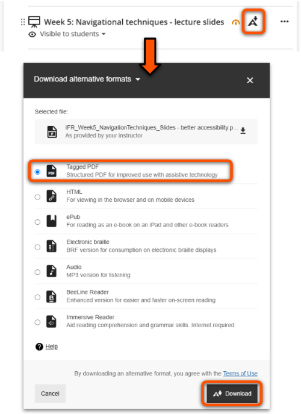

<!-- Core Ally Guidance:

- [Student Ally Guidance](https://docs.google.com/document/d/1c296bnkMAP058YXv8eBlHA8Cu6f3Ul3OOhyk3lo9dfw/edit) (findable via [our central student help pages](https://subjectguides.york.ac.uk/learning-tech/accessibility))
- [Staff Ally Guidance](https://docs.google.com/document/d/1oDokxj1Fcfw_CmxOTTT6yOT-CCvZrNAgM3IsVVGE1Is/edit?usp=sharing) (RETIRE THIS)
- [Ally Guidance from Blackboard Anthology](https://help.blackboard.com/Ally/Ally_for_LMS) (the supplier). -->