---
tags:
# Delete to leave only relevant tags
    - Advanced
    - Teaching
    - Ultra
---

# Announcements

!!! Summary

    Announcements is a one-way channel for important news such as key dates and events.

## Quick Start Guide

Typical types of announcement may include:

- reminders of assessment due dates
- changes to exam schedules
- corrections of materials

### Video Steps

Below is an embedded video detailing how to **Create Announcements in the Ultra Course View**. Alternatively, you can [open the video in a new browser tab](https://www.youtube.com/watch?v=h5IrqfVswb0&t=).

<!-- PASTE YOUTUBE EMBED (should look like this:) -->

<iframe width="560" height="315" src="https://www.youtube.com/embed/h5IrqfVswb0" title="YouTube video Create Announcements in the Ultra Course View" frameborder="0" allow="accelerometer; autoplay; clipboard-write; encrypted-media; gyroscope; picture-in-picture" allowfullscreen></iframe>

### Text Steps

<!-- Clear and concise: Click **Submit**, not Click on the **Submit button** -->
<!-- Use **bold** to highight key tasks and features -->

#### **Create an announcement**

1. In the **Details & Actions** panel on the left hand side, click **Create Announcement**.

    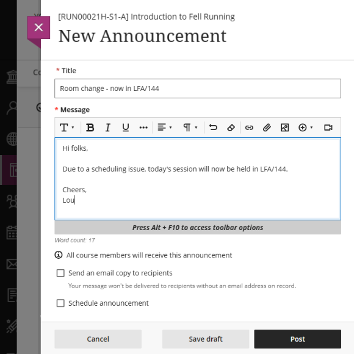
2. At the **top right corner** of the Course Announcement page, click the **plus icon** to create an announcement.

    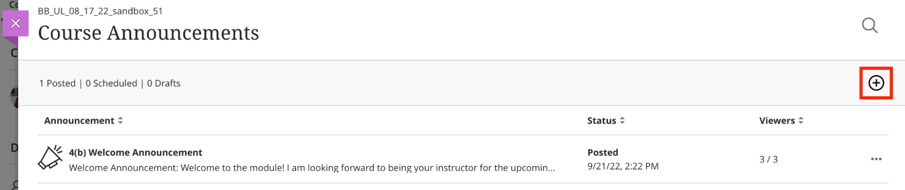
3. On the **New Announcement** page, enter **a descriptive title** and **information** you want students to see as the announcement. Optionally, use the toolbar in the **message editor** to format text, embed multimedia, and attach files. You can also choose your recipients by clicking the **down arrow**.

    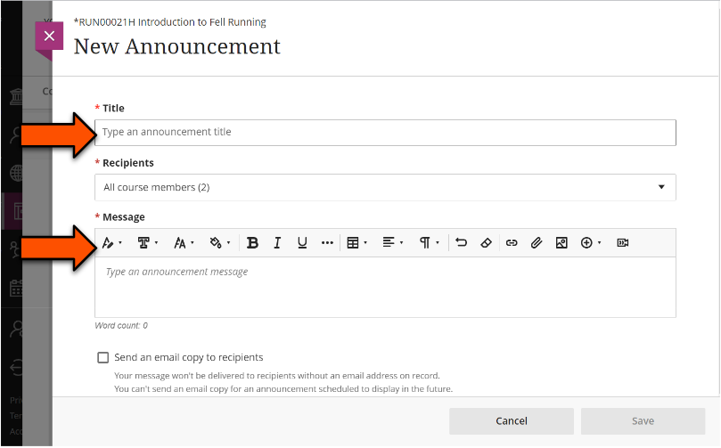
4. You can use the **Send an email copy to recipients** for critical announcements (e.g. changes of exam schedule). Students will receive emails at the address associated with their VLE account, even if they don’t log into the course.

    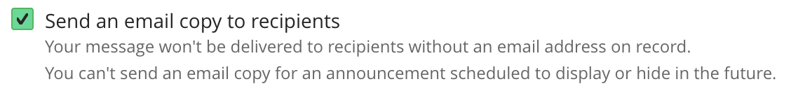

!!! Warning

     This feature only works when you first create the announcement. If you edit the announcement after saving and check this option, the email will not be sent.

5. Use the **Schedule Announcement > Show on/Hide on dates** if you want the announcement to be visible for a specific time period.

    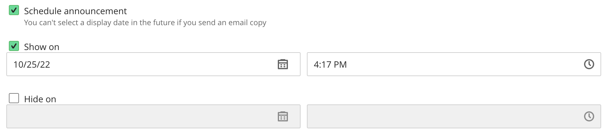
6. Click **Save**. Your announcement is saved as a draft on your Course Announcements page.

    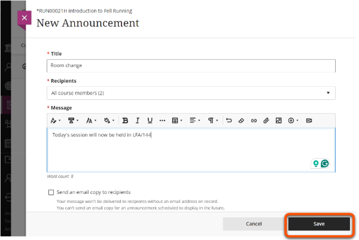
7. To post your announcement immediately, select **Post Now**. If you scheduled your announcement to show on a future date, Ultra will automatically post the announcement at the scheduled time.

    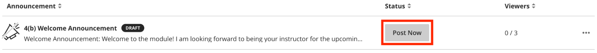

#### **Edit, copy or delete an announcement**

1. Find the announcement you want to edit, copy or delete. On the right, click the **three dots > Edit/Copy/Delete.**

    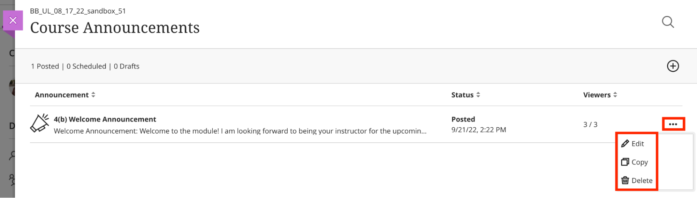

!!! Warning

    If you post an announcement and forget to choose the email copy check box, you’ll need to create a new announcement. If you edit the announcement and select an email copy and post it again, the email will not be sent.

#### **What do students see?**

* **Pop-up window**

    New and active course announcements appear on **a pop-up window** the first time students enter the course. Students need to close the window before they can view course content. After students close the window, it won’t appear again. If you post new announcements, the window appears again with only the new announcements.

    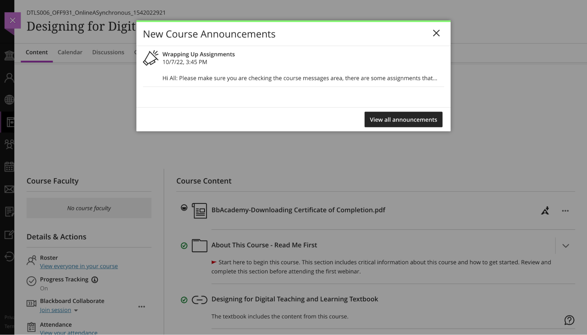

* **Activity stream**

    Active announcements also appear in the **Today and Recent sections** of the activity stream. Most announcements disappear from the activity stream when students view them within their courses. If you schedule an announcement, it also appears in the activity stream at the scheduled time.

    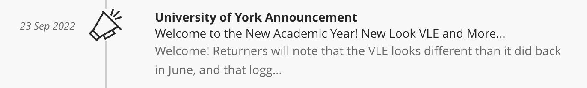

* **Course content page**

    On the Course Content page, in the Details & Actions panel, students can select **View archive** to read past, active announcements. They may also click the **search icon** and type keywords to locate a specific announcement.

    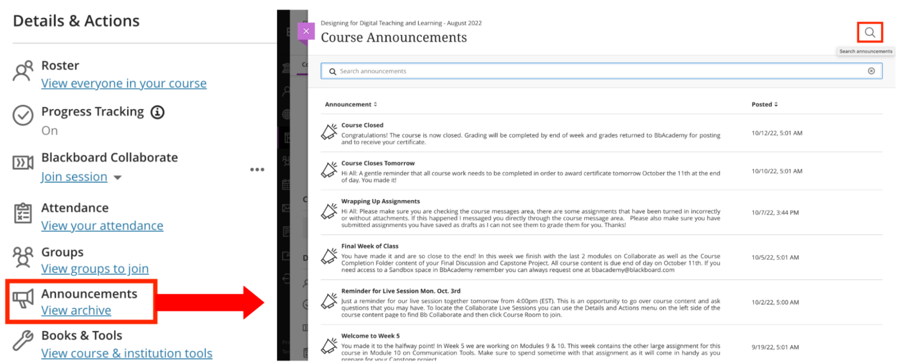

* **Email**

    In the email, embedded content appears as **links**. Students can select the links to view the announcement.

    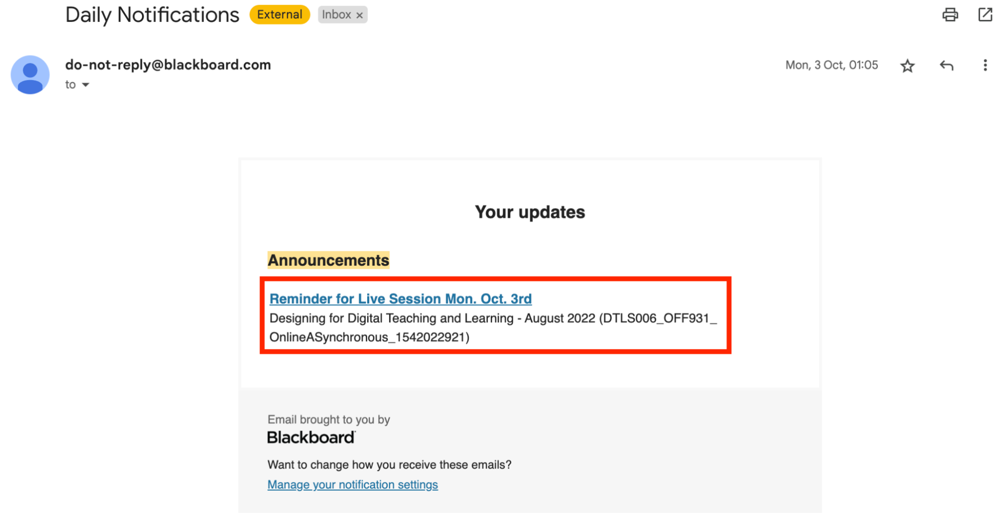

## Further Help
* [Blackboard Help: Announcements](https://help.blackboard.com/Learn/Instructor/Ultra/Interact/Announcements)