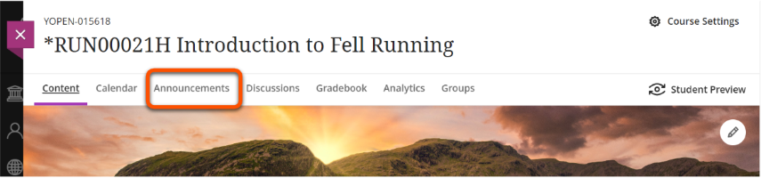
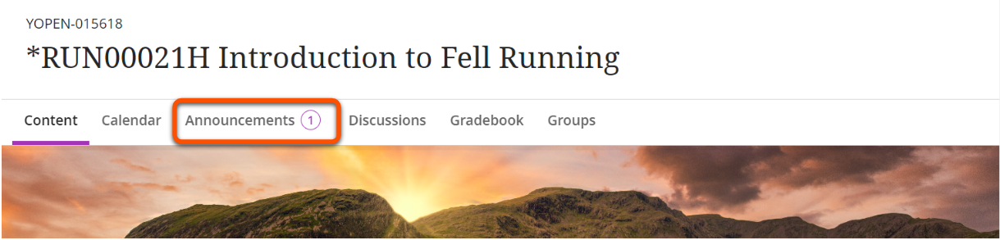

---
tags:
    - Communication
    - Ultra
---

# Announcements

!!! Summary

    Announcements are a one-way communication channel for urgent, time-sensitive or important updates sent to all users.

!!! principle "Relevant [VLE site design principles](../ultra/site-design-principles.md)"

    - 1.3 Essential: Provide module staff details and communication expectations.

## Overview

Use Announcements to send urgent, time-sensitive or important updates to **all users** on the site. These can be scheduled in advance.

Announcements are useful for information such as:

- urgent updates, eg. room change 
- reminders of assessment due dates or tasks
- 'Welcome to the course'

Good Announcements practice:

- Keep Announcements concise and to the point.
- Don't overuse them - if students receive many Announcements they may not read them.
- Include how you'll use Announcements in your communication expectations.

!!! Warning

    Don't use Announcements as the only way to provide module content or assessment instructions - you must include these materials in the site itself.

Announcements are sent to all enrolled users (including staff). To send targeted communications to specific users or groups, use [Messages](../ultra/messages.md) instead.

## Create an announcement

1. Select **Announcements** in the top navigation menu.
  
2. At the **top right corner** of the Course Announcement page, click the **plus icon** to create an announcement.
  
3. On the **New Announcement** page, enter a descriptive title and the message text of your announcement. You can use the toolbar to format text, embed multimedia, and attach files (but remember that any module content included must also be added to the site itself).
4. Optional features: **Send an email copy** (See [What emails do announcements generate?](../ultra/announcements.md/#what-emails-do-announcements-generate) below for more details), or **Schedule annoucement** to automatically post later. [Note: a future update will allow both options to be chosen]
5. Click **Post** to send immediately, or  **Save draft** to review later via the Announcments panel.
  

## Edit, copy or delete an announcement

1. Select **Announcements** in the top navigation menu.
 
2. Find the announcement you want to edit, copy or delete. On the right, click the **three dots** > **Edit/Copy/Delete.**
 
3. If editing, follow steps 3-5 above to make your edits.

## What emails do announcements generate?
The Announcement tool on Ultra VLE sites can email out the announcement in several different ways to different users, depending on a number of factors. See [our summary guidance on Announcements Emails](https://docs.google.com/document/d/1FAmb1tOh7zPL930c7f3_kWBYCCtXXIqTpKx4e3K57KA/edit?usp=sharing) for details, and key recommendations/ tips for tasks such as: 

- sending emails for urgent announcements that all enrolled users must receive as soon as possible.
- sending emails for out future-scheduled announcements.

## What do students see?

* **Within site: pop-up window**

    New and active course announcements appear on **a pop-up window** the first time students enter the course. Students need to close the window before they can view course content. After students close the window, it won’t appear again. If you post new announcements, the window appears again with only the new announcements.

    

* **Within site: Announcements page**

    The number of unread Announcements is shown in the top navigation bar:
    

    If students select **Announcements** in the top navigation menu they can view (and search) all posted announcements for the module.
    

* **Activity stream**

    Active announcements also appear in the **Today and Recent sections** of the activity stream. Most announcements disappear from the activity stream when students view them within their courses. If you schedule an announcement, it also appears in the activity stream at the scheduled time. Note that students can opt-out of notifications in the Activity Stream.

    

* **Email**

    If selected, users will receive the announcement by email. What users see in an emailed announcement can vary. See [our summary guidance on Announcements Emails](https://docs.google.com/document/d/1FAmb1tOh7zPL930c7f3_kWBYCCtXXIqTpKx4e3K57KA/edit?usp=sharing) for details.