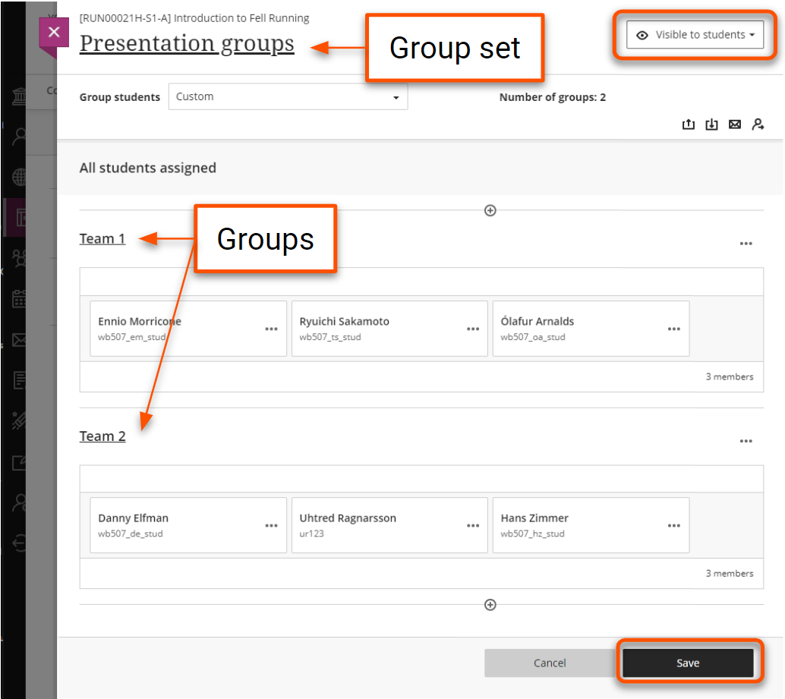
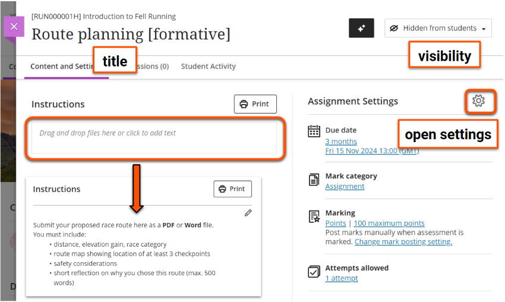
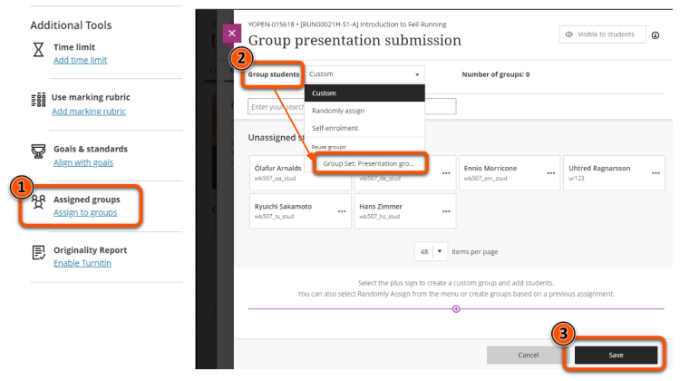
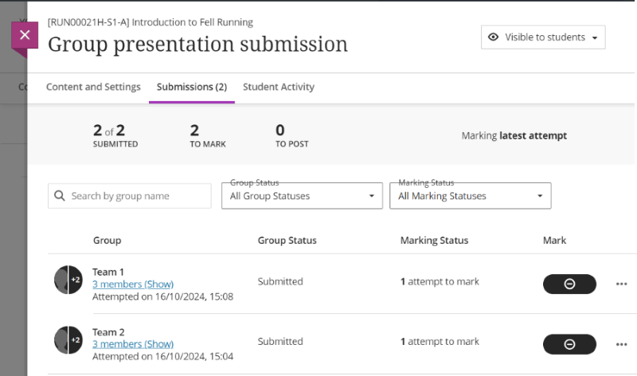
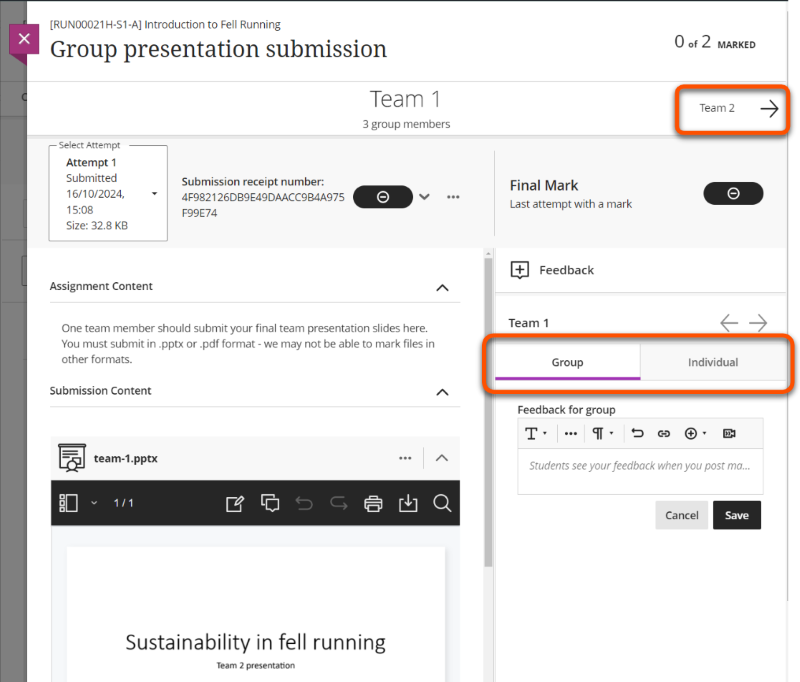

---
tags:
    - Assessment
    - Communication
    - Ultra
---

# Assignment: non-anonymous group assessment

!!! Summary 

    Assignment can be used with Course Groups to allow a student to transparently make a submission on behalf of the whole group, and for marks and feedback to be released to all group members.

    This guide covers using Assignment for non-anonymous formative and summative group assessments, and is aimed at **Administrators** and **Teaching staff**.

## When to use group Assignment

Possible uses of Assignment for group assessment include:

- written assignments: submit .docx or .pdf files etc.
- presentations (delivered live or recorded): submit slides and/or video file
- project work: can submit a range of file types, or a link to an external site or repository

!!! Warning

    Ultra Assignments don't yet support anonymous marking for group submissions, so can only be used for **formative** or **non-anonymous summative** assessments.
    
    Turnitin Feedback Studio does not support group assessment.

## Workflow

How to create, configure and mark group Assignments.

### 1. Set up Course Groups

Create (or check) the Course Groups:

1. Click the **Groups** tab in the top navigation bar.
2. Set up the groups; you need a Group set (eg. Presentation groups) containing all assessment groups (Team 1, Team 2 etc.).
3. Assign students to groups manually or via CSV file.
4. Make the group set **Visible to students**; ths is required to use it to set up an Assignment for group submissions.
5. Click **Save**.

For more detail, see our guide to [Course Groups](../ultra/course-groups.md).

### 2. Create the Assignment

1. In the **Assessment section**, hover where you want to add the Assignment and click the **purple plus icon**.
2. Select **Assignment**.
3. Add a **clear, descriptive title** (eg. Group presentation: slides submission).
4. Add the assessment **Instructions**, either by adding text directly in the box or by uploading a file. These will only show once students open the Assignment.

!!! Warning

    Leave the Assignment as **Hidden from students** until you are ready to release the submission point.

### 3. General settings for group Assignments

The Assignment Settings panel gives quick access to key settings: Due date, Mark category, Marking, Attempts allowed, Originality Report. Click the **cog icon** to access the full settings options.

Appropriate settings will depend on your particular assessment, but here are our general recommended settings for group assessments:

=== "Formative"

    - **Details & Information**
        - set a *Due date* and set a time within core working hours so students can access technical support if needed, **or** tick *No due date*
        - leave all other options unticked
    - **Formative Tools**
        - tick *Formative assessment*
        - leave *Display formative label to students* ticked
    - **Marking & Submissions**
        - *Mark category*: in most cases, leave this as Assignment, but you can change to another option (eg. Presentation). This determines the icon shown on the item in the Course Content area and can be used to filter the Gradebook.
        - *Attempts allowed*: set to Unlimited
        - *Mark using*: leave as Points or change to Percentage or a qualitative marking schema (eg. Complete/Incomplete)
        - *Maximum points*: leave as 100 or change to another amount. For formative work, that is often '1' to show the work is marked.
        - *Anonymous marking: can't be used with group submissions
        - *Evaluation options*: can't be used with group submissions
        - *Assessment mark*: in most cases, leave *Post marks automatically* unticked to release marks manually. If this is ticked, marks and feedback are released to students immediately when a mark is entered for a submission; this could be useful to streamline workflow for large cohorts with lots of markers.
    - **Assessment Security**: leave unticked
    - **Additional Tools**
        - *Time limit*: can't be used with group submissions
        - *Use marking rubric*: if desired, attach a marking rubric to streamlime marking and feedback
        - *Goals & standards*: leave unticked, not used at UoY
        - *Assigned groups*: see [Assign to Groups section](#4-assign-to-groups) below
        - *Originality Report*: can't be used with group submissions
    - **Description**: if desired, enter a description to show on the item in the Course Content area (ie. students can see this before they open the Assignment).

    Click **Save** when finished.

=== "Summative"

    - **Details & Information**
        - set a *Due date* and set a time within core working hours so students can access technical support if needed
        - leave all other options unticked
    - **Formative Tools**
        - leave unticked
    - **Marking & Submissions**
        - *Mark category*: in most cases, leave this as Assignment, but you can change to another option (eg. Presentation). This determines the icon shown on the item in the Course Content area and can be used to filter the Gradebook.
        - *Attempts allowed*: in most cases, change to Unlimited to avoid administrative work if students wish to supersede their most recent submission but have no more attempts left.
        - *Mark using*: leave as Points or change to Percentage or a qualitative marking schema (eg. Complete/Incomplete)
        - *Maximum points*: most likley leave as the default 100
        - *Anonymous marking: can't be used with group submissions
        - *Evaluation options*: can't be used with group submissions
        - *Assessment mark*: leave *Post marks automatically* unticked to release marks manually once the marking process is complete.
    - **Assessment Security**: leave unticked
    - **Additional Tools**
        - *Time limit*: can't be used with group submissions
        - *Use marking rubric*: if desired, attach a marking rubric to streamlime marking and feedback
        - *Goals & standards*: not used at UoY
        - *Assigned groups*: see [Assign to Groups section](#4-assign-to-groups) below
        - *Originality Report*: can't be used with group submissions
    - **Description**: if desired, enter a description to show on the item in the Course Content area (ie. students can see this before they open the Assignment)

    Click **Save** when finished.

Please contact us if you would like advice on selecting appropriate settings for your assessment.

### 4. Assign to Groups

!!! Tip 

    If you haven't set up your groups and made them visible to students yet, save your Assignment and follow the instructions in the [Set up Course Groups section](#1-set-up-course-groups) above. Once finished, navigate back to the Assigment and click the **cog icon** to open the settings again.

1. Under **Additional Tools** in the assignment settings, click **Assign to groups**.
2. Click **Group students**, then select the relevant Group Set under **Reuse groups**.
3. Check the groups are as expected and click **Save** to return to the general settings.
 
4. **Assigned groups** will now show the number of groups set up for the assessment.
5. Click **Save**.

### 5. Make visible to students

When you are ready to release the Assignment to students, set it to be **Visible to students**. For instructions, see our [guide to content visibility](../ultra/content-visibility.md).

!!! Warning

    Once a submission is made, you can't change/delete the Group Set, and may not be able to edit other settings.

### 6. Mark Group Assignments

The marking workflow is mostly the same as [marking individual Assignment submissions](../ultra/assignment-marking.md), except:

**Assignment Submissions tab** lists groups instead of individual students.

**Marking interface**

- The student panel does not appear. To move between groups, use the arrows above the main marking area.
- Feedback can be given to the group as a whole and to individual students.

