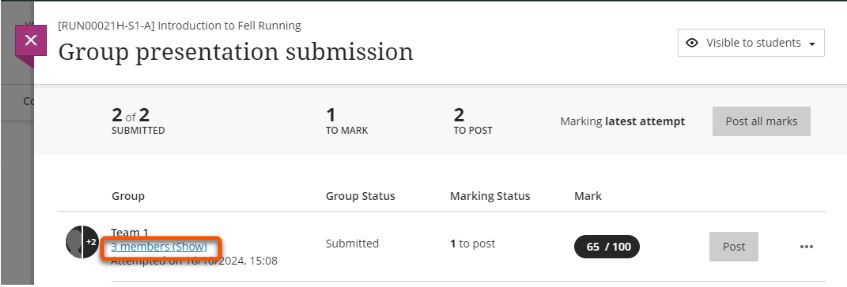
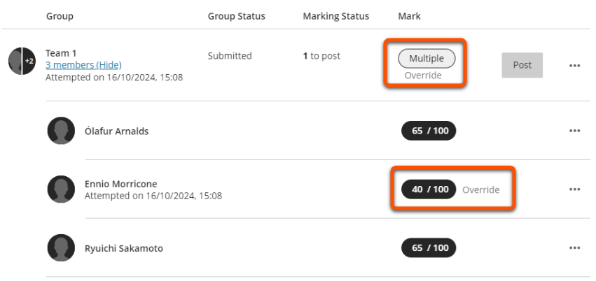

---
tags:
    - Assessment
    - Communication
    - Ultra
---

# Assignment: non-anonymous group assessment

!!! Summary 

    Assignment can be used with Course Groups to allow a student to transparently make a submission on behalf of the whole group, and for marks and feedback to be released to all group members.

    This guide covers using Assignment for non-anonymous formative and summative group assessments, and is aimed at **Administrators** and **Teaching staff**.

## When to use group Assignment

Possible uses of Assignment for group assessment include:

- written assignments: submit .docx or .pdf files etc.
- presentations (delivered live or recorded): submit slides and/or video file
- project work: can submit a range of file types, or a link to an external site or repository

!!! Warning

    Ultra Assignments don't yet support anonymous group submissions, so can only be used for **formative** or **non-anonymous summative** assessments.
    
    Turnitin Feedback Studio does not support group assessment.

## Setting up a group Assignment

How to create and configure group Assignments.

### 1. Set up Course Groups

Create (or check) the Course Groups:

1. Click the **Groups** tab in the top navigation bar.
2. Set up the groups: you need a Group set (eg. Presentation groups) containing all assessment groups (Team 1, Team 2 etc.).
3. Assign students to groups manually or via CSV file.
4. Make the group set **Visible to students** so it can be used to set up an Assignment for group submissions.
5. Click **Save**.

For more detail, see our guide to [Course Groups](../ultra/course-groups.md).

### 2. Create the Assignment

1. In the **Assessment section**, hover where you want to add the Assignment and click the **purple plus icon**.
2. Select **Assignment**.
3. Add a **clear, descriptive title** (eg. Group presentation: slides submission).
4. Add the assessment **Instructions**, either by adding text directly in the box or by uploading a file. These will only show once students open the Assignment.
5. When ready for students to access the Assignment, set the submission point to [Visible to students](../ultra/content-visibility.md#showhide-a-single-item).

### 3. Adjust general settings

The Assignment Settings panel gives quick access to key settings: Due date, Mark category, Marking, Attempts allowed, Originality Report. Click the **cog icon** to access the full settings options.

Appropriate settings will depend on your particular assessment, but here are our general recommended settings for group assessments:

??? Abstract "Recommended settings: Formative"

    - **Details & Information**
        - set a *Due date* (this must be within working hours) or tick *No due date*
        - leave all other options unticked
    - **Formative Tools**
        - tick *Formative assessment*
        - leave *Display formative label to students* ticked
    - **Marking & Submissions**
        - *Mark category*: in most cases, leave this as Assignment, but you can change to another option (eg. Presentation). This determines the icon shown on the item in the Course Content area and can be used to filter the Gradebook.
        - *Attempts allowed*: set to Unlimited
        - *Attempts to mark*: set to Last attempt
        - *Mark using*: leave as Points or change to Percentage or a qualitative marking schema (eg. Complete/Incomplete)
        - *Maximum points*: leave as 100 or change to another amount. For formative work, that is often '1' to show the work is marked.
        - *Anonymous marking*: can't be used with group submissions
        - *Evaluation options*: can't be used with group submissions
        - *Assessment mark*: in most cases, leave *Post marks automatically* unticked to release marks manually. If this is ticked, marks and feedback are released to students immediately when a mark is entered for a submission; this could be useful to streamline workflow for large cohorts with lots of markers.
    - **Assessment Security**: leave unticked
    - **Additional Tools**
        - *Time limit*: can't be used with group submissions
        - *Use marking rubric*: if desired, attach a marking rubric to streamlime marking and feedback
        - *Goals & standards*: leave unticked, not used at UoY
        - *Assigned groups*: see [Assign to Groups section](#4-assign-to-groups) below
        - *Originality Report*: can't be used with group submissions
    - **Description**: if desired, enter a description to show on the item in the Course Content area (ie. students can see this before they open the Assignment).

    Click **Save** when finished.

??? Abstract "Recommended settings: Summative"

    - **Details & Information**
        - set a *Due date* (this must be within working hours)
        - leave all other options unticked
    - **Formative Tools**
        - leave unticked
    - **Marking & Submissions**
        - *Mark category*: in most cases, leave this as Assignment, but you can change to another option (eg. Presentation). This determines the icon shown on the item in the Course Content area and can be used to filter the Gradebook.
        - *Attempts allowed*: set to Unlimited
        - *Attempts to mark*: set to Last attempt
        - *Mark using*: leave as Points or change to Percentage or a qualitative marking schema (eg. Pass/Fail)
        - *Maximum points*: most likely leave as the default 100
        - *Anonymous marking*: can't be used with group submissions
        - *Evaluation options*: peer review can't be used with group submissions
        - *Assessment mark*: leave *Post marks automatically* unticked to release marks manually once the marking process is complete.
    - **Assessment Security**: leave unticked
    - **Additional Tools**
        - *Time limit*: can't be used with group submissions
        - *Use marking rubric*: if desired, attach a marking rubric to streamlime marking and feedback
        - *Goals & standards*: not used at UoY
        - *Assigned groups*: see [Assign to Groups section](#4-assign-to-groups) below
        - *Originality Report*: can't be used with group submissions
    - **Description**: if desired, enter a description to show on the item in the Course Content area (ie. students can see this before they open the Assignment)

    Click **Save** when finished.

Please contact us if you would like advice on selecting appropriate settings for your assessment.

### 4. Assign to Groups

!!! Tip 

    If you haven't set up your groups and made them visible to students yet, save your Assignment and follow the instructions in the [Set up Course Groups section](#1-set-up-course-groups) above.

1. Under **Additional Tools** in the assignment settings, click **Assign to groups**.
2. Click **Group students**, then select the relevant Group Set under **Reuse groups**.
3. Check the groups are as expected and click **Save** to return to the general settings.
 
4. **Assigned groups** will now show the number of groups set up for the assessment.
5. Click **Save**.

### 5. Make visible to students

When you are ready to release the Assignment to students, set it to be **Visible to students**. For instructions, see our [guide to content visibility](../ultra/content-visibility.md).

!!! Tip

    Once a submission is made, you can't change or delete the Group Set, and may not be able to edit other settings.

For student Assignment submission instructions, see our [student guides to submitting assignments on the VLE](https://subjectguides.york.ac.uk/learning-tech/vle-assignments).

## Marking group Assignments

For details of the general Assignment marking workflow, see our [marking Assignments guide](../ultra/assignment-marking.md). This section covers additional guidance specific to marking group Assignments.

**Assignment Submissions tab** lists groups instead of individual students.

**Marking interface**

- The student panel does not appear for group Assignments. To move between groups, use the arrows above the main marking area or close the marking interface and select another group.
- Feedback can be given to the whole group and to individual students. The active tab is highlighted and the name of the group or student shown above the feedback box.
- Marks entered in the marking interface are overall grades automatically given to each group member.

**Giving different marks to individual students**

!!! Tip

    Setting or updating an overall group mark will override individual marks already given, so enter group marks before overriding individual marks.

If you need to award different marks for individual group members (eg. one student did not engage), this can't be done through the marking interface. Instead:

1. Enter any overall group mark through the marking interface.
2. Open the Assignment's Submission tab.
3. Locate the relevant group and click **X members (Show)**.
 
4. Locate the relevant student, click the **mark pill** and enter/update the individual mark.

Adjusted individual marks and the overall group mark (now showing *Multiple*) are labelled as *Override* marks.

Additional notes on individual marking behaviour: 

- Individual marks can only be given for the final mark, not for individual attempts (this is only relevant if you mark more than one attempt).
- You can also update individual marks on the Gradebook Marks tab, but this does not show student groupings.
- If individual marks are entered for each student without entering an overall group mark, the attempt will still show as Needs Marking.

## Testing group Assignment workflows

For student Assignment submission instructions, see our [student guides to submitting assignments on the VLE](https://subjectguides.york.ac.uk/learning-tech/vle-assignments).

!!! Warning

   Practice any Assignment workflow in your personal Ultra sandpit site to avoid:

    - 'locking in' live Assignment settings after a submission is made.
    - allowing students early access to the Assignment or sending them unnecessary or confusing notifications.

If you haven't already created your Student preview user in this site, do that first:

1. Click **Student Preview** in the top right, then click **Start Preview**.
2. Click **Exit** in the top right to close Student Preview.
3. When prompted, click **Save** to retain the preview user.

You can then use Student Preview to test the group Assignment and marking workflow:

1. Create a **group set** and assign your Student preview user to a group. Make the group set visible to students.
2. Create an **Assignment** with the same settings as your 'live' Assignment or use the [Copy Content tool](../ultra/copy-content.md) to copy an Assignment from your module site. Assign it to groups and make it visible to students.
4. Click **Student Preview** in the top right, then click **Start Preview**.
5. Open the Assignment. Check that the group shows as expected, then click **Start attempt 1** (or **View instructions**).
6. To make a submission, drag and drop to upload a file, set the file display name, and then **Submit**.
7. Click **Exit** in the top right to close Student Preview. When prompted, click **Save** to retain your submission.
8. Back in editing mode, open and mark the submission as described in this guide.