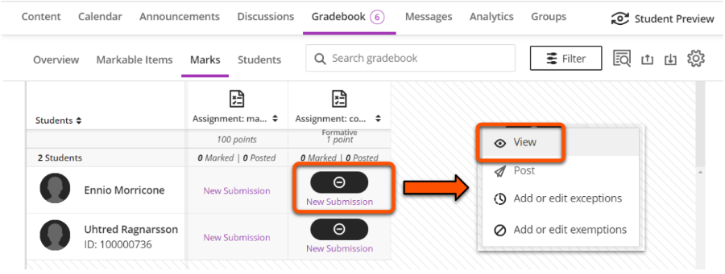
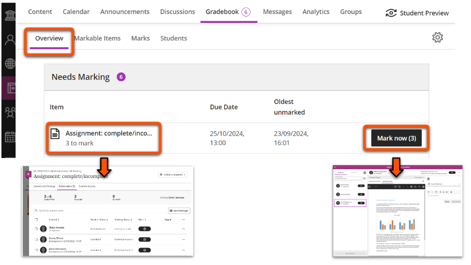
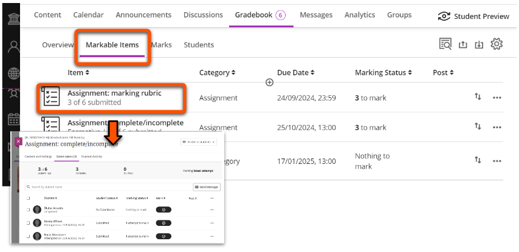

---
tags:
    - Assessment
    - Ultra
---

# Assignment: marking workflow

!!! Summary

    Assignment is the built-in assignment submission and marking tool in the Learn Ultra VLE. It is mostly used for formative, non-anonymous summative and group assignments.

    This guide gives a suggested marking workflow for formative or non-anonymous Assignment submissions. It is primarily aimed at **Teaching staff**.

Assessment is most easily managed through the Gradebook tab. A counter displays when there are submissions that need marking. 

## 1. Open a submission

There are various ways to open a submission for marking. All have the same outcome, so use whichever you prefer.

!!! Tip 

    If your Assignment has marking groups set up (eg. for seminar groups), use the [**Gradebook Marks tab**](#marks-tab) to filter for your assigned group.

### Via the Assignment submission point

**Use for**: direct access to an Assignment's Submissions tab

Open an Assignment, select the **Submissions** tab and then click on a student's row to open their submission.

This also shows the numbers of assignments submitted, to mark and to post, and the date(s) that students made their submission(s). Grades also display here once work is marked.

### Via the Gradebook

Submissions can also be accessed through the various Gradebook tabs:

=== "Marks tab"

    **Use for**: filtering for a specific marking group or assessment, or for quick access to a particular submission. 
    
    !!! Note
        
        This tab may not be available on very small screens (eg. a mobile phone). 

    Click **Gradebook**, then select the **Marks** tab. This displays a grid of students (rows) and assessment items (columns). 

    To filter for marking groups, click **Filter**. Open the **Groups** dropdown, select your marking group (and/or apply other filters) and click **Apply**. 

    

    To open a submission, click the relevant student/assessment cell and select **View**.

    

=== "Overview tab"

    **Use for**: quick access to Assignments with submissions that *Needs Marking*.

    Click **Gradebook**, then select the **Overview** tab. Under **Needs Marking**, find the relevant Assignment and click:

    - the Assignment name to open its [Submissions tab](#submission-point) with the *Needs Marking* filter applied.
    - the **Mark now** button to open the marking interface with the *Needs Marking* filter applied.

    

=== "Markable items tab"

    **Use for**: a summary of marking status for all assessment items.

    Click **Gradebook**, then select the **Markable items** tab. This displays all assessment items and the number still to mark. Click the relevant Assignment to open its [Submissions tab](#submission-point).

    

## 2. Review and annotate

Use the marking interface to review the submitted file and make annotations or comments (if needed). The interface contains:

- an expandable students panel (on the left)
- main section with the submission to review and annotation menu bar
- an expandable feedback panel (one the right)

!!! Tip
    
    Options in the annotation menu bar may be collapsed depending on the size of your screen and whether the Students and Feedback panels are open.

*Navigate the submission file* using icons on the left of the menu bar: view thumbnails, pan and zoom.

*Annotate submissions* using icons in the centre of the menu bar:

1. **Drawing**: draw or write freehand on the file. Especially useful if marking on a tablet.
2. **Image**: add an image or stamp on the file.
3. **Comment**: add a sticky note style-comment in a panel next to the file.
4. **Text box**: type text on the file.
5. **Lines**: draw lines, arrows and other shapes on the file.
6. **Select text**: format text or add comments for specific text.

??? Info "Open for more detail on using annotation options"

    **1. Draw/write**

    - Click the **Drawing icon** then draw or write on the file as desired.
    - Change the colour, thickness and other settings in the menu that appears under the annotation menu.
    - To change between drawing, brush and eraser, click the downwards chevron next to the Drawing icon.

    

    **2. Image/file**

    - Click the **image icon** and select an image or file to upload.
    - Resize or move the image as desired. The image will be overlaid over the submission.
    - Delete, add a note change opacity or rotate using the menu that appears under the annotation menu.

    

    **3. Comment**

    - Click the **Comment icon**, click the desired location and add your comment text and save. This will show your comment with your name and the date/time the comment was made.
    - To edit or delete a comment, click it then the three dots and select the relevant option. 
    - To add another comment in the same chain, click on the comment and enter the new comment.
    - To make comments anonymously, click the Anonymous icon before saving or click an existing comment, then the three dots icon and select Anonymous.

    

    **4. Text box**

    - Click the **Text icon** then click on the file in the location to add text.
    - Change the colour, font and other settings in the menu that appears under the annotation menu.

    

    **5. Line/shape**

    - Click the **Line icon** then click on the file in the location to add it.
    - Change the colour, thickness and other settings in the menu that appears under the annotation menu.
    - To change the shape, click the downwards chevron next to the Line icon.

    

    **6. Select text**

    Select submission text to open a new menu to:
        
    - highlight, strikethrough and underline text.
    - add comments relating to specific text.

    

*Search and export* the file with options on the right of the menu bar:

- **Print** or **download** the annotated file in PDF format. Use the icon above the menu bar to download the original file.
- **Search** the file for specific content.

<!-- Video demonstration:
<iframe width="560" height="315" src="https://www.youtube.com/embed/LIald_8FqMg?si=urQ9mwX09ZdnJF-X" title="YouTube video player" frameborder="0" allow="accelerometer; autoplay; clipboard-write; encrypted-media; gyroscope; picture-in-picture; web-share" referrerpolicy="strict-origin-when-cross-origin" allowfullscreen></iframe>
[Annotate in Blackboard Learn (YouTube)](https://youtu.be/LIald_8FqMg?si=1CfLkGcUxnLQaGXK) -->

## 3. Enter feedback and marks

Open the collapsible panel on the right side to enter feedback and access a marking rubric.

=== "Overall feedback"

    

    

    Overall feedback can be given for all submissions.

    You can enter feedback in multiple ways: 

    - enter text
    - upload a file
    - [record audio or video feedback](https://help.blackboard.com/Learn/Instructor/Ultra/Interact/Audio_Video_Recording#ultra_feedback)
    

    
    

    !!! Warning
        Feedback is not automatically saved, so you must click **Save Changes** before leaving the submission.

=== "Marks: manual entry"

    For most Assignments, you will manually enter a mark. In this case, the Overall Feedback box is the only content in the right tab.

    Students can be shown a qualitative grade using a marking schema (eg. complete/incomplete, or A/B/C/D), but you must still enter a numerical mark. To do this:

    1. Click the **mark pill** in the top right.
    2. **Enter a mark** equal to or less than the maximum score shown.
    3. If marks are set to *Post automatically*, the mark and feedback will be immediately made available to students. If set to [*Post manually*](#5-manually-post-marks), the mark is saved for posting later.

    

=== "Marks: Marking Rubric"

    Assignments may use a Marking Rubric to efficiently give feedback and mark based on specific criteria. If used, this appears under the Overall Feedback box.

    To mark the work, **select the relevant mark level for each criterion**. The total mark is automatically calculated from your selections.

    There are also options to:

    1. toggle criteria descriptions on/off.
    2. expand or collapse each criterion.
    3. add criterion-specific feedback.

    

## 4. Open another submission

In the **marking interface**, choose another submission in the Student list in the left Student panel, or use the *Previous student*/*Next student* arrows above the submission. This can be filtered to only show work that needs marking.

!!! Note

    The marking interface does not filter by group. If you are using a marking group, close the interface and select another student from the filtered Gradebook Marks tab.

You can also select another submission using any of the [methods to open a submission](#1-open-a-submission) described above.

## 5. Manually post marks

!!! Note

    **Post marks** is to release marks and feedback to students. They will receive a notification that the marks are available.

    Your department may have guidelines on who is to post marks and when.

An Assignment can be set to automatically post marks after marking, or to manually post marks. If a marking rubric is used, marks must be posted manually.

=== "Post indvidual marks"

    There are various ways to post marks for a specific submission:

    - In the **marking interface**, select the three dots icon next to the mark pill and select **Post mark**.
     
    - In the **submissions list**, click the **Post 1 mark** button in the relevant student's row (the value shows the number of attempts marked).
     
    - In the **Gradebook Marks tab**, click the student/assessment cell and click **Post**.
     

=== "Post marks for a cohort"

    There are various ways to post marks for all submissions at once:

    - In the **marking interface**, click the **Post marks** button at the bottom of the left Students panel.
     
    - In the **submissions list**, click the **Post all marks** button in the summary bar
     
    - In the **Gradebook Marks tab**, click the Assignment column header and click **Post**.
     

## Practice the marking workflow

!!! Warning

    Always practice any marking workflow in your personal Ultra sandpit site. This is to avoid:
    
    - 'locking in' live Assignment settings after a submission is made.
    - potentially sending students unnecessary or confusing notifications.

Use the Student Preview function to submit a file which you can then mark:

1. Make sure you are working in your personal Ultra sandpit site.
2. Create an **Assignment** with the same settings as your 'live' Assignment (eg. with or without a rubric, marks posted manually/automatically). 
3. Click **Student Preview** in the top right, then click **Start Preview**.
4. Open the Assignment and click **View Instructions**.
5. Drag and drop to upload a file, set the file display name, and then **Submit**.
5. Click **Exit** in the top right to close Student Preview. When prompted, click **Save** to retain your submission.
6. Back in editing mode, open and mark the submission as described in this guide.