---
tags:
    - Assessment
    - Ultra
---

# Assignment: marking workflow

!!! Summary

    Assignment is the built-in assignment submission and marking tool in the Learn Ultra VLE. It is mostly used for formative, non-anonymous summative and group assignments.

    This guide gives a suggested marking workflow for formative or non-anonymous Assignment submissions. It is primarily aimed at **Teaching staff**.

For student Assignment submission instructions, see our [student guides to submitting assignments on the VLE](https://subjectguides.york.ac.uk/learning-tech/vle-assignments).

## Video demonstrations

Use the video demonstrations here for a quick start on accessing and marking submissions, or for more detail see the in-depth written guidance below.

<iframe width="560" height="315" src="https://www.youtube.com/embed/XGuTT5hnLAY?si=W37HgVuhz36hOaeh" title="YouTube video player" frameborder="0" allow="accelerometer; autoplay; clipboard-write; encrypted-media; gyroscope; picture-in-picture; web-share" referrerpolicy="strict-origin-when-cross-origin" allowfullscreen></iframe>
[Marking Ultra Assignments: accessing submissions [YouTube]](https://www.youtube.com/watch?v=XGuTT5hnLAY)

<iframe width="560" height="315" src="https://www.youtube.com/embed/FdVWquEDRvA?si=o9eVQzxhGrhHBo9F" title="YouTube video player" frameborder="0" allow="accelerometer; autoplay; clipboard-write; encrypted-media; gyroscope; picture-in-picture; web-share" referrerpolicy="strict-origin-when-cross-origin" allowfullscreen></iframe>
[Marking Ultra Assignments: annotations, feedback & marks [YouTube]](https://www.youtube.com/watch?v=FdVWquEDRvA)

## Marking process

### 1. Open a submission

A counter displays on the Gradebook tab when there are submissions that need marking. 

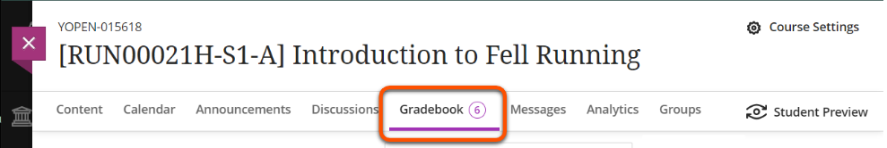

There are various ways to open submissions. Ultimately they all have the same outcome, so you can use whichever you prefer.

!!! Tip 

    If your Assignment has marking groups set up (eg. for seminar groups), you can filter for your assigned group using the **Gradebook Marks tab**.

=== "Submissions tab"

    **Use for**: direct access to an Assignment's Submissions tab

    In the Course Content area, open the **Assignment** then select the **Submissions** tab. Click on a student's row to open their submission.

    This also shows the numbers of submissions made, to mark and to post, and the date(s) that students made their submission(s). Grades also display here once work is marked.

    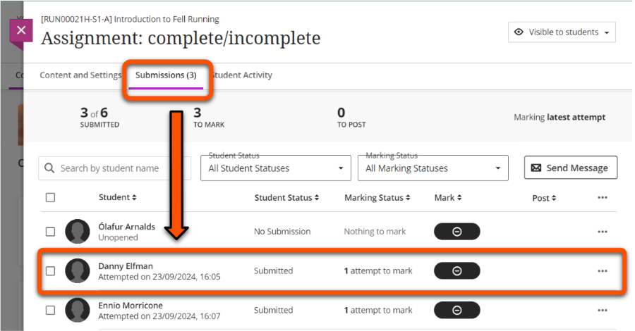

=== "Marks tab"

    **Use for**: filtering for a specific marking group or assessment, or for quick access to a particular submission. 
    
    !!! Note
        
        This tab may not be available on very small screens (eg. a mobile phone). 

    Click **Gradebook**, then select the **Marks** tab. This displays a grid of students (rows) and assessment items (columns). 

    To filter for marking groups, click **Filter**. Open the **Groups** dropdown, select your marking group (and/or apply other filters) and click **Apply**. 

    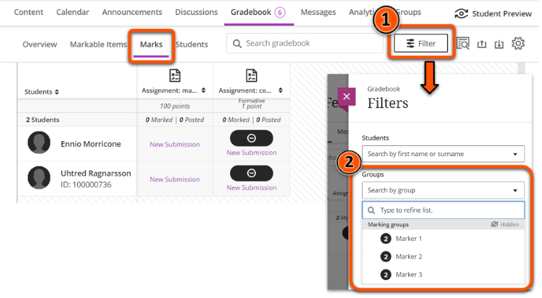

    To open a submission, click the relevant student/assessment cell and select **View**.

    

=== "Overview tab"

    **Use for**: quick access to Assignments with submissions that *Needs Marking*.

    Click **Gradebook**, then select the **Overview** tab. Under **Needs Marking**, find the relevant Assignment and click:

    - the Assignment name to open its Submissions tab with the *Needs Marking* filter applied.
    - the **Mark now** button to go straight to the marking interface with the *Needs Marking* filter applied.

    

=== "Markable items tab"

    **Use for**: a summary of marking status for all assessment items.

    Click **Gradebook**, then select the **Markable items** tab. This displays all assessment items and the number still to mark. Click the relevant Assignment to open its Submissions tab.

    

### 2. Late submissions: check for previous submissions

!!! Tip
    
    University assessment policy is to **mark the last on-time submission**, or to mark the first submission if all submissions are late. The correct attempt to mark may not be the default attempt presented for marking.

Ultra Assignment stores all submissions made by a student. If a students makes multiple submissions, the default should be to present the last submission (attempt) for marking. Depending on when this was submitted, it may or may not be the correct attempt to mark:

- Last attempt is **on time**: mark this attempt.
- Last attempt is **late**: check for previous submissions.
  If there are:
    - no other submissions: mark this attempt.
    - any *on-time* submissions: manually select and mark the last on-time attempt.
    - no on-time submissions, but previous *late* submissions: manually select and mark the first attempt submitted after the deadline.

If this applies to your marking, the sections below give more details on how to do this.

<!-- This means that if there are **multiple attempts and at least one of those is late**, you will need to manually select the relevant attempt to mark. This table gives details:

| Attempts | Submission time            | Policy: attempt to mark   | Interface: mark default attempt  | Late penalty*  |
| -----    | -----                      | -----                     | -----                            | -----          |
| 1        | on time                    | only attempt              | yes                              | no             |
| 2+       | all **on time**            | last attempt              | yes                              | no             |
| 2+       | **on time** and **late**   | last on time attempt      | **no - manually select attempt** | no             |
| 1        | **late**                   | only attempt              | yes                              | yes            |
| 2+       | all **late**               | first late attempt        | **no - manually select attempt** | yes            |

\* Note: late penalties are usually applied by administrators -->

??? info "Identify late submissions"

    Late submissions are identified in numerous locations:

    - *Marking interface*: in an open submission, a Late label is shown with the attempt information. This is shown to the right of or below the student's name, depending on screen size.
     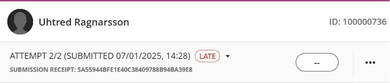
    - *Assignment submission tab*: a student's row shows their total attempts and if any are late, eg. *2 attempts (1 late)*. For late or missing submissions, this text is red and a red circle is shown around the user icon/photograph.
     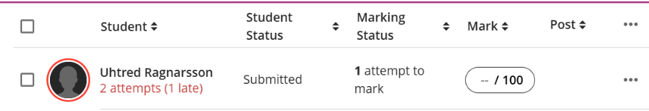

??? info "Manually select an attempt to mark"

    When viewing a submission in the marking interface, you can manually change to a different attempt: 

    1. Click the attempt submission information (where the *Late* label is shown) to open a list of all attempts.
    2. Select the attempt to mark (see table above).
    3. The marking interface will change to the selected attempt. Check the attempt information before you start marking.

    For example, a student submits two attempts; one on time, one late. In this case, you should mark the on time attempt. The marking interface displays the late submission (Attempt 2) by default, so click the attempt information and select the on time submission (Attempt 1) to mark.
    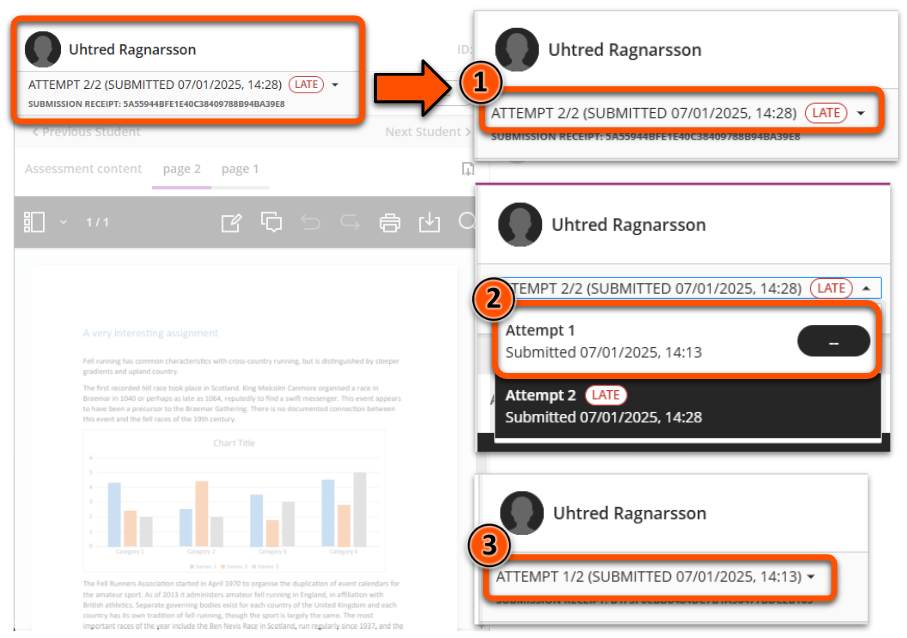

### 3. Review and annotate

Use the marking interface to review the submitted file and make annotations or comments (if needed). The interface contains:

- an expandable students panel (on the left)
- submission details (top bar)
- main section with the submission to review and annotation menu bar
- an expandable feedback panel (on the right)

Options in the annotation menu bar may be collapsed depending on the size of your screen and whether the Students and Feedback panels are open.

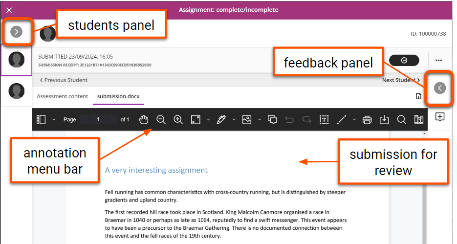

It's possible for students to **upload multiple files in the same submission**, for example uploading each page of a handwritten submission as a separate image. If this has occurred, the files are shown as tabs above the annotation menu, which you can click to view.

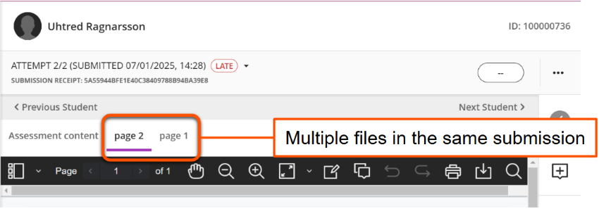

#### Menu bar: navigate

Navigate the submission file using icons on the left of the menu bar: view thumbnails, pan and zoom.

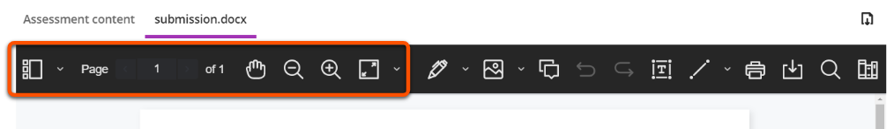

#### Menu bar: comment & annotate

!!! Warning

    Comments are **not automatically saved**. You must save each comment before navigating away from the submission. Unsaved comments can't be retrieved.

Comments can be added at specific points on the submission:

1. Click the **Comment icon** in the menu bar, then click the desired location. Or, select the relevant text then click the **comment icon** in the menu above the text.
2. Enter your comment into the pop-up  box. On a small screen this may appear at the bottom of the window.
3. By default, your name will be shown on the comment. If desired, click the **Anonymous icon** to make the comment anonymously.
4. Click the **Save button** (this may be shown as an **up arrow icon**).
5. To edit, delete or change anonymity of a comment, click the **three dots icon** and select the relevant option. 

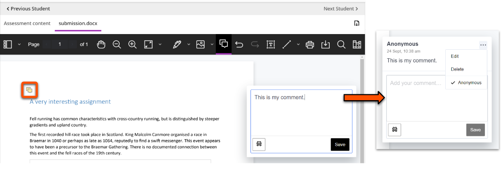

There are also various other annotation options, including drawing, free text and more.

??? Info "More detail on using other annotation options"

    The full annotation options are: 

    1. **Drawing**: draw or write freehand on the file. Especially useful if marking on a tablet.
    2. **Image**: add an image or stamp on the file.
    3. **Comment**: add a sticky note style-comment in a panel next to the file.
    4. **Text box**: type text on the file.
    5. **Lines**: draw lines, arrows and other shapes on the file.
    6. **Select text**: format text or add comments for specific text.
    7. **Content library**: create a bank of reusable comments for common feedback.

    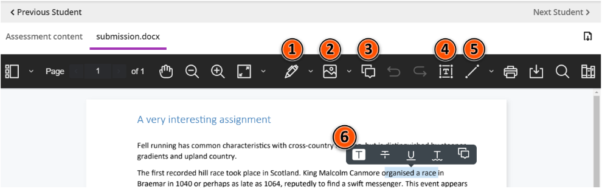

    **1. Draw/write**

    - Click the **Drawing icon** then draw or write on the file as desired.
    - Change the colour, thickness and other settings in the menu that appears under the annotation menu.
    - To change between drawing, brush and eraser, click the downwards chevron next to the Drawing icon.

    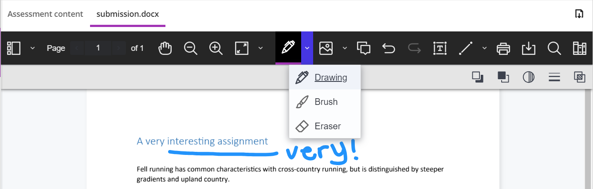

    **2. Image/file**

    - Click the **Image icon** and select an image or file to upload.
    - Resize or move the image as desired. The image will be overlaid over the submission.
    - Delete, add a note change opacity or rotate using the menu that appears under the annotation menu.

    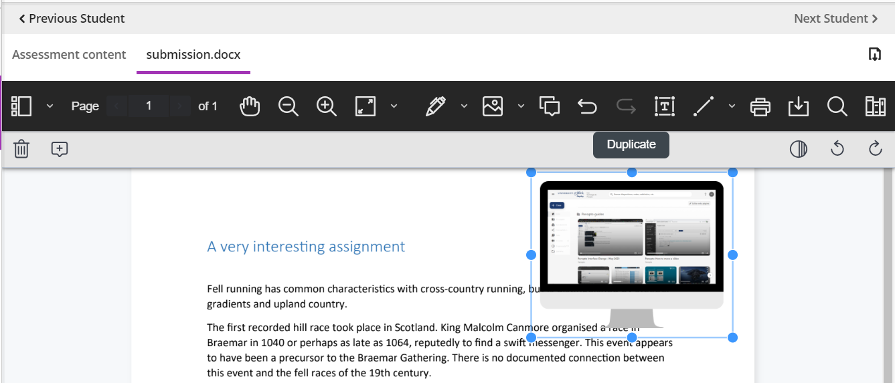

    **3. Comment**

    See section above.

    **4. Text box**

    - Click the **Text icon** then click on the file in the location to add text.
    - Change the colour, font and other settings in the menu that appears under the annotation menu.

    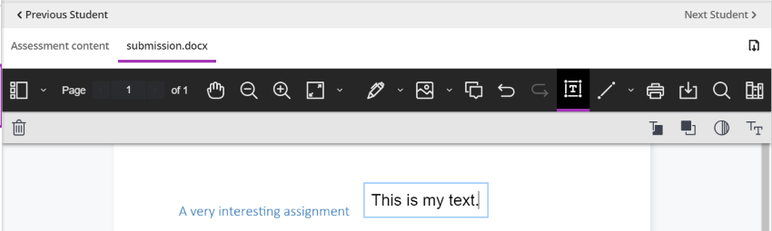

    **5. Line/shape**

    - Click the **Line icon** then click on the file in the location to add it.
    - Change the colour, thickness and other settings in the menu that appears under the annotation menu.
    - To change the shape, click the downwards chevron next to the Line icon.

    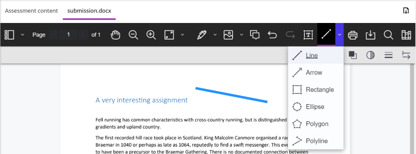

    **6. Select text**

    Select submission text to open a new menu to:
        
    - highlight, strikethrough and underline text.
    - add comments relating to specific text.

    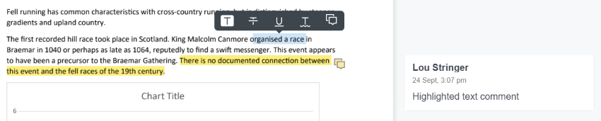

    **7. Content Library**

    To save time, you can add common comments to the library to reuse for different students or for different assignments. Comments you add are specific to you; other markers can't see or use them.

    - Click the **Content Library (books) icon** (may be hidden on small screens).
    - Depending on the size of your screen, you may need to scroll right and/or collapse the Students panel to see the comments panel.
    - To add a new comment to the bank: Click the **plus icon**, enter the comment in the text box, assign a category (optional) and click **Add comment**.
    - To apply the comment as feedback: click the **three dots** icons on the relevant comment and click **Place comment**. Note: the options will disappear and it looks like nothing has happened - this is expected. Click the desired location on the work to add the comment, and follow instructions for *3. Comment* above.

    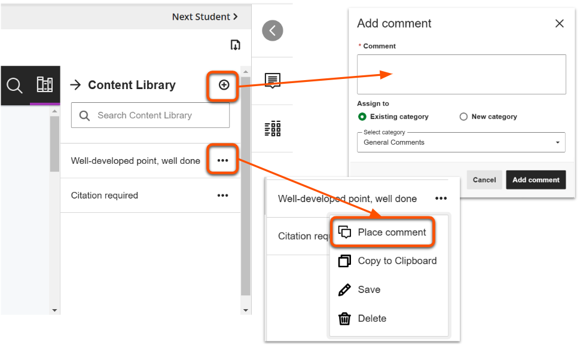

#### Menu bar: search & export

Search and export the file with options on the right of the menu bar:

- **Print** or **download** the annotated file in PDF format. Use the icon above the menu bar to download the original file.
- **Search** the file for specific content.

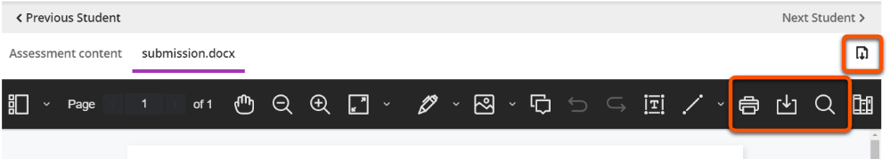

### 4. Enter feedback and marks

Open the collapsible panel on the right side to enter feedback and access a marking rubric.

=== "Overall feedback"

    

    

    Overall feedback can be given for all submissions.

    You can enter feedback in multiple ways: 

    - enter text
    - upload a file
    - record audio or video feedback
    

    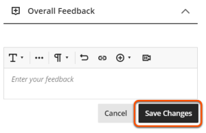
    

    !!! Tip
        Feedback is not automatically saved, so you must click **Save Changes** before leaving the submission.

=== "Marks: manual entry"

    For most Assignments, you will manually enter a mark. In this case, the **Overall Feedback** box is the only content in the right tab.

    If the assignment uses a marking schema to display qualitative grades (eg. complete/incomplete, or A/B/C/D), you must still enter a numerical mark.
    
    To do enter a mark:

    1. Click the **mark pill** in the top right.
    2. **Enter a mark** equal to or less than the maximum score shown.
    3. If marks are set to *Post automatically*, the mark and feedback will be immediately made available to students once you click elsewhere on the page. If set to [*Post manually*](#6-manually-post-marks), the mark is saved for posting later.

    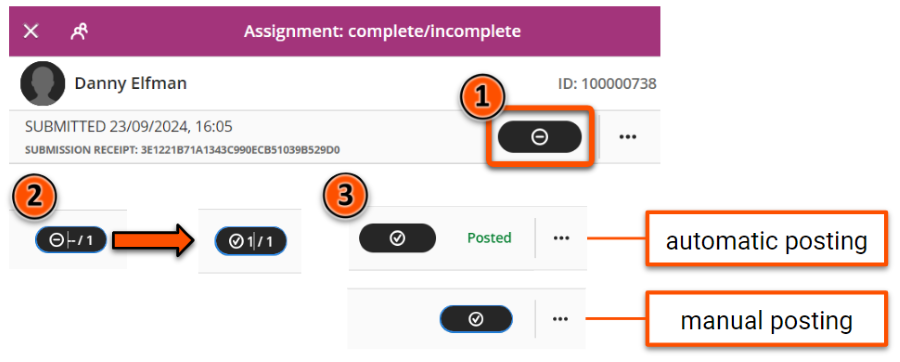

    Marks can also be entered directly in the Assignment Submissions tab or the Gradebook Grid view.

=== "Marks: Marking Rubric"

    Assignments may use a **Marking Rubric** to efficiently give feedback and mark based on specific criteria. If used, this appears under the Overall Feedback box.

    To mark the work, **select the relevant mark level for each criterion**. The total mark is automatically calculated from your selections.

    There are also options to:

    1. toggle criteria descriptions on/off.
    2. add criterion-specific feedback.
    3. expand or collapse each criterion.

    For more details, see our guide to [Marking Rubrics](../ultra/rubric.md)

    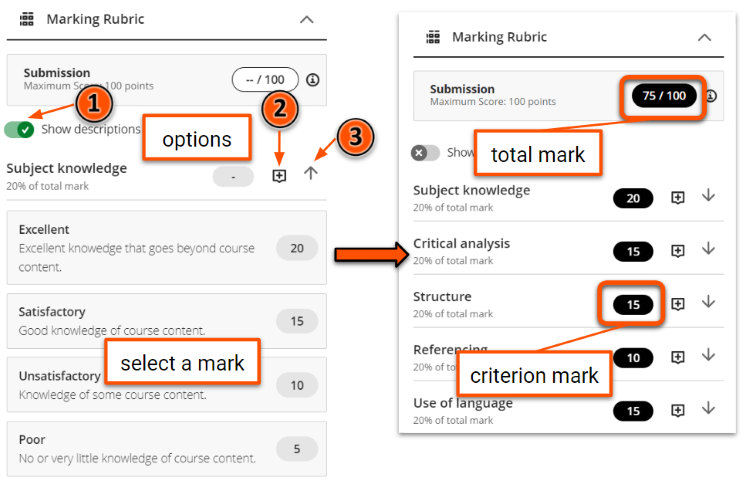

### 5. Open another submission

In the **marking interface**, choose another submission in the Student list in the left Student panel, or use the *Previous student*/*Next student* arrows above the submission. This can be filtered to only show work that needs marking.

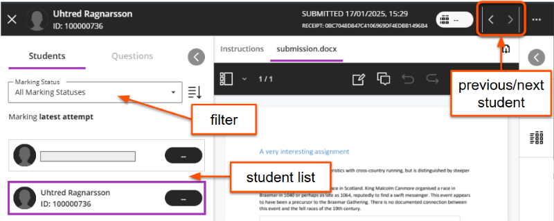

!!! Tip

    The marking interface does not filter by group. If you are using a marking group, close the interface and select another student from the filtered Gradebook Marks tab.

You can also select another submission using any of the [methods to open a submission](#1-open-a-submission) described above.

### 6. Manually post marks

!!! Tip

    **Post marks** means to release marks and feedback to students. They will receive a notification that the marks are available. Marks cannot be unposted.

    Your department may have guidelines on whether module staff or administrators post marks and when.

An Assignment can be set to automatically post marks after marking, or to manually post marks. If a marking rubric is used, marks must be posted manually. 

=== "Post individual marks"

    There are various ways to manually post marks and feedback for a specific submission:

    - In the **marking interface**, select the three dots icon next to the mark pill and select **Post mark**.
     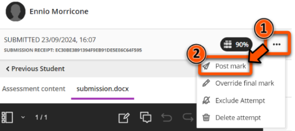
    - In the **submissions list**, click the **Post 1 mark** button in the relevant student's row (the value shows the number of attempts marked).
     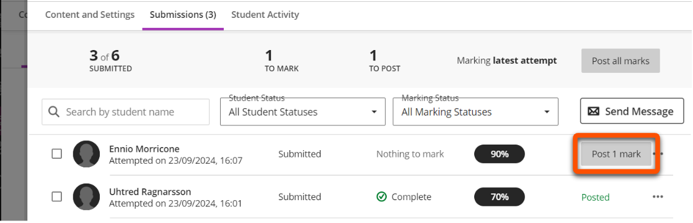
    - In the **Gradebook Marks tab**, click the student/assessment cell and click **Post**.
     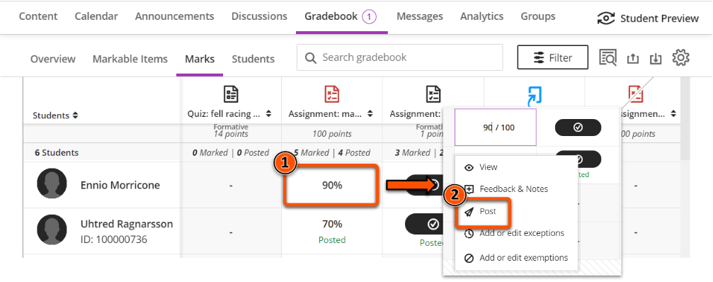

=== "Post marks for a cohort"

    There are various ways to manually post marks and feedback for all submissions at once:

    - In the **marking interface**, click the **Post marks** button at the bottom of the left Students panel.
     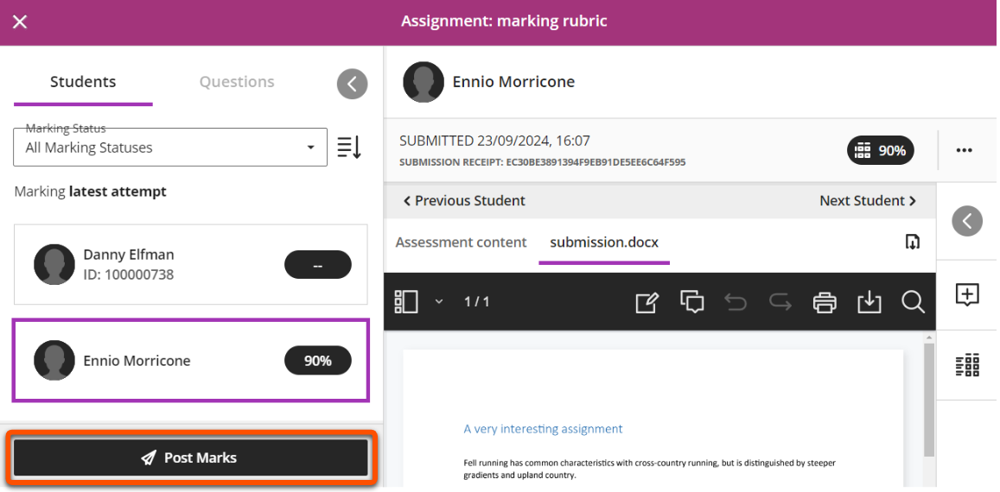
    - In the **submissions list**, click the **Post all marks** button in the summary bar
     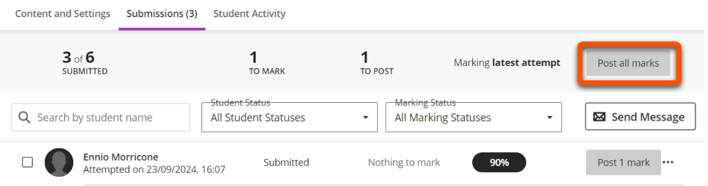
    - In the **Gradebook Marks tab**, click the Assignment column header and click **Post**.
     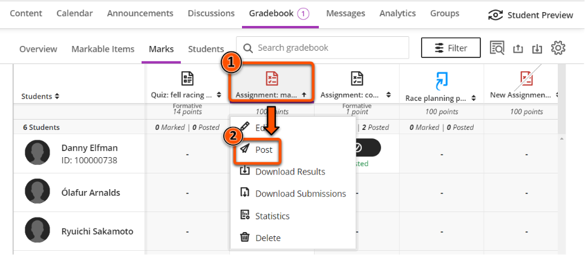

## Practice the marking workflow

!!! Warning

    We recommend practicing any Assignment workflow in your personal Ultra sandpit site. This is to avoid:
    
    - 'locking in' live Assignment settings after a submission is made.
    - potentially sending students unnecessary or confusing notifications.

Use the Student Preview function to submit a file which you can then mark:

1. Make sure you are working in your personal Ultra sandpit site.
2. Create an **Assignment** with the same settings as your 'live' Assignment (eg. with or without a rubric, marks posted manually/automatically). Alternatively, use the [Copy Content tool](../ultra/copy-content.md) to copy an Assignment from your live module site. 
3. Make sure your test Assignment is **Visible to students**.
4. Click **Student Preview** in the top right, then click **Start Preview**.
5. Open the Assignment and click **View Instructions**.
6. Drag and drop to upload a file, set the file display name, and then **Submit**.
7. Click **Exit** in the top right to close Student Preview. When prompted, click **Save** to retain your submission.
8. Back in editing mode, open and mark the submission as described in this guide.

## Monitor student review of feedback

The student overview page in the Gradebook allows you to see if a particular student has reviewed their posted mark and feedback.

See our [Gradebook guide](../ultra/gradebook.md#monitor-student-review-of-feedback) for more details.

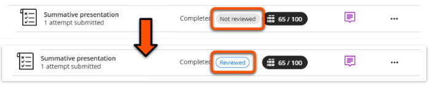