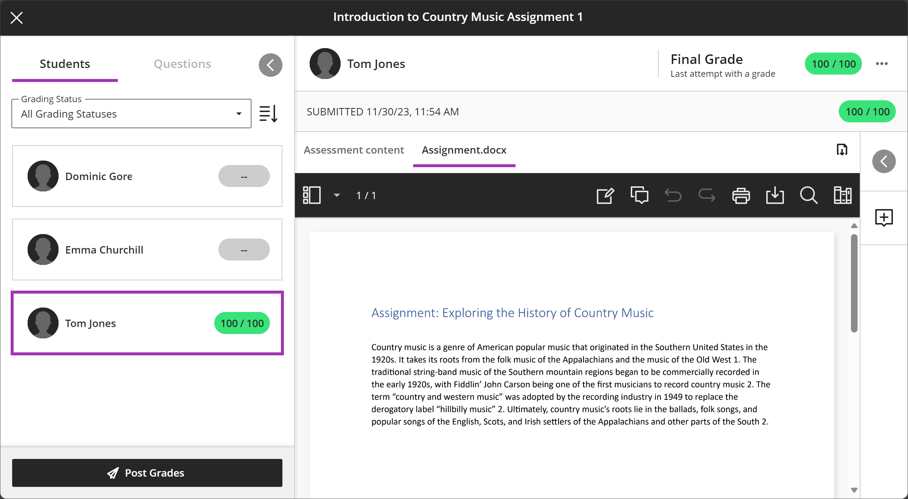

---
tags:
    - Assessment
    - Ultra
---

# Assignment: marking

!!! Summary

    Assignment is the built-in assignment submission and marking tool in the Learn Ultra VLE. It is mostly used for formatives, non-anonymous summatives and group assignments.

    This guide covers marking Assignment submissions, and is primarily aimed at **Teaching staff**.

## Marking submissions: Flex Grading

Ultra Assignments are marked online using the 'Flex Grading' tool. This allows you to:

- make inline feedback comments
- use a marking rubric
- input grades
- easily see which assignments still need to be marked

To mark an Ultra Assignment, with a module site you can access the submissions though the submission point or the Gradebook.

See Blackboard's guide to [Flex Grading Assignments](https://help.blackboard.com/Learn/Instructor/Ultra/Assignments/FlexGradingAssignments) for more information. 

## Managing multiple markers

If assignments to the same submission point are divided between multiple markers, this can be managed in a few ways:

- Markers **can see** other marks: [set up marking groups](../ultra/course-groups.md) and each marker can [filter their gradebook view](https://help.blackboard.com/Learn/Instructor/Ultra/Grade/Views_of_the_Gradebook#:~:text=The%20grid%20view%20provides%20an%20overview) to see just their group(s)
- Markers **must not see** other marks: use [parallel grading functionality](https://help.blackboard.com/Learn/Instructor/Ultra/Assignments/Grade_Assignments/ULTRA_Parallel_Grading#ultra_workflow)

!!! Tip

    Your assessment administrators can advise on the workflow adopted within your department.