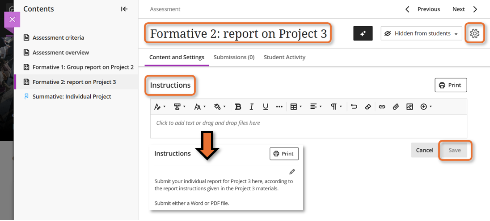
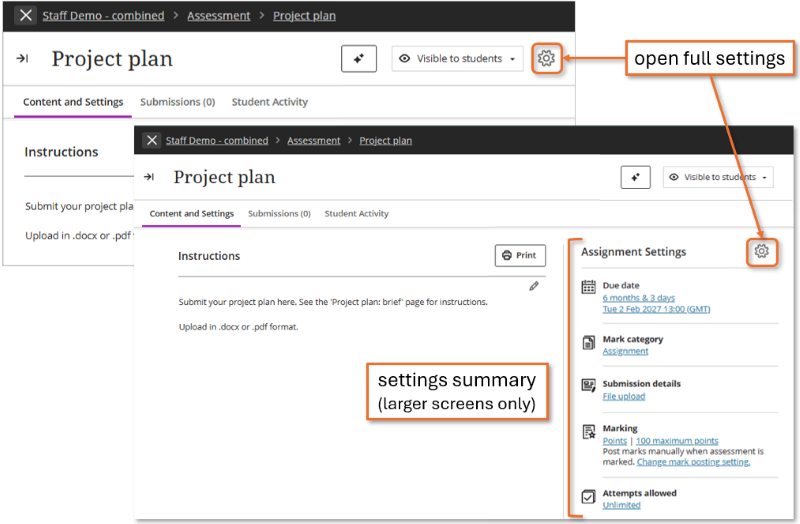
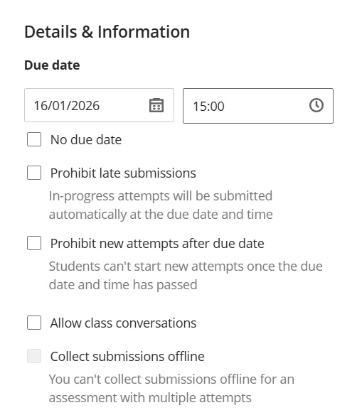
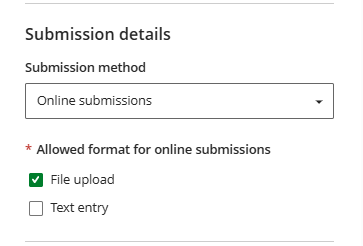
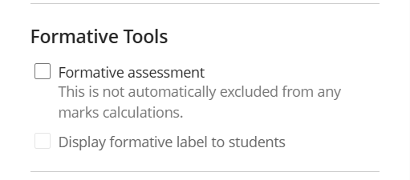
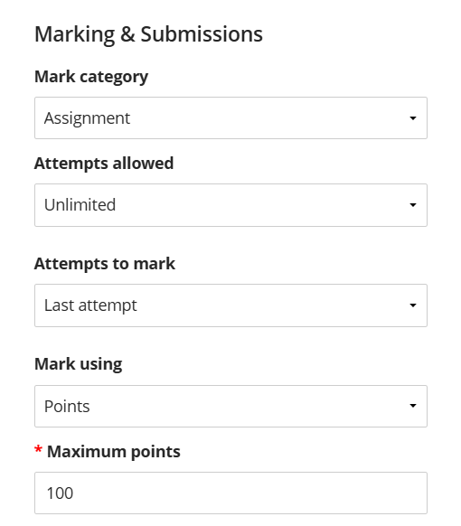
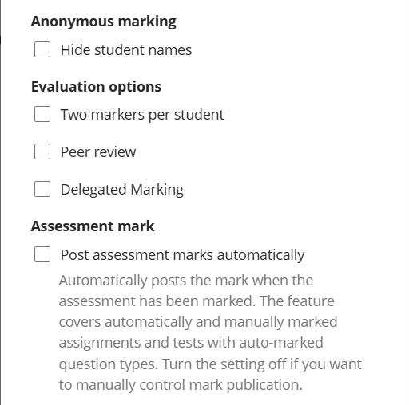
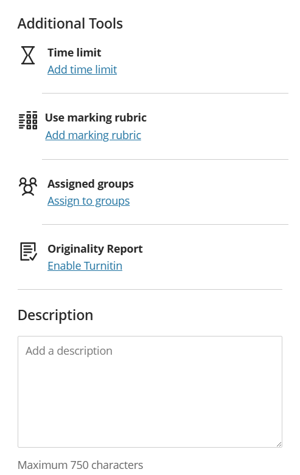
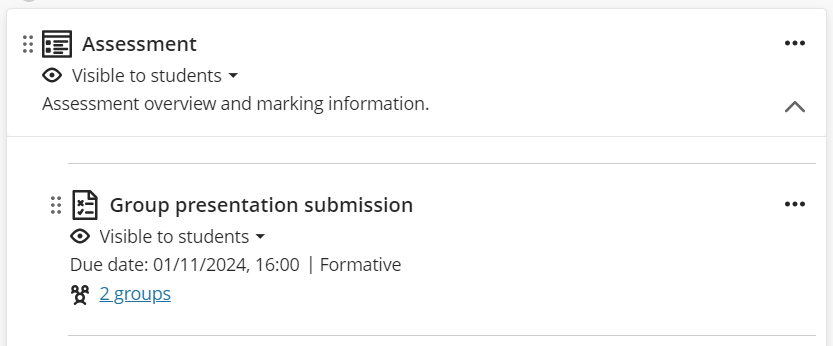

---
tags:
    - Key guide - admin
    - Assessment
    - Ultra
---

# Assignment: set up

!!! Summary

    Assignment is the built-in assignment submission and marking tool in the Learn Ultra VLE. It is mostly used for formatives, non-anonymous summatives and group assignments.

    This guide covers setting up Assignment submission points, and is aimed at **Administrators** and **Teaching staff**.

!!! principle "Relevant [VLE site design principles](../ultra/site-design-principles.md)"

    - 4.1 Essential: The assessment section contains all information about module assessments.
    - 4.2 Essential: Assessment instructions are clearly labelled and explain the task and requirements.
    - 4.3 Essential: Provide marking criteria or other grading policies showing how work is marked.

<figure markdown>

<figcaption>Assignment: staff view of interface</figcaption>
</figure>

## When to use Assignment

Assignment is most suitable for:

- formative and non-anonymous summative assignments
- individual and group assignments
- a range of assessment types, including: written work, presentations, images, low res video, audio
- a range of file types up to 100MB

The Assignment tool does technically allow anonymous submissions, however **we don't recommend using Assignment anonymously** as this:

1. can be turned off with a single button click, and can't be turned back on.
2. limits the marking tools and filtering options available.
3. makes managing SSP adjustments very difficult.

For text-based anonymous summative assignments, see our [TurnItIn Feedback Studio set up guide](../assessment/tfs/set-up.md).

## Generate Assignment prompts & rubrics with AI

!!! ai "Using AI tools effectively"

    AI-generated content is a **starting point** for your own content development rather than a finished product. You must always **carefully check** that output is accurate and appropriate for your intended use and adapt as needed.

    See our [general guide to Artificial Intelligence tools](../other-tools/ai.md) for more details on using AI responsibly.

The AI Design Assistant Tool can [auto-generate assignment prompts](../ultra/ai-da.md#task-prompts) based on your site content. This tool may also be useful for exploring ideas for project work or discussion tasks more generally. It can also [generate marking rubric content](../ultra/rubric.md#generate-using-ai) as a starting point of your own rubric development.

## Create an Assignment

!!! Tip

    All formal formative and summative assessment information and submission points **must be located in the Assessment section**. 

To create an assignment:

1. In the **Assessment section**, hover where the Assignment should appear. Click the **purple plus icon**, then **Create** and select **Assignment**.
2. Enter a descriptive title at the top left. 
3. Add clear **Instructions** for the assessment.
 Note: the Assignment must be visible for students to view instructions entered here. If required before that, add instructions as a separate item and clearly direct students to it in the Assignment.
4. Click the **cog icon** to open Settings: set a Due Date within working hours and adjust other settings (see suggested settings below). Click **Save** when finished.
5. Once confident that the Assignment is ready, set it as **Visible to students** or specify **Release conditions**(see our guide to [Content visibility](../ultra/content-visibility.md) for more detail).

You may like to set up and preview the Assignment in your personal sandpit site (especially if you are new to setting up submission points). You can then use the [Copy Content tool](../ultra/copy-content.md#copy-content-tool) to copy it into your module site. 

## Settings

Click the **cog icon** to open full Assignment settings. This is found:

- in the heading banner in most cases if the Assignment is within a Learning Module.
- at the top of the summary **Assessment settings** panel next to assignment content on a larger screen or if the Assignment is outside a Learning Module.

Appropriate settings will depend on your particular assignment, but here are our general recommended settings. More details on each setting is given below.

??? Abstract "Recommended settings: Formative"

    - **Details & Information**
        - tick *No due date* or set a *Due date* (this must be within working hours)
        - do **not** tick *Prohibit late submissions* or *Prohibit new attempts after due date*
        - leave all other options unticked
    - **Submission details**
        - leave *Online submissions* selected unless no work is submitted online
        - leave *File upload* ticked, consider unticking *Text entry*
    - **Formative Tools**
        - tick *Formative assessment*
        - leave *Display formative label to students* ticked
    - **Marking & Submissions**
        - *Mark category*: in most cases, leave this as Assignment, but can be updated.
        - *Attempts allowed*: set to Unlimited
        - *Attempts to mark*: set to Last attempt
        - *Mark using*: leave as Points or change to Percentage or a qualitative marking schema (eg. Complete/Incomplete)
        - *Maximum points*: leave as 100 or change to another amount. For formative work, that is often '1' to show the work is marked.
        - *Anonymous marking*: leave unticked - Assignment should only be used for *non-anonymous* assessment
        - *Evaluation options*:
            - Delegated marking: assign staff to mark specific group(s) of students. Usually not necessary, but see our [Guide to delegated marking](https://docs.google.com/document/d/1PWCIBntTazlmoTGUT9PyYZfRv1bFChWezIdDlGiIQQA/edit?usp=sharing) if required.
            - leave other options unticked
        - *Assessment mark: post marks automatically*: leave unticked to release marks manually.
    - **Assessment Security**: leave unticked unless very fine access control is required
    - **Additional Tools**
        - *Time limit*: leave unticked
        - *Use marking rubric*: if desired, attach a marking rubric to streamlime marking and feedback
        - *Assigned groups*: if needed, assign to groups to create a [group assignment](../ultra/assignment-groups.md)
        - *Originality Report*: enable if required
    - **Description**: enter a description to show on the item in the Course Content area (ie. students can see this before they open the Assignment).

??? Abstract "Recommended settings: non-anonymous summative"

    - **Details & Information**
        - set a *Due date* (this must be within working hours)
        - do **not** tick *Prohibit late submissions* or *Prohibit new attempts after due date*
        - leave all other options unticked
    - **Submission details**
        - leave *Online submissions* selected
        - leave *File upload* ticked, consider unticking *Text entry*
    - **Formative Tools**
        - leave unticked
    - **Marking & Submissions**
        - *Mark category*: in most cases, leave this as Assignment, but can be updated.
        - *Attempts allowed*: set to Unlimited
        - *Attempts to mark*: set to Last attempt
        - *Mark using*: leave as Points or change to Percentage or a qualitative marking schema (eg. Pass/Fail)
        - *Maximum points*: most likely leave as the default 100
        - *Anonymous marking*: leave unticked - Assignment should only be used for *non-anonymous* assessment
        - *Evaluation options*:
            - Two markers per student: not recommended (ie. every assignment must be second marked)
            - Peer review: can't be used if multiple attempts are allowed
            - Delegated marking: assign staff to mark specific group(s) of students. Usually not necessary, but see our [Guide to delegated marking](https://docs.google.com/document/d/1PWCIBntTazlmoTGUT9PyYZfRv1bFChWezIdDlGiIQQA/edit?usp=sharing) if required.
        - *Assessment mark: post marks automatically*: leave unticked to release marks manually.
    - **Assessment Security**: leave unticked unless very fine access control is required
    - **Additional Tools**
        - *Time limit*: leave unticked
        - *Use marking rubric*: if desired, attach a marking rubric to streamlime marking and feedback
        - *Assigned groups*: if needed, assign to groups to create a [group assignment](../ultra/assignment-groups.md)
        - *Originality Report*: enable if required
    - **Description**:  enter a description to show on the item in the Course Content area (ie. students can see this before they open the Assignment).

### Details & Information (Due date)

!!! Question "Key consideration: Does your Assignment need a due date?"

    Setting a due date/deadline (eg. submit by 15/05/2027 14:00) is only recommended for summative tasks. Formative tasks may be easier to manage without a deadline.
    
    If required, set a due date and time during core work hours and liaise with your departmental assessment administration team to manage deadline extensions for SSPs, ECAs etc (eg. 3 day extension). **Students must be able to start and submit late attempts.**
    
These settings **can** be updated after students have started their submissions.

- *Due date*: tick *No due date* or set a due date and time during core work hours. If used, liaise with your departmental assessment administration team to manage deadline extensions for SSPs, ECAs etc.
- **! Do not tick !** *Prohibit late submissions*: in-progress attempts are automatically submitted at the deadline (not marked late). Can't start new attempts after the deadline.
- **! Do not tick !** *Prohibit new attempts after due date*: in-progress attempts at the deadline can be manually submitted after the deadline (marked late). Can't start new attempts after the deadline.
- *Allow class conversations*: attaches a Discussion to the Assignment. Recommend to leave unticked.
- *Collect submissions offline*: for marking physical submissions or performances. Unlikely to be necessary.

### Submission details

These settings can be **partially** updated after students have started their submissions; additional formats can be added, but not removed.

- *Submission method*: select *Offline submissions* for work that is not submitted via the VLE (eg. a physical product), otherwise leave as *Online submissions*.
- *Allowed format for online submissions*: Leave *File upload* entry checked. *Text entry* allows students to type/paste their submission directly into the VLE.

### Formative Tools

!!! Question "Key consideration: is the Assignment formative?"

    We recommend applying both of these settings for any formative Assignments.

These settings **can** be updated after students have started their submissions.

- *Formative Assessment*: shows a formative label on the Assignment. This doesn't exclude the item from any automatic Gradebook mark calculations.
- *Display formative label to students*: default on if *Formative assessment* is ticked. Leave ticked.

### Marking & Submissions

!!! Question "Key consideration: does marking need to be anonymous?"

    [Anonymity](#anonymity) is currently tricky to manage in Assignments, so should not be applied. If your summative assignment requires anonymous marking, [Turnitin Feedback Studio](../assessment/tfs/set-up.md) is likely more appropriate.

Unless otherwise stated, these settings **can** be updated after students have started their submissions.

- *Mark Category*: may change the icon shown on the item, but doesn't have any real impact.
- *Attempts allowed*: how many assignment submissions can be made. In most cases set to *Unlimited*. Can't be reduced after students start their submissions.
- *Attempts to mark*: which assignment submission to mark. In most cases leave as *Last attempt*.
- *Mark using*: leave as the default *Points*, change to *Percentage* or use a [mark schema](../ultra/mark-schema.md) to convert marks to qualitative categories.
- *Maximum points*: leave as the default *100* or adjust as needed.

- *Anonymous marking: Hide student names*: don't use. Can't be updated after students have started their submissions.
- *Evaluation options: Two markers per student*: require double-marking for *all* students. If ticked, you will be prompted to select markers. Not recommended in most cases.
- *Evaluation options: Peer review*: allows students to give feedback on peers' submissions. Only available if 1 attempt allowed. Can't be updated after students have started their submissions. See [Blackboard Help's guide to Peer review](https://help.anthology.com/blackboard/instructor/en/assessments/peer-review-for-qualitative-peer-assessments.html) for more details.
- *Evaluation options: Delegated marking*: assign markers to specific groups of students. Only required for manually marked questions and large cohorts.
- *Assessment mark: post automatically*: immediately releases overall mark after an attempt is marked. In most cases, leave unticked to manually manage overall mark release.

### Assessment security

!!! Question "Key consideration: is fine access control needed?"

    If it's not known exactly who will need access to your Assignment and when, access can be managed by setting up an access code to open the Assignment. This may be useful for escape room-type activities, for example.

This setting **can** be edited after students start their submissions.

- *Access code*: click *Add access code* and toggle on the slider to require students to enter a 6-digit code to begin an attempt.

### Additional tools & Description

Unless stated, these settings **cannot** be updated after students have started their submissions.

- *Time limit*: adds a timer for attempts, with optional automatic submission at the end. In most cases, this is not applicable.
- *Use marking rubric*: add a [marking rubric](../ultra/rubric.md) to assist with marking and feedback.
- *Assign to groups*: to set as a collaborative group task. Useful for group assessment and  escape room-type activities.
- *Originality report*: adds Turnitin originality reporting.
- *Description*: adds a contextual note to the Assignment item on the Course Content page. Maximum 750 characters. Can be updated after students have started their submissions.

For more detail, see [Staff Help: Ultra Assignment Set Up & Use - Blackboard's Own Guide](https://help.anthology.com/blackboard/instructor/en/assessments/assignments/create-assignments.html)

## Group assessment

Group assessment is best managed using Ultra Assignment. Note that *TurnItIn does not support group assessment*.

The **Assign to Course Groups** feature allows a student to transparently make a submission on behalf of the whole group, and for group and/or individual marks and feedback to be released to group members.

See our [guide to Group Assignments](../ultra/assignment-groups.md) for full details and how to set this up.

## Preview the student submission process

For student Assignment submission instructions, see our [student guides to submitting assignments on the VLE](https://subjectguides.york.ac.uk/learning-tech/vle-assignments).

You can check how the Assignment appears to students using the **Student Preview** function:

!!! Warning

    To preview the Assignment, it must be **Visible to students**. To prevent students seeing the submission point before it is ready, use the [Copy Content tool](../ultra/copy-content.md#copy-content-tool) to copy it to your personal sandpit site for previewing.

1. In editing mode, set the Assignment availability as **Visible to students**.
2. Click **Student Preview** in the top right, then **Start Preview**.
3. In Student preview mode, open the Assignment and check that information shown on the summary tab is correct. 
Check that the group shows as expected, then click **Start attempt 1** (or **View instructions**).
4. To trial making a submission, drag and drop to upload a file, set the file display name, and then **Submit**. *Not recommended in a live module site!*
5. Click **Exit** in the top right to close Student Preview. When prompted, click **Save** to retain your submission (eg. to [practice the marking workflow](../ultra/assignment-marking.md#practice-the-marking-workflow) or **Discard** to remove your preview activity.
8. Back in editing mode, adjust any settings as needed and preview again until you are satisfied.
7. In your module site, use the the [Copy Content tool](../ultra/copy-content.md#copy-content-tool) to copy the final Assignment version from your sandpit site, or update the settings as needed if it was set up there originally.