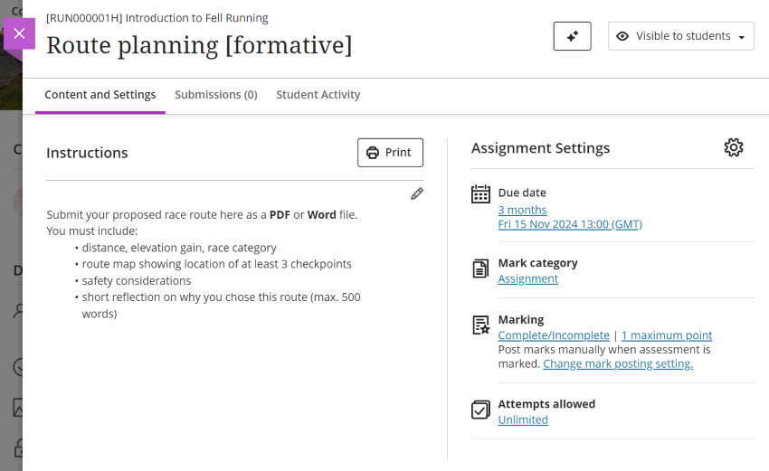

---
tags:
    - Key guide - admin
    - Assessment
    - Ultra
---

# Assignment: set up

!!! Summary

    Assignment is the built-in assignment submission and marking tool in the Learn Ultra VLE. It is mostly used for formatives, non-anonymous summatives and group assignments.

    This guide covers setting up Assignment submission points, and is aimed at **Administrators** and **Teaching staff**.

!!! principle "Relevant [VLE site design principles](../ultra/site-design-principles.md)"

    - 4.1 Essential: The assessment section contains all information about module assessments.
    - 4.2 Essential: Assessment instructions are clearly labelled and explain the task and requirements.
    - 4.3 Essential: Provide marking criteria or other grading policies showing how work is marked.

## When to use Assignment

Assignment is most suitable for:

- formative and non-anonymous summative assignments
- individual and group assignments
- a range of assessment types, including: written work, presentations, images, low res video, audio
- a range of file types up to 100MB

The Assignment tool does technically allow anonymous submissions, however **we don't recommend using Assignment anonymously** as this:

1. can be turned off with a single button click, and can't be turned back on.
2. limits the marking tools and filtering options available.
3. makes managing SSP adjustments very difficult.

For text-based anonymous summative assignments, see our [TurnItIn Feedback Studio set up guide](../assessment/tfs/set-up.md).

## Set up submission points

- All formal formative and summative assessment information and submission points **must be located in the Assessment section**. A [Course Link](../ultra/links.md#course-link) can be used to also present the item in a weekly section if desired.
- Give **clear instructions** on the assessment task and requirements, either within the submission point or in its own item also within the Assessment section. Include technical requirements as needed, eg. file type, number of files to submit, page orientation etc.
- **Marking criteria or grading policies** for the assignment must be available or linked within the Assessment section.

### Deadline and late submission considerations

Assessment **deadlines must be set within working hours** so students can access technical support if needed. Ideally, please set the deadline between 10:00 and 16:00, Monday - Friday.

!!! Warning 
    
    University assessment policy requires that students must be permitted to submit work late, so **do not apply settings preventing late submissions**. Any late submissions received are clearly flagged in the marking interface so they can be easily identified.

There are two settings relating to late submission. **Do not tick these settings**:

- *Prohibit late submissions*: automatically submits any in-progress work at the deadline (ie. files that have been uploaded as drafts but not submitted) and prevents new submissions.
- *Prohibit new attempts after due date*: prevents beginning a new submission after the deadline. Automatically applied if *Prohibit late submissions* is ticked.

### Individual assessment

!!! Tip

    To avoid students seeing the Assignment before it is ready, you may like to set up and preview an Assignment in your personal sandpit site (especially if you are new to setting up submission points). You can then use the [Copy Content tool](../ultra/copy-content.md) to copy it into your module site. 

To set up an individual Assignment: 

1. In the **Assessment section**, hover where you want to add the Assignment and click the **purple plus icon**.
2. Select **Assignment**.
3. Add a **descriptive title**, set [appropriate **visibility**](../ultra/content-visibility.md) and add **instructions** as text or a file.
4. Click the **cog icon** to set a Due Date within working hours and adjust other settings (see suggested settings below).
5. Click **Save** when finished.
6. Preview the Assignment and then copy to your module site.

Appropriate settings will depend on your particular assessment, but here are our general recommended settings:

??? Abstract "Recommended settings: Formative"

    - **Details & Information**
        - set a *Due date* (this must be within working hours) or tick *No due date*
        - do **not** tick *Prohibit late submissions* or *Prohibit new attempts after due date* (see above)
        - leave all other options unticked
    - **Formative Tools**
        - tick *Formative assessment*
        - leave *Display formative label to students* ticked
    - **Marking & Submissions**
        - *Mark category*: in most cases, leave this as Assignment, but you can change to another option (eg. Presentation). This determines the icon shown on the item in the Course Content area and can be used to filter the Gradebook.
        - *Attempts allowed*: set to Unlimited
        - *Attempts to mark*: set to Last attempt
        - *Mark using*: leave as Points or change to Percentage or a qualitative marking schema (eg. Complete/Incomplete)
        - *Maximum points*: leave as 100 or change to another amount. For formative work, that is often '1' to show the work is marked.
        - *Anonymous marking*: leave unticked - Assignment should only be used for *non-anonymous* assessment
        - *Evaluation options*:
            - Two markers per student: not recommended (ie. every assignment must be second marked)
            - Peer review: can't be used if multiple attempts are allowed
            - Delegated marking: assign staff to mark specific group(s) of students. Usually not necessary, but see our [Guide to delegated marking](https://docs.google.com/document/d/1PWCIBntTazlmoTGUT9PyYZfRv1bFChWezIdDlGiIQQA/edit?usp=sharing) if required.
        - *Assessment mark*: in most cases, leave *Post marks automatically* unticked to release marks manually. If this is ticked, marks and feedback are released to students immediately when a mark is entered for a submission; this could be useful to streamline workflow for large cohorts with lots of markers.
    - **Assessment Security**: leave unticked
    - **Additional Tools**
        - *Time limit*: not recommended unless there is a clear pedagogic rationale for this
        - *Use marking rubric*: if desired, attach a marking rubric to streamlime marking and feedback
        - *Goals & standards*: leave unticked, not used at UoY
        - *Assigned groups*: not relevant to individual assignments
        - *Originality Report*: not recommended for formative work
    - **Description**: if desired, enter a description to show on the item in the Course Content area (ie. students can see this before they open the Assignment). Don't enter full instructions here, put those in the body of the Assignment.

??? Abstract "Recommended settings: non-anonymous summative"

    - **Details & Information**
        - set a *Due date* (this must be within working hours)
        - do **not** tick *Prohibit late submissions* or *Prohibit new attempts after due date* (see above)
        - leave all other options unticked
    - **Formative Tools**
        - leave unticked
    - **Marking & Submissions**
        - *Mark category*: in most cases, leave this as Assignment, but you can change to another option (eg. Presentation). This determines the icon shown on the item in the Course Content area and can be used to filter the Gradebook.
        - *Attempts allowed*: set to Unlimited
        - *Attempts to mark*: set to Last attempt
        - *Mark using*: leave as Points or change to Percentage or a qualitative marking schema (eg. Pass/Fail)
        - *Maximum points*: most likely leave as the default 100
        - *Anonymous marking*: leave unticked - Assignment should only be used for *non-anonymous* assessment
        - *Evaluation options*:
            - Two markers per student: not recommended (ie. every assignment must be second marked)
            - Peer review: can't be used if multiple attempts are allowed
            - Delegated marking: assign staff to mark specific group(s) of students. Usually not necessary, but see our [Guide to delegated marking](https://docs.google.com/document/d/1PWCIBntTazlmoTGUT9PyYZfRv1bFChWezIdDlGiIQQA/edit?usp=sharing) if required.
        - *Assessment mark*: leave *Post marks automatically* unticked to release marks manually once the marking process is complete.
    - **Assessment Security**: leave unticked
    - **Additional Tools**
        - *Time limit*: not recommended unless there is a clear pedagogic rationale for this
        - *Use marking rubric*: if desired, attach a marking rubric to streamlime marking and feedback
        - *Goals & standards*: not used at UoY
        - *Assigned groups*: not relevant to individual assignments
        - *Originality Report*: not currently recommended
    - **Description**: if desired, enter a description to show on the item in the Course Content area (ie. students can see this before they open the Assignment). Don't enter full instructions here, put those in the body of the Assignment.

For more detail, see [Staff Help: Ultra Assignment Set Up & Use - Blackboard's Own Guide](https://help.blackboard.com/Learn/Instructor/Ultra/Assignments)

## Generate Assignment prompts & rubrics with AI

The AI Design Assistant Tool can [auto-generate assignment prompts](../ultra/ai-da.md#task-prompts) based on your site content. This tool may also be useful for exploring ideas for project work or discussion tasks more generally. It can also [generate marking rubric content](../ultra/rubric.md#generate-using-ai) as a starting point of your own rubric development.

!!! ai "Using AI tools effectively"

    AI-generated content is a **starting point** for your own content development rather than a finished product. You must always **carefully check** that output is accurate and appropriate for your intended use and adapt as needed.

    See our [general guide to Artificial Intelligence tools](../other-tools/ai.md) for more details on using AI responsibly.

### Group assessment

Group assessment is best managed using Ultra Assignment. Note that *TurnItIn does not support group assessment*.

The **Assign to Course Groups** feature allows a student to transparently make a submission on behalf of the whole group, and for group and/or individual marks and feedback to be released to group members.

See our [guide to Group Assignments](../ultra/assignment-groups.md) for full details and how to set this up.

## Preview the student submission process

For student Assignment submission instructions, see our [student guides to submitting assignments on the VLE](https://subjectguides.york.ac.uk/learning-tech/vle-assignments).

You can check how the Assignment appears to students using the **Student Preview** function:

!!! Warning

    To preview the Assignment, it must be **Visible to students**. To prevent students seeing the submission point before it is ready, use the [Copy Content tool](../ultra/copy-content.md) to copy it to your personal sandpit site for previewing.

1. In editing mode, set the Assignment availability as **Visible to students**.
2. Click **Student Preview** in the top right, then **Start Preview**.
3. In Student preview mode, open the Assignment and check that information shown on the summary tab is correct. 
Check that the group shows as expected, then click **Start attempt 1** (or **View instructions**).
4. To trial making a submission, drag and drop to upload a file, set the file display name, and then **Submit**. *Not recommended in a live module site!*
5. Click **Exit** in the top right to close Student Preview. When prompted, click **Save** to retain your submission (eg. to [practice the marking workflow](../ultra/assignment-marking.md#practice-the-marking-workflow) or **Discard** to remove your preview activity.
8. Back in editing mode, adjust any settings as needed and preview again until you are satisfied.
7. In your module site, use the the [Copy Content tool](../ultra/copy-content.md) to copy the final Assignment version from your sandpit site, or update the settings as needed if it was set up there originally.
