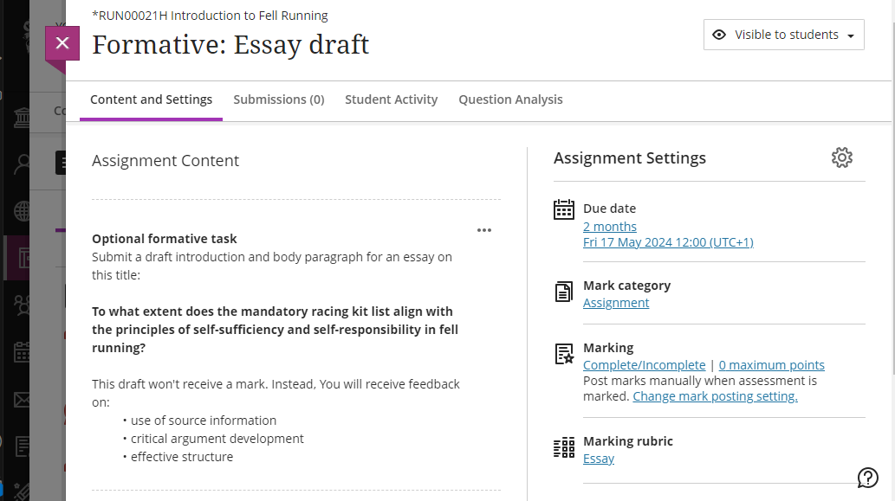

---
tags:
    - Assessment
    - Ultra
---

# Assignment: set up

!!! Summary

    Assignment is the built-in assignment submission and marking tool in the Learn Ultra VLE. It is mostly used for formatives, non-anonymous summatives and group assignments.

    This guide covers setting up Assignment submission points, and is aimed at **Administrators** and **Teaching staff**.

!!! principle "Relevant [VLE site design principles](https://vle-support.york.ac.uk/ultra/site-design-principles)"

    - 4.1 Essential: The assessment section contains all information about module assessments.
    - 4.2 Essential: Assessment instructions are clearly labelled and explain the task and requirements.
    - 4.3 Essential: Provide marking criteria or other grading policies showing how work is marked.

## When to use Assignment

Assignment is most suitable for:

- formative and non-anonymous summative assignments
- individual or group assignments
- doubleblind marking
- a range of file types up to 100MB (eg. text documents, slide decks, low res video and audio)

The Assignment tool does techncally allow anonymous submissions, however **we don't recommend using Assignment anonymously** as this can:

1. be turned off with a single button click, and can't be turned back on
2. limit the marking tools and filtering options available

If you want to run an anonymous summative assignment, see our [TurnItIn Feedback Studio set up guide](/assessment/turnintin-feedback-studio-set-up).

## Submission points

- As Ultra Assignments are used for formatives or non-anonymous summatives, submission points can be set up by teaching staff or admins.
- Submission points must appear in the Assessment section of the module site. If desired, a Course Link to the submission point can also be added in a weekly content folder.
- Give clear instructions on the assessment task and requirements, either within the submission point or in its own item also within the Assessment section.
- Marking criteria or grading policies for the assignment must be available or linked within the Assessment section.

### Individual assessment
- Formative or non-anonymous summative: [Staff Help: Ultra Assignment Set Up & Use - Blackboard's Own Guide](https://help.blackboard.com/Learn/Instructor/Ultra/Assignments)

### Group assessment
- Formative: [Staff Help: Formative Ultra *Group* Assignment Set Up & Use - UoY Guide](https://docs.google.com/document/d/12prcsksWPTEzuP4d9QOnjH9l4zHjGwRZsP99QU8hyTw/edit?usp=sharing)
- Summative: [Staff Help: Summative Ultra *Group* Assignment Set Up & Use - UoY Guide](https://docs.google.com/document/d/1MTc5SYuvoAgWxPIQKfW0K1hDqLA3U8rA00czaeFeDs0/edit)

!!! Warning
    Files uploaded to Learn VLE sites (eg. PDF or Word documents) are technically accessible to all site users, even if hidden from students in the Course Content area.
    
    When **uploading assessment-related files** were access needs to be limited (eg. assessment briefs or test materials), view and apply [our guidance on Strict File Access Control for Sensitive Files](https://docs.google.com/document/d/1j6g1k2W0Ont1kA8DfSq7VuLYwgIhbDI7vzwd0-tQAaM/edit).