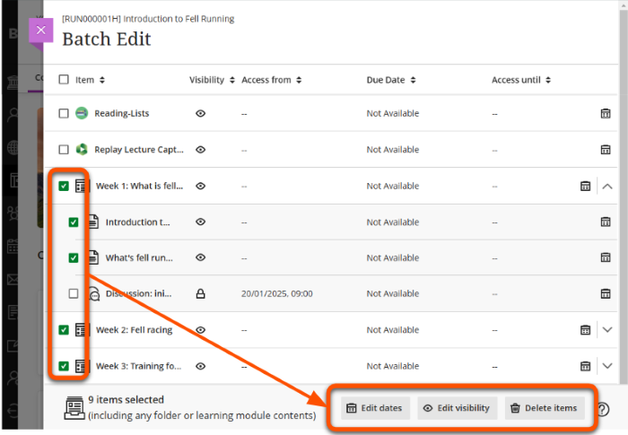

---
tags:
    - Ultra
---

# Batch edit 

!!! Summary

    Use Batch Edit to update common settings for multiple items at once.

The Batch Edit tool allows you to update settings for multiple content items at once, which can be much faster than manually updating items individually. Settings that can be edited:

- Date/time settings: change due dates or show/hide dates
- Visibility settings: set items as visible or hidden
- Delete items: permanently delete

!!! Tip

    Batch Edit is especially useful to update due dates and item availability after rollover.

To use Batch Edit:

1. At the top right of the *Course Content area*, click the **three dots** then **Batch Edit**.
 
2. The *Batch Edit page* shows all course content items, with any current date settings and visibility. Click a Folder or Learning Module to show the items within.
3. Select items to edit using the **check box** next to its name. Selecting a Folder or a Learning Module automatically selects the items inside. To exclude items, open the container and untick the relevant items.
 
4. Select an edit option:
    - **Edit dates**: 
        - Update *Show on*, *Due* and *Hide after* dates to a specific date, shift dates by a set number of days or update based on course start dates.
        - Only items with existing date settings are updated.
          
    - **Edit visibility**: 
        - Set items as hidden from or visible to students, then click **Save Visibility**.
        - This overrides any existing visibility settings or release conditions.
          
    - **Delete items**: 
        - Read the warning and click **Delete** if you want to proceed.
        - This permanently deletes the items and can't be undone.
          
4. After you confirm the action, it may take a few seconds to process the edits. When complete, a success message is displayed above the item list on the Batch Edit page.
