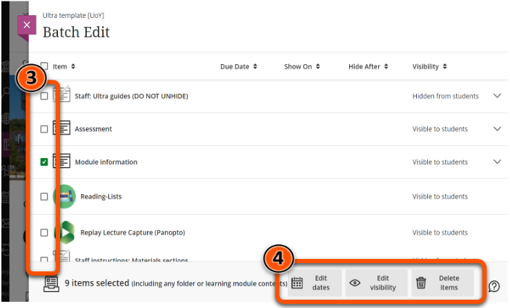
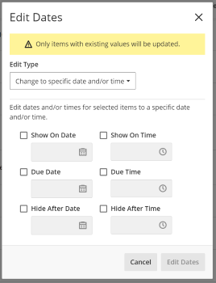
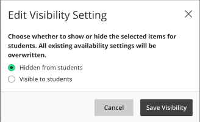
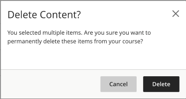

---
tags:
    - Ultra
---

# Batch edit 

!!! Summary

    Use Batch Edit to update common settings for multiple items at once.

## Overview

You can use Batch Edit to update multiple contents items at once, which can be much faster than manually updating items individually.

Settings that can be edited:

- Date/time settings: change due dates or show/hide dates
- Visibility settings: set items as visible or hidden
- Delete items: permanently delete

Batch Edit can be especially useful to update and prepare content for a new academic year.

## Using Batch Edit

1. At the top right of the **Course Content area**, click the **three dots** then **Batch Edit**.
      
2. A list of site content appears on the **Batch Edit page**, with any current date settings and visibility.
3. At the left of the page, select the **check box** next to items to edit. If you select a Folder or a Learning Module, the content items are also selected. To exclude items from batch editing, click the container to open it and untick the relevant items.
4. At the bottom of the page, select one of the edit options: **Edit dates**, **Edit visibility**, **Delete items**
      
    - **Edit dates**: change due dates or show/hide dates to a specific date/time or shift dates by a set number of days. This will only update existing date settings - items without date settings will not have them added.
          
    - **Edit visibility**: set items as visible to or hidden from students. This will override any existing visibility settings. Visibility can't be set using Release Conditions using Batch Edit.
          
    - **Delete items**: permanently delete the items. This can't be undone.
          
4. After you confirm the action, it may take a few seconds to process the edits. When complete, a success message will be displayed above the item list on the Batch Edit page.

You can also watch BlackBoard Help's demonstration of Batch Edit:
<iframe width="560" height="315" src="https://www.youtube.com/embed/XJ0UxI-Qx_E" title="YouTube video Batch Edit in the Ultra Course View" frameborder="0" allow="accelerometer; autoplay; clipboard-write; encrypted-media; gyroscope; picture-in-picture" allowfullscreen></iframe>
[Batch Edit - Bb Help [YouTube]]((https://www.youtube.com/watch?v=XJ0UxI-Qx_E))