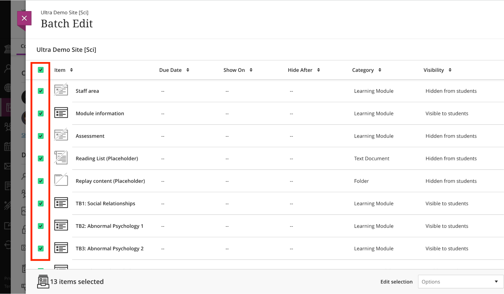
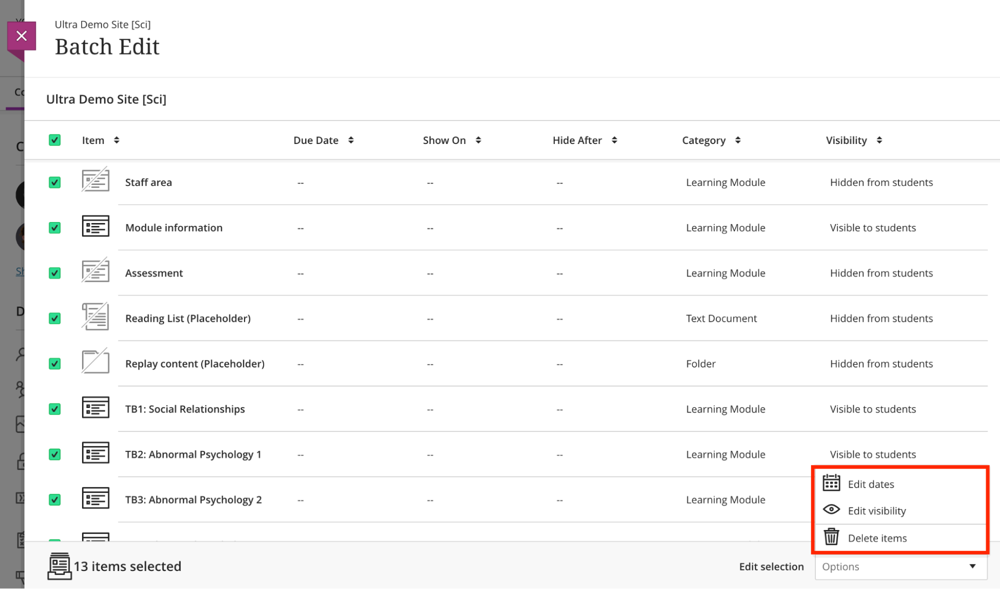
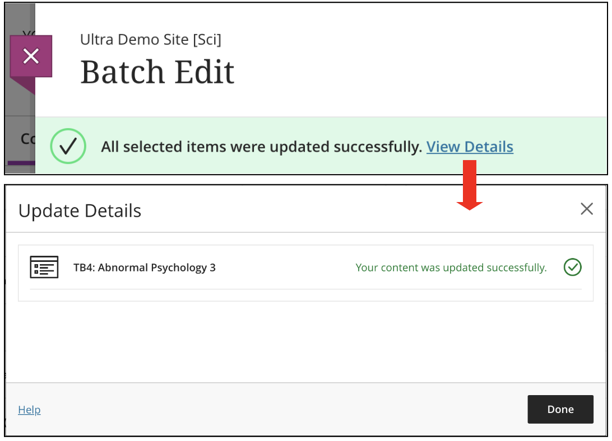

---
tags:
# Delete to leave only relevant tags
    - Advanced
    - Teaching
    - Ultra
---

# Batch edit 

!!! Summary

    In Ultra, **batch edit** is a function used to update common settings across all content, such as **content visibility** and **due dates**. You can also use the tool to **delete** a group of selected course content. The following items that appear on the Course Content page are supported in batch edit:

    * Documents, files, and links
    * Folders and learning modules
    * Teaching tools with LTI connection
    * Assessments, such as tests and assignments
    * Discussions and journals

    This guide provides the key information you need to control content settings with batch edit all in one place.

## Quick Start Guide

### Video Steps

Below is an embedded video detailing how to **Batch Edit in the Ultra Course View**. Alternatively, you can [open the video in a new browser tab](https://www.youtube.com/watch?v=XJ0UxI-Qx_E).

<!-- PASTE YOUTUBE EMBED (should look like this:) -->

<iframe width="560" height="315" src="https://www.youtube.com/embed/XJ0UxI-Qx_E" title="YouTube video Batch Edit in the Ultra Course View" frameborder="0" allow="accelerometer; autoplay; clipboard-write; encrypted-media; gyroscope; picture-in-picture" allowfullscreen></iframe>

### Text Steps

<!-- Clear and concise: Click **Submit**, not Click on the **Submit button** -->
<!-- Use **bold** to highight key tasks and features -->

#### **To use the batch edit function**

1. At the right of the **Course Content area**, click the **three dots** > **Batch Edit**.

    
2. On the **Batch Edit page**, all your content appears as a list. At the left of the page, select the **check box** next to items you want to change. If you want to edit items inside a Learning Module or Folder, click the Learning Module or Folder to see and check the items inside.

    
3. At the bottom right of the page, select one of the options in **Edit selection**. (see a,b,c below)

    
    **a. Edit dates**
        
    **b. Edit visibility**
        
    **c. Delete**
        
4. After you confirm the action, you’ll see a message about the success of the selected action. Click **View Details** to confirm the success of each selected item.

    

!!! Warning
    Batch Edit only lets you edit content within the folder you're currently viewing. You can't choose content within two different folders and update visibility, change dates, or delete at the same time. Make a selection on the current screen and complete your task before you leave. You can select a mix of items and folders, but you can only edit the items together if they appear on the same screen. When you navigate into or out of a folder, your previous content selections are cleared.

## Further Help
* [Blackboard Help: Batch Edit](https://help.blackboard.com/Learn/Instructor/Ultra/Course_Content/Ultra_Batch_Edit)