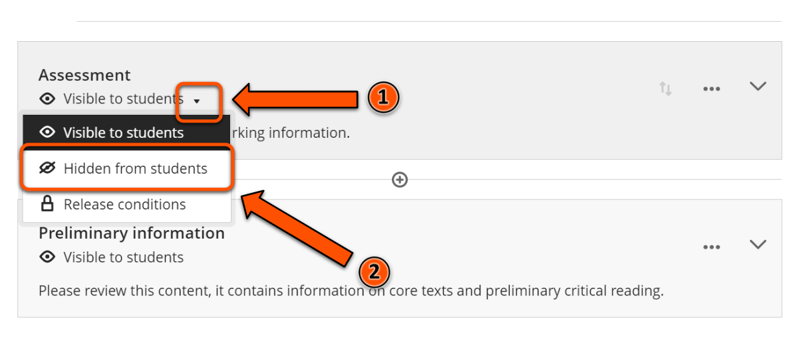
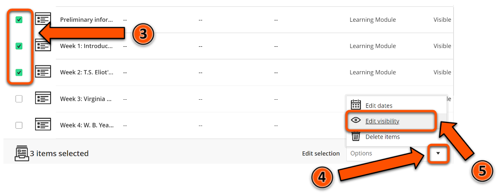
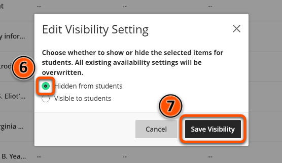

---
tags:
# Delete to leave only relevant tags
    - Foundation
    - Teaching
    - Administration
    - Ultra
---

# Content availability

!!! Summary

    Ultra sites allow staff to set content as visible to students or hidden from students.

## Quick Start Guide

### Video Steps

Below is an embedded video detailing how to adjust content availability in Ultra. Alternatively, you can [open the video in a new browser tab](https://youtu.be/P1lNK0ob2ho).

<!-- PASTE YOUTUBE EMBED (should look like this:) -->
<iframe width="560" height="315" src="https://www.youtube.com/embed/P1lNK0ob2ho" title="YouTube video player" frameborder="0" allow="accelerometer; autoplay; clipboard-write; encrypted-media; gyroscope; picture-in-picture" allowfullscreen></iframe>

### Text Steps

<!-- Clear and concise: Click **Submit**, not Click on the **Submit button** -->
<!-- Use **bold** to highight key tasks and features -->

Items in the **Course Content** area can be set to **Visible to students** or **Hidden from students**. By default, all new items are automatically hidden from students.

To change an item’s visibility:

1. Mouse over the current visibility status (e.g. **Hidden from students**) of the content item whose visibility you want to modify, then click the down arrow that appears.
2. Click on the required visibility option - e.g. if you want to make an item visible to students, click **Visible to students**.

To do this for multiple items simultaneously:

1. Click on the three dots icon to the right of the **Course Content** heading.
2. Select **Batch Edit**.
3. Select the content items whose visibility you want to modify by clicking on the appropriate checkboxes on the left hand side of the screen.
4. Click on the box labelled **Options** in the bottom right corner of the screen.
5. Click on **Edit visibility**.
6. Select the required visibility state, e.g. **Hidden from students**.
7. Click on **Save visibility**.

!!! Warning 
    It is important to check that all the correct content items are visible or hidden before students are enrolled on the course. To check, click on Student Preview in the top right corner of the page.

## More Details and Troubleshooting 

It is possible to set items to become visible to or hidden from students based on certain conditions, e.g. date and time. For more information on this, please see the [Conditional Release](https://pdlt-university-of-york.github.io/vle-help/ultra/conditional-release/) guide. 

<!-- More info here as needed. -->