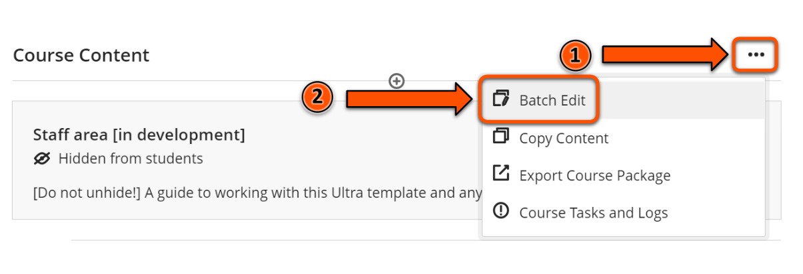
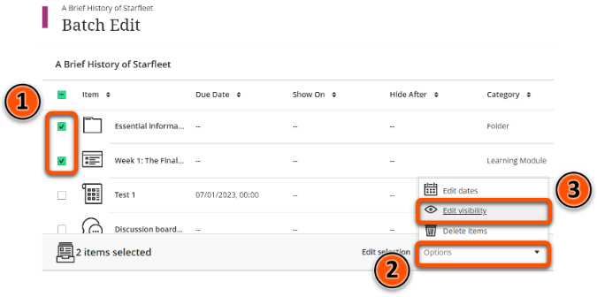
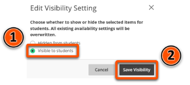

---
tags:
# Delete to leave only relevant tags
    - Foundation
    - Teaching
    - Administration
    - Ultra
---

# Content visibility

!!! Summary

    Content can be set as visible to students or hidden from students.

!!! principle "Relevant [VLE site design principles](https://vle-support.york.ac.uk/ultra/site-design-principles)"

    - 5.1 Recommended: Ensure that students can see and access module materials and content.

## Quick Start Guide

### Video Steps

<!-- PASTE YOUTUBE EMBED (should look like this:) -->
<iframe width="560" height="315" src="https://www.youtube.com/embed/P1lNK0ob2ho" title="Content availability in Ultra" frameborder="0" allow="accelerometer; autoplay; clipboard-write; encrypted-media; gyroscope; picture-in-picture" allowfullscreen></iframe>

Video: [Content availability in Ultra](https://youtu.be/P1lNK0ob2ho)

### Text Steps

<!-- Clear and concise: Click **Submit**, not Click on the **Submit button** -->
<!-- Use **bold** to highight key tasks and features -->

Items in the **Course Content** area can be set to **Visible to students** or **Hidden from students**. By default, all new items are automatically hidden from students.

#### Single item

1. Hover over the current visibility status (e.g. **Hidden from students**) of the content item whose visibility you want to change, then click the arrow.
2. Click on the required visibility option.    

#### Muliple items

1. Click on the three dots icon to the right of the **Course Content** heading.
2. Select **Batch Edit**.    
3. Select the content items whose visibility you want to change by clicking the checkboxes.
4. Click **Options** in the bottom right corner of the screen.
5. Click **Edit visibility**.    
6. Select the required visibility state, e.g. **Hidden from students**.
7. Click **Save visibility**.    

!!! Warning 
    It is important to check that all the correct content items are visible or hidden before students are enrolled on the course. To check, click on Student Preview in the top right corner of the page.

## More Details and Troubleshooting 

It is possible to set items to become visible to or hidden from students based on certain conditions, e.g. date and time. For more information on this, please see the [Conditional Availability](https://vle-support.york.ac.uk/ultra/conditional-release/) guide. 

<!-- More info here as needed. -->