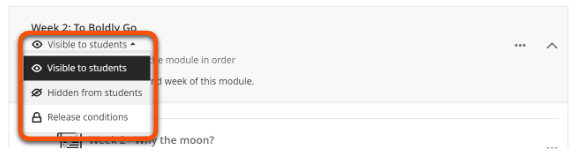

---
tags:
    - Key guide - tutors
    - Ultra
---

# Content visibility

!!! Summary

    Manage whether content items are visible to or hidden from students.

!!! principle "Relevant [VLE site design principles](../ultra/site-design-principles.md)"

    - 5.1 Recommended: Ensure that students can see and access module materials and content.

Items in the Course Content area can be set to **Visible to students** or **Hidden from students**. By default, all new items are automatically hidden from students.

You can check that items are shown or hidden correctly using the Student Preview tool.

## Content visibility and accessibility

A key accessibility requirement is that students have sufficient time to use materials to prepare for a session, particularly if they use any assistive tools. For example, a dyslexic student may need to read lecture slides in advance to help them follow the session.

To support this, make sure that module materials are available in advance - we recommend **at least one week before the session**.

## Change content visibility

For a single content item:

1. Click the current visibility status (e.g. **Hidden from students**) of the content item to open the drop-down options.
2. Select the required visibility option: Visible to students, Hidden from students, Release conditions   

!!! Warning

    Making a Folder or Learning Module visible does not automatically change the visbility of items within it; individual items set to hidden will stay hidden even if the container is made visible.

To change the visibility of multiple items, see our [Batch Edit guide](../ultra/batch-edit.md)

You can also watch a demonstration of changing content visibility:
<iframe width="560" height="315" src="https://www.youtube.com/embed/P1lNK0ob2ho" title="Content availability in Ultra" frameborder="0" allow="accelerometer; autoplay; clipboard-write; encrypted-media; gyroscope; picture-in-picture" allowfullscreen></iframe>
[Content availability in Ultra [YouTube]](https://youtu.be/P1lNK0ob2ho)

## Release conditions

Content visibility can be set based on certain conditions, such as releasing content on a certain date or only to specific groups. For more details see our [Release Conditions guide](..ultra/release-conditions.md).