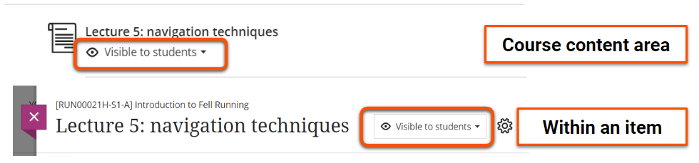
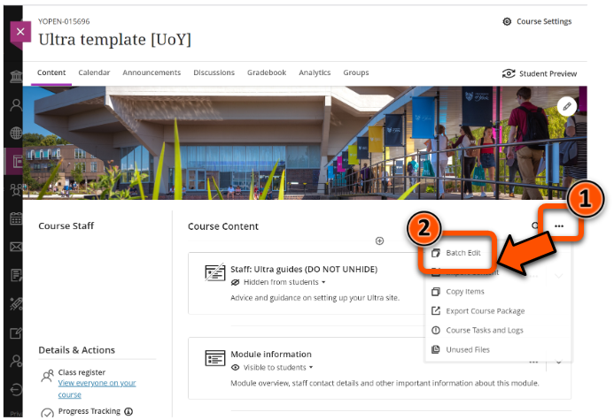
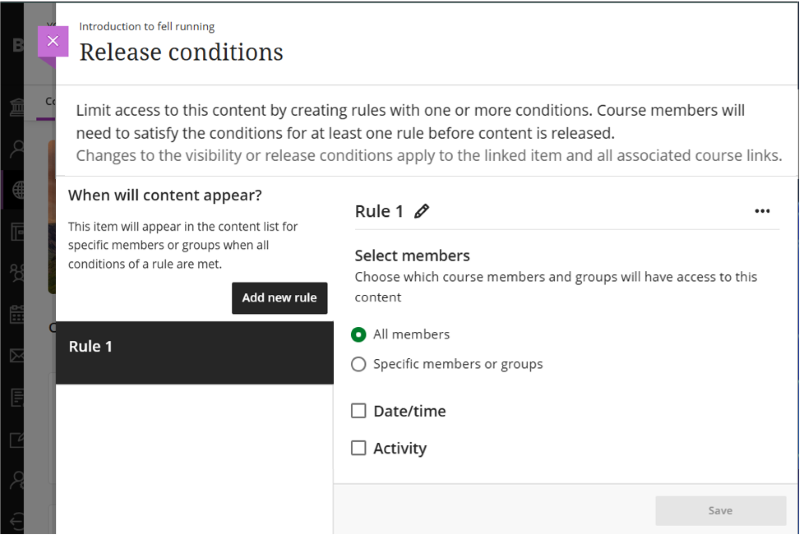
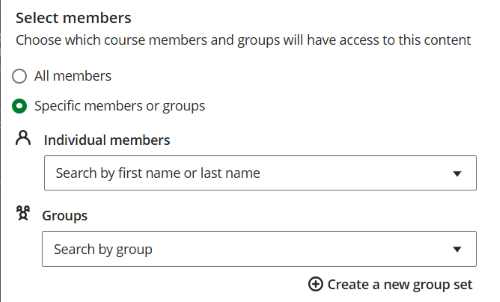
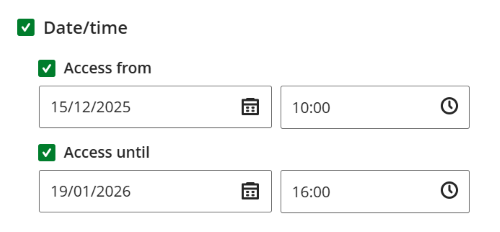
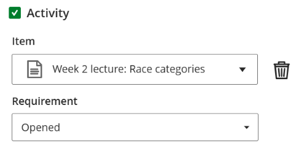
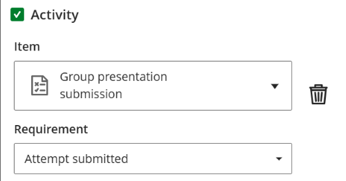
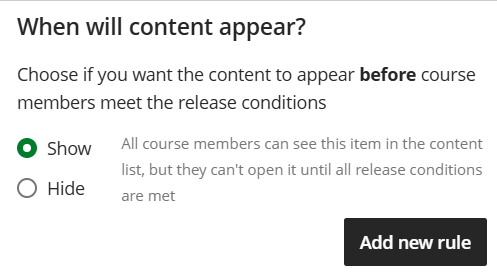

---
tags:
    - Key guide - teaching
    - Ultra
---

# Content visibility & release conditions

!!! Summary

    Manage visibility of content items for all users or based on certain conditions.

!!! principle "Relevant [VLE site design principles](../ultra/site-design-principles.md)"

    - 5.1 Recommended: Ensure that students can see and access module materials and content.

!!! Accessibility 
    
    It is best practice to make all materials available at the start of the module. If this isn't possible, materials should be released **at least a week in advance** to allow students to prepare appropriately.

Items in the Course Content area can be set to **Visible to students** or **Hidden from students**. By default, all new items are automatically hidden from students. You can check that items are shown or hidden correctly using the Student Preview tool.

## Show/hide a single item

This method **applies visibility changes to the specific item only**. Making a Learning Module or Folder visible using this method does not automatically make the items inside visible too (ie. hidden nested items will remain hidden). To change visibility of a container and its contents, use the [Batch Edit tool](../ultra/batch-edit.md)  to change all at once, or manually update the content items' visibility.

1. Open the item's visibility menu from either:
    - *Course content area*: under the item title
    - *Within the item*: in the top right, near the cog settings icon
 
2. Select the required visibility option:
    - **Visible to students**: all students can access.
    - **Hidden from students**: no students can access the item. You can choose whether it is completely hidden or whether to show the item without allowing access.
    - **Release conditions**: visibility managed based on certain conditions (see section below).
 

## Show/hide multiple items

Use the Batch Edit function to quickly change the visibility of multiple items at once. For example, you can use this to make a Learning Module and the items nested within it visible with only a few clicks.

This is accessed in a different way to single item visibility. See our [Batch Edit guide](../ultra/batch-edit.md) for details.

## Release conditions

Items can also be shown based on certain conditions:

| Condition      | Details | Example uses |
| -------------- | ------- | ------------ |
| Select members | Show item to specific course members or groups | **Teaching**: release different topic to each project group   **Assessment**: limit access to resit submission point only to resit students
| Date/time      | Show/hide item at a specific time | **Teaching**: Release module materials at appropriate time   **Assessment**: show submission point from a specific date |
| Activity:  Opened | Show item if students have opened another item | **Teaching**: release workshop materials after opening a safety briefing   **Assessment**: not recommended in assessment contexts |
| Activity: Performance | Show item if students submit, complete or receive a certain score for another markable item | **Teaching**: release workshop materials after completing a pre-workshop quiz   **Assessment**: release extension activities only for high quiz scores |

For greater control, conditions can be combined (eg. date and specific group) and multiple rules can be set (eg. different dates for different groups).

### Create a rule

!!! Tip

    Release conditions are very flexible; each rule can contain multiple conditions, and each item can have [multiple rules](#multiple-rules) applied.

1. Open the item visibility drop-down menu and and select **Release conditions**.
2. Set conditions:
    - *Select members*: select the **Specific members or groups** option, then select relevant Individual member(s) and/or Group(s) from the drop-downs. There is also the option to create a new group set here.
     
    - *Date/time*: click the **Date/time** check box. Check the **Access from** and/or **Access until** check boxes and enter the relevant date and time (during work hours).
     
    - *Activity: Opened*: click the **Activity** check box, then search for the relevant item in the *Item* menu. In the *Requirement* menu, select **Opened**.
     
    - *Activity: Performance*: click the **Activity** check box, then search for the relevant markable item (Test, Assignment, Discussion etc.) in the *Item* menu. In the *Requirement* menu, select *Submitted*, a minimum mark, or enter a custom mark range.
     
3. Click **Save** and check the summary is correct.

### When will content appear?

If you have added *Date/time* or *Activity* conditions, select whether to **Show** (default) or **Hide** the item in the content area before the release conditions are met.

This is useful if students should be able to see the item in the site content, but not be able to open it until the release conditions are met.

### Multiple rules

Multiple rules can be added to the same item to set different release conditions for different students. For example, use two rules to give one group early access to an item before releasing it to all students:

- *Rule 1*: release to the early access group on date 1
- *Rule 2*: release to all users on date 2

To add multiple rules:

1. Set up Rule 1 as above. It may be helpful to also click the **pencil icon** and set a descriptive rule name.
2. Click the **Add new rule** button under *When will content appear?*.
3. Repeat as needed.

### Edit or delete a rule

!!! Tip 

    If all release conditions are removed, the item visibility defaults to *Hidden*.

To make changes after setting up a rule:

- If using multiple rules, click the relevant rule to show the options.
- *Edit conditions*: make changes as above and click **Save**.
- *Delete the rule*: click the **three dots icon** alongside the rule name and select **Delete**.