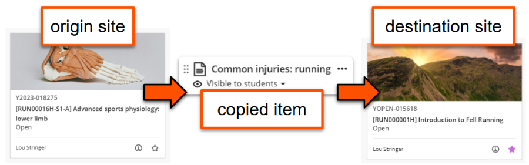
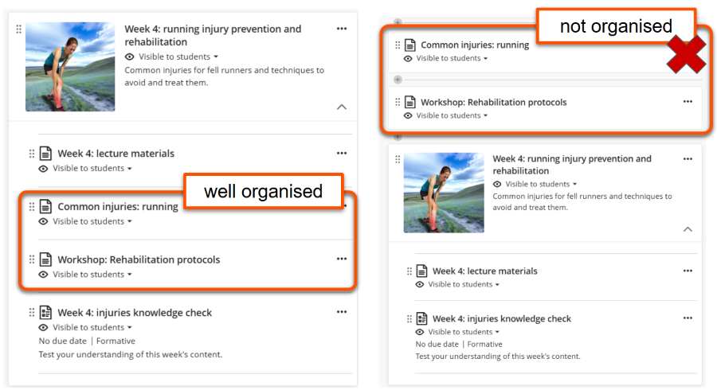
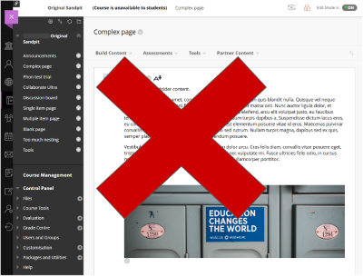
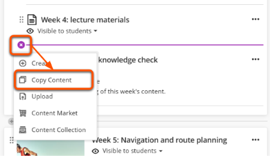
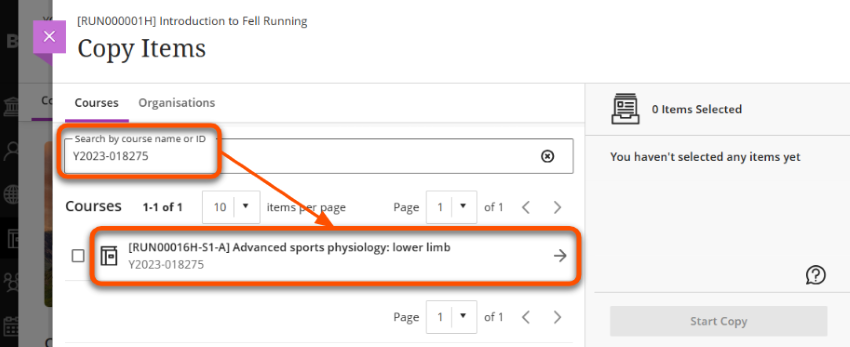
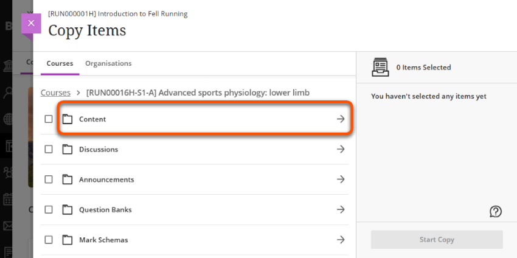
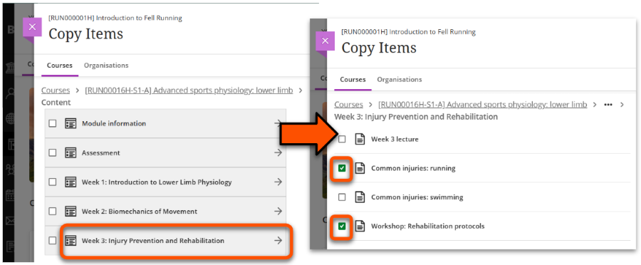
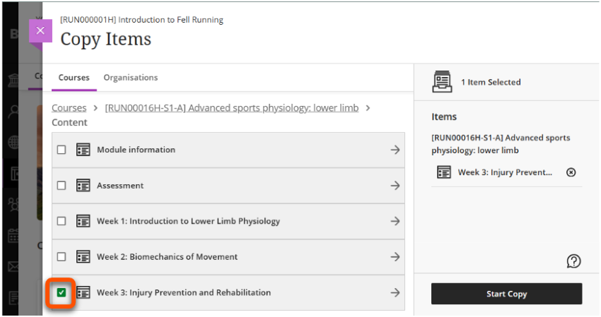
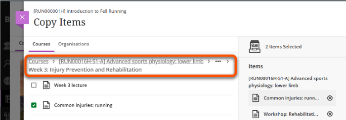
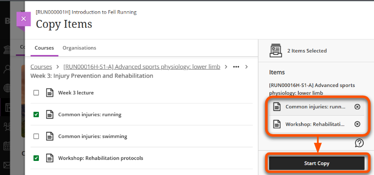

---
tags:
    - Key guide - teaching
    - Ultra
---

# Copy content tool

!!! Summary

    Use the Copy Content tool to copy items from another Ultra site or duplicate items within the same site.

The Copy Content tool allows you to easily copy existing Ultra content into your site, such as content items, marking rubrics, questions banks and more.

Some terminology that we'll use in this guide:

- **origin site**: the site where the content is coming from
- **destination site**: the site where the copied content will appear

You must be enrolled as an Instructor on the origin *and* destination sites.

!!! Tip

    The copies are static. Later changes to content items in the origin site **do not update** in copied items in the destination site.

## Best practices

### Organise copied content

Make sure to organise the copied content items into your site structure so that students can find them easily. Don't copy items into the top level and leave them there.

There are two ways to do this:

- Recommended: Navigate to the place you want a specific item to appear and copy it there directly. Repeat for items in other locations.
- Copy items into the Course Content area, then move each one to the specific location.

### Avoid copying from Original sites

 
In most cases, we don't recommend using the Copy Content tool if the origin site is an Original ('old style') site.

Ultra and Original sites are structured differently, so content doesn't copy well and needs a lot of tidying up. It's likely easier to recreate it directly the Ultra destination site.

However, Questions Banks do usually copy well from Original to Ultra sites.

## Using the Copy Content tool

1. Open the **destination site**.
2. Hover in the location where you want to copy the content to. Click the **plus icon** then select **Copy Content** in the menu that appears.
 
3. Search for the origin site by name or ID ([YCode](../help/ycodes.md), eg. Y2024-100200), then click the site name. Don't tick the box - that will copy the entire site!
 
4. Select **Content** or another relevant content type. Again, don't tick the box as that will copy everything. The categories shown depend on the content in the site.
 
5. The Course Content area of the origin site is now shown. Navigate through to select the content you need:
    - *Specific items*: click a Learning Module/folder to show the items within. Tick the box next to each item to copy.
     
    - *Full Learning Module/folder*: tick the box next to the Learning Module/folder to select it and all of the items within.
     
    - To move back up a level, use the breadcrumbs above the content list.
     
6. Check the Items Selected to copy, and remove any that aren't needed. Click **Start Copy** and wait for the copy to complete.
 
7. Copied items are hidden from students by default, so make them [visible or set appropriate release conditions](../ultra/content-visibility.md).
8. If needed, organise items by moving them to the relevant location.

You can also watch a video demonstration:

<iframe width="560" height="315" src="https://www.youtube.com/embed/n5CB9CfpSFI" title="YouTube video player" frameborder="0" allow="accelerometer; autoplay; clipboard-write; encrypted-media; gyroscope; picture-in-picture; web-share" allowfullscreen></iframe>

[Copying content in Ultra [YouTube]](https://youtu.be/n5CB9CfpSFI)