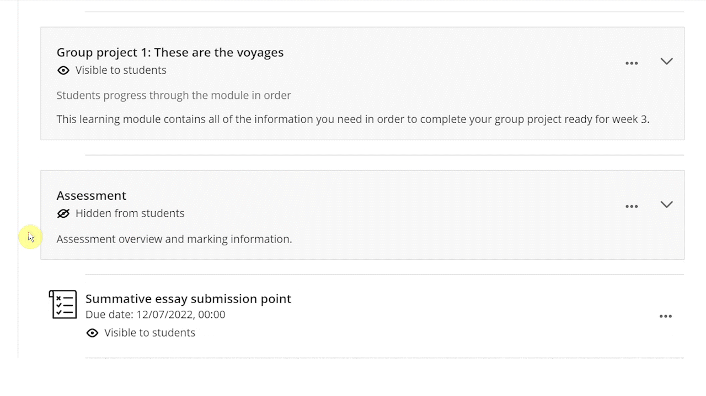
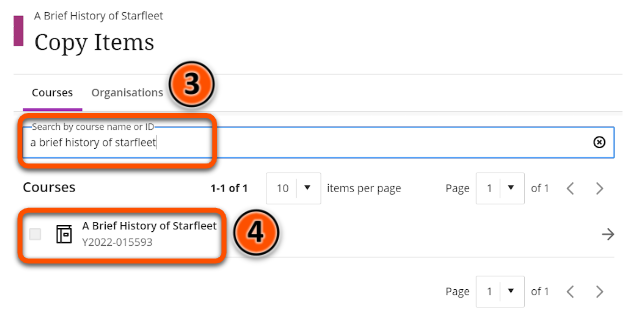
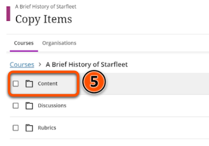
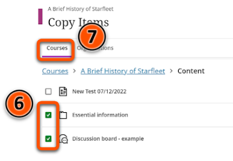
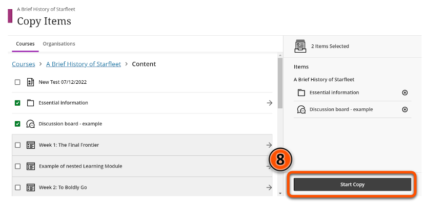

---
tags:
# Delete to leave only relevant tags
    - Foundation
    - Administration
    - Ultra
---

# Copying and reusing content WIP

!!! Summary

    Content items and containers can be copied within Ultra sites and also across different Ultra sites.

## Quick Start Guide

### Video Steps

Below is an embedded video detailing how to copy content in Ultra. Alternatively, you can [open the video in a new browser tab](https://www.youtube.com/watch?v=BHbPKdtqTyQ).

<!-- PASTE YOUTUBE EMBED (should look like this:) -->
<iframe width="560" height="315" src="https://www.youtube.com/embed/BHbPKdtqTyQ" title="YouTube video player" frameborder="0" allow="accelerometer; autoplay; clipboard-write; encrypted-media; gyroscope; picture-in-picture" allowfullscreen></iframe>

### Text Steps

<!-- Clear and concise: Click **Submit**, not Click on the **Submit button** -->
<!-- Use **bold** to highight key tasks and features -->

To copy content items:

1. Hover your mouse over the grey divider where you want your content to appear, then click the plus icon.
2. Click **Copy Content**.
3. In the box labelled **Search by course name or ID**, type the title or course ID of the Ultra site you want to copy content from.
4. Click on the site you want to copy from in the list of search results.
5. Click **Content**.
6. Select the content items you want to copy using the checkboxes next to each item’s name.
7. At this point you can click **Courses** and repeat steps 5-6 if you want to copy items from multiple sites.
8. When you have selected all the items you want to copy, click **Start Copy**.

!!! Warning

	 It is **not recommended** to directly copy content from a Blackboard Original site to an Ultra site, as this can cause problems with the content.

