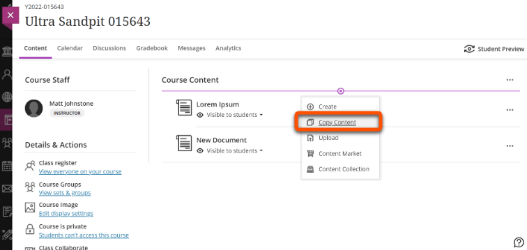
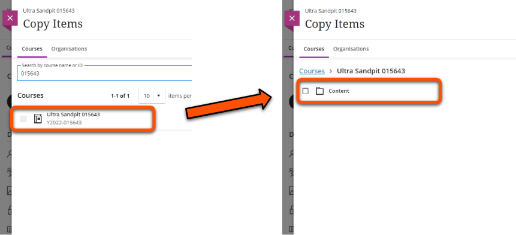
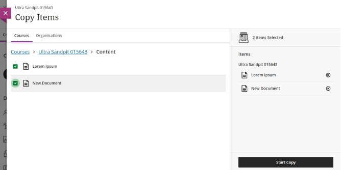
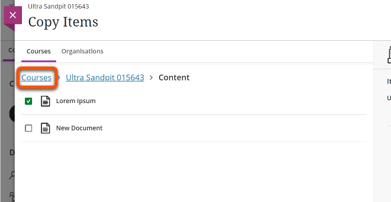

---
tags:
    - Key guide - teaching
    - Ultra
---

!!! Note

    This guide will be updated for the 2024/25 academic year.

# Copying content

!!! Summary

    Content items and containers can be copied within Ultra sites and also across different Ultra sites.

## Video Steps

<!-- PASTE YOUTUBE EMBED (should look like this:) -->
<iframe width="560" height="315" src="https://www.youtube.com/embed/n5CB9CfpSFI" title="YouTube video player" frameborder="0" allow="accelerometer; autoplay; clipboard-write; encrypted-media; gyroscope; picture-in-picture; web-share" allowfullscreen></iframe>

Video: [Copying content](https://youtu.be/n5CB9CfpSFI)

## Text Steps

<!-- Clear and concise: Click **Submit**, not Click on the **Submit button** -->
<!-- Use **bold** to highight key tasks and features -->

To copy content items:

1. Click the Plus icon in the Course Content area and select **Copy Content**.
    
2. Type the title or course ID of the Ultra site you want to copy content from.
3. Click on the site you want to copy from in the list of search results.
4. Click **Content**.
    
5. Select the content items you want to copy using the checkboxes next to each item’s name.
    
6. At this point you can click **Courses** and repeat steps 2-5 if you want to copy items from multiple sites at once.
    
7. When you have selected all the items you want to copy, click **Start Copy**. Refreshing your browser tab may speed up the copying process.
