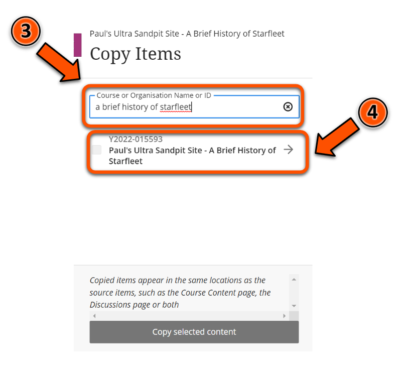
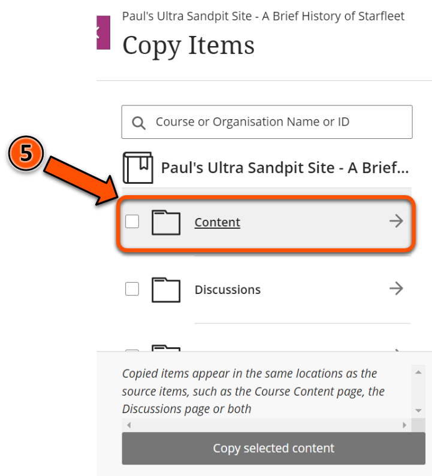
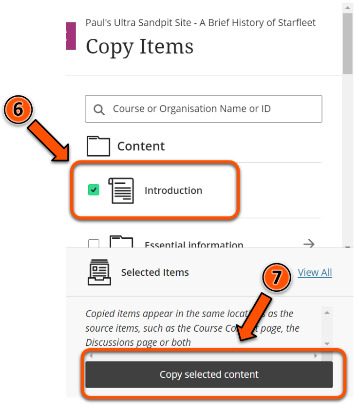

---
tags:
# Delete to leave only relevant tags
    - Foundation
    - Administration
    - Ultra
---

# Copying and reusing content

!!! Summary

    Content items and containers can be copied within Ultra sites and also across Ultra sites.

## Quick Start Guide

### Video Steps

Below is an embedded video detailing how to DO THE THING. Alternatively, you can [open the video in a new browser tab](VIDEO URL).

<!-- PASTE YOUTUBE EMBED (should look like this:) -->
<iframe width="560" height="315" src="VIDEO EMBED URL" title="YouTube video VIDEO TITLE" frameborder="0" allow="accelerometer; autoplay; clipboard-write; encrypted-media; gyroscope; picture-in-picture" allowfullscreen></iframe>

### Text Steps

<!-- Clear and concise: Click **Submit**, not Click on the **Submit button** -->
<!-- Use **bold** to highight key tasks and features -->

To copy content items:

1. Hover your mouse over the grey divider where you want your content to appear, then click the plus icon.
2. Click **Copy Content**.
3. Type in the title or course ID of the Ultra site you want to copy content from.
4. Click on the site in the list of search results.
5. Click **Content**.
6. Select the content items you want to copy using the checkboxes next to each item’s name.
7. Click **Copy selected content**.

!!! Warning

	While it is possible to copy content within and between Ultra sites, it is **not possible** to directly copy content from a Learn Original site to an Ultra site. 

