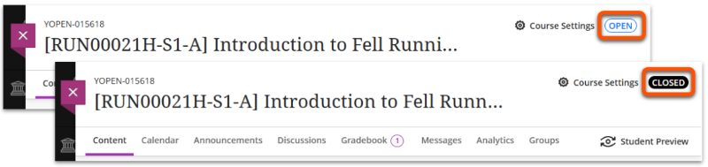
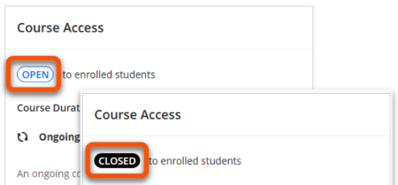
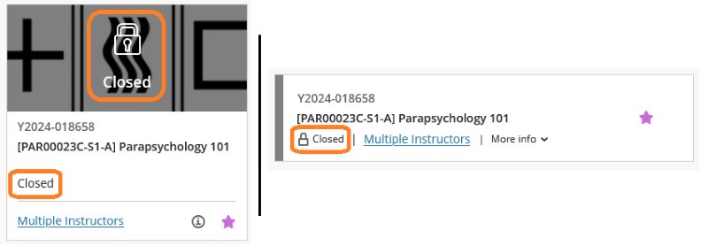
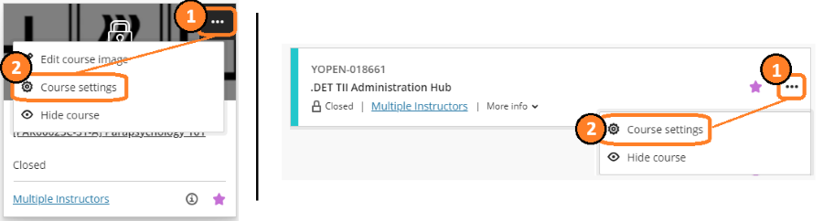
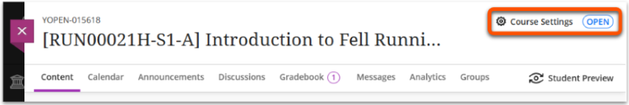
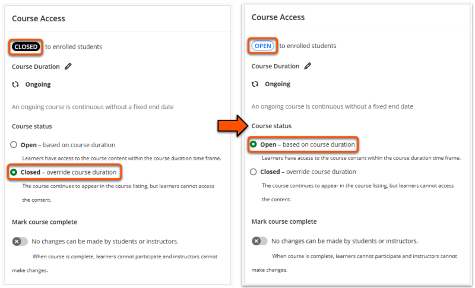
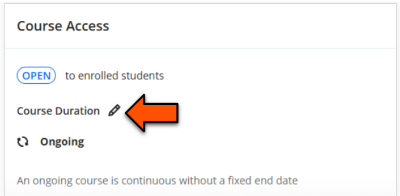
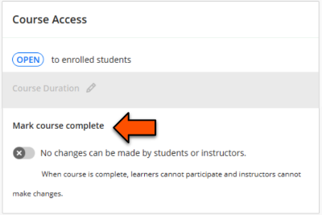

---
tags:
    - Key guide - teaching
    - Key guide - admin
    - Ultra
---

# Course Access (site availability)

!!! Summary

    Use Course Access settings to manage when enrolled students (and some other users) can enter your Ultra VLE sites.

## Course status (student access)

!!! Tip

    Sites are not automatically made available for students each semester. When the site is ready, you must set the *Course status* to **Open**.
  
The Course Status setting controls whether students (and [some other user roles](../ultra/user-management.md#user-roles)) can access the site. Instructors, Course Builders and Teaching Assistants can always access sites.

- **Open**: students can access the site and content.
- **Closed**: students can't access the site, but it is till shown in their [Courses list](../ultra/courses-list.md).

Current course status is shown in numerous locations:

- **Main course page**
 An *Open* or *Closed* label appears in the top right of the page.
 
- **Course Settings page**
 An *Open* or *Closed* label appears at the top of the Course Access section.
 
- **[Courses List](../ultra/courses-list.md)**
 *Open* or *Closed* appears under the site name. For Closed sites, a padlock icon also appears over the thumbnail image (Grid view) or next to the status (List view).
 

## Update Course status

!!! Warning

    Instructors have the option to [hide a Course from their own view](../ultra/courses-list.md#hideshow-sites-from-your-own-view) of the Courses List. Using this option does *not* affect student access to the site.

1. Open the *Course Settings* page:
    - In the Courses List: click the **three dots icon** (in Grid view, hover over the course to show the icon) then click **Course Settings**.
     
    - Within the VLE site: Click **Course Settings** (or the course status label) in the top right of the page.
     
2. In the *Course Access* section, set the Course status to **Open** (students can access) or **Closed** (students can't access). The status shown at the top of the Course Access section will be updated.
 
3. Close the Course Settings page. The updated status will save automatically. If you don't immediately see the new status in the main course page, refresh your screen to update.
4. Depending on their preferred settings, students may receive a notification of a *New Course available* when a site is made open. If it's essential that students are notified, send an [Announcement](../ultra/announcements.md) through the site.

## Course settings not in use

The Course Access panel contains some additional settings that are not used to manage site access at the University of York.cd documnets

### Course Duration

Course Duration relates to automatically opening and closing courses.

All teaching sites should be left on the default **Ongoing** setting, even after the teaching ends. This allows students to access their teaching materials throughout their programme.

### Mark course complete

Marking a course as complete prevents any user making changes to the site. 

All teaching sites should be left with this setting **turned off**, even after the teaching ends. Turning it on causes issues for students on LoA who may need to submit assessments to the site later.

