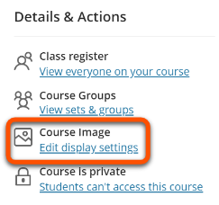
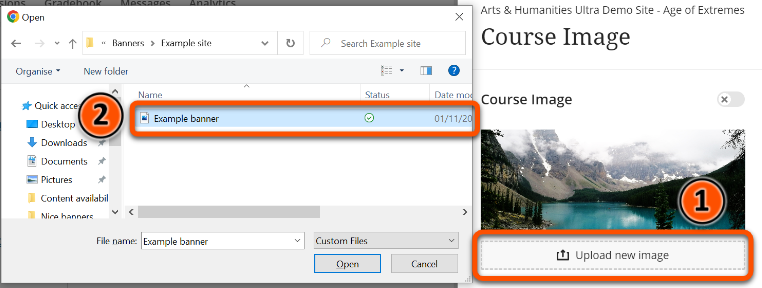
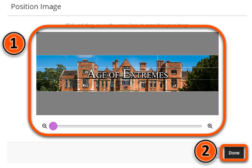
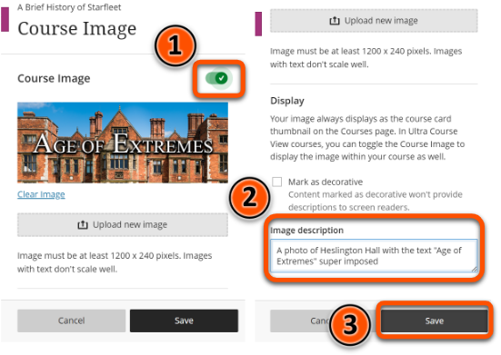

---
tags:
    - Ultra
---

# Course images

!!! Summary

    The Course Image is a customisable site banner image.

!!! principle "Relevant [VLE site design principles](../ultra/site-design-principles.md)"

    - 2.3 Essential: Design and images adhere to the UoY brand.

## Overview

The Course Image is a site banner image. It appears in two locations:

- Course List: appears in the tile view of the module site 
- Within the site: a banner across the main 'Content' view of the site.

You can change the Course Image supplied with your site template to something related to your module.

## Add or update the course image

!!! Tip

    Course images need to be at least 1200 × 240 pixels.

To set up your Ultra site's Course Image:

1. Open your Ultra site and click **Edit display settings** under **Course Image** in the **Details &  Actions** menu.   
2. Click **Upload new image**.
3. Select the desired image from the browser.   
4. Position the image as required, adjusting the zoom if necessary.
5. Click **Done**.   
6. Ensure that the **Course Image** toggle is set to the **On** position.
7. Add a description of the image to the **Image description** box.
8. Click **Save**.   

You can also watch a demonstration of adding a Course Image:
<iframe width="560" height="315" src="https://www.youtube.com/embed/O0B4R8RyBYU" title="Course images in Ultra" frameborder="0" allow="accelerometer; autoplay; clipboard-write; encrypted-media; gyroscope; picture-in-picture" allowfullscreen></iframe>
[Course images in Ultra [YouTube]](https://youtu.be/O0B4R8RyBYU)

## Technical details

### Image size

Course images need to be at least 1200 × 240 pixels. If you want to use a larger image, maintain the same 5:1 aspect ratio.

### Visible area
The Course Image will resize and scale based on the size of the screen. Any content that should always be visible (eg. module name) should be restricted to a 550 × 150 pixel area in the centre of the image, regardless of overall image size - see template below.

You can download this template as a PNG file by right clicking on the image and clicking **Save image as**.

### Sourcing images

!!! Warning

    You must not use copyrighted material for site images.

Images should be high quality: use the [University’s photo library](https://brand.york.ac.uk/account/dashboard/) or [Unsplash.com](https://unsplash.com/) to source copyright-free images.

Download images at a resolution that meets the minimum requirements for Ultra. The **Web Image gallery** size on the University's photo library meets these requirements.

