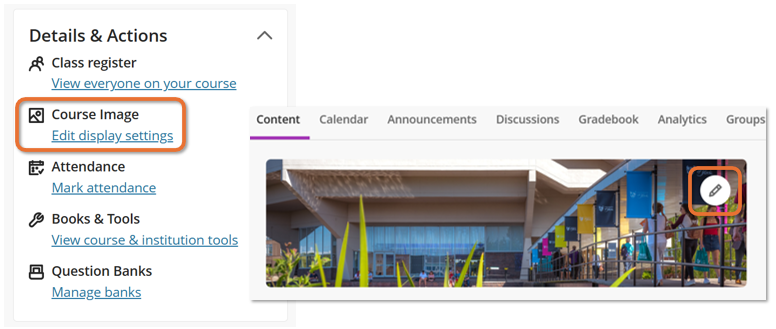

---
tags:
    - Ultra
---

# Course images

!!! Summary

    The Course Image is a customisable site banner image.

!!! principle "Relevant [VLE site design principles](../ultra/site-design-principles.md)"

    - 2.3 Essential: Design and images adhere to the UoY brand.

The Course Image is a site banner image. It appears in two locations:

- Course List: appears in the tile view of the module site 
- Within the site: a banner across the main 'Content' view of the site.

You can change the Course Image supplied with your site template to a decorative image related to your module.

## Add or update the course image

!!! Tip

    Course banners must be decorative only, and also resize to fit screen size. Because of this, avoid including text in your Course Image.

To add or update the Course Image:

1. In the **Details &  Actions** menu, click **Course Image**, or if you already have a Course Image you can click the **edit/pencil icon** on the banner.
  
2. On the *Display Settings* panel, click the **image icon**.
  
3. On the *Insert image* panel, there are two ways to add an image:
    - **Upload from Device**: drag and drop an image file or click **Upload file** and select an image (must be at least 1200x2400 pixels).
    - Under *Image Source*, select **Stock images from Unsplash** and choose an image.
  
4. Preview the image and click **Next**.
5. Position and zoom the image as required. Consider how the image will be resized to fit screen sizes; the central portion of the grid will always be shown. Click **Save**.
  
6. Check that the **Course Image** toggle is set to **On**.
7. By default, the banner image is marked as decorative; leave this ticked.
 
8. Click **Save**.

<!-- You can also watch a demonstration of adding a Course Image:
<iframe width="560" height="315" src="https://www.youtube.com/embed/O0B4R8RyBYU" title="Course images in Ultra" frameborder="0" allow="accelerometer; autoplay; clipboard-write; encrypted-media; gyroscope; picture-in-picture" allowfullscreen></iframe>
[Course images in Ultra [YouTube]](https://youtu.be/O0B4R8RyBYU) -->

## Remove the course image

!!! Tip

    An image will always be shown in the thumbnail view in the Courses list. If there is no Course Image in your site, a default image will be used.

To **hide** the course image in the site but keep it in the Courses list thumbnail:

1. In the **Details &  Actions** menu, click **Course Image**, or click the **edit/pencil icon** on the banner.
2. Set the *Course Banner* toggle to **Off**.

To completely **delete** the course image and use a default image in the Courses list thumbnail:

1. In the **Details &  Actions** menu, click **Course Image**, or click the **edit/pencil icon** on the banner.
2. Click the **bin icon** and **Delete** when prompted.

## Sourcing images

!!! Warning

    You must not use copyrighted material for site images.

Images should be high quality: use the [University’s photo library](https://brand.york.ac.uk/account/dashboard/) or [Unsplash.com](https://unsplash.com/) to source copyright-free images.

Download images at a resolution that meets the minimum requirements for Ultra. The **Web Image gallery** size on the University's photo library meets these requirements.

