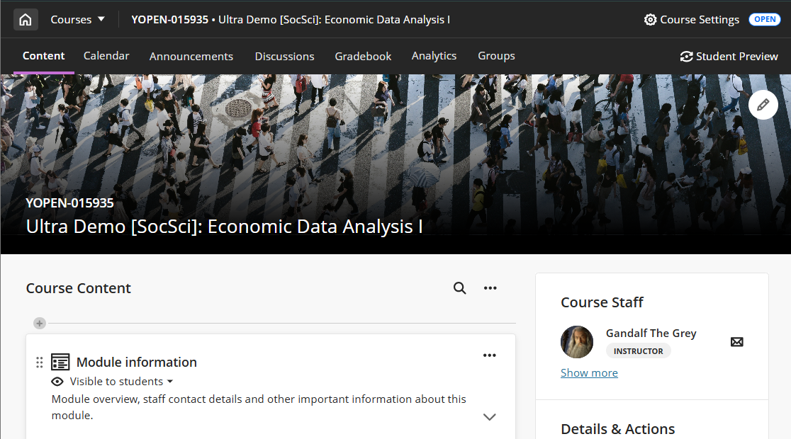
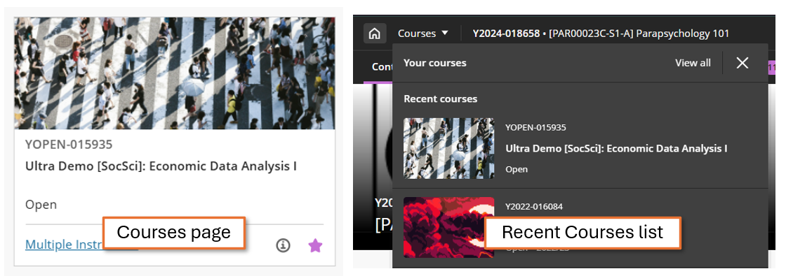
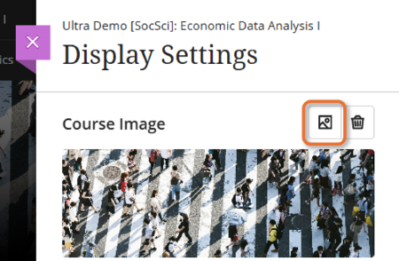
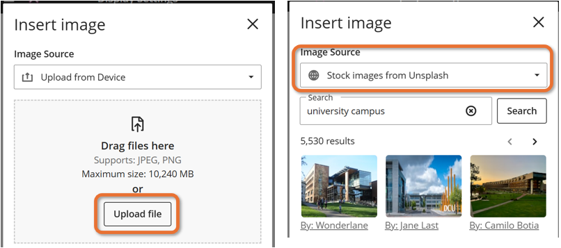
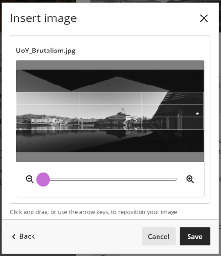
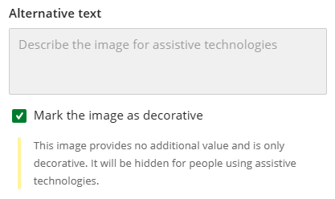
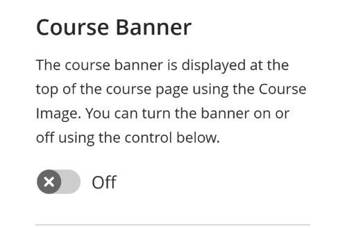
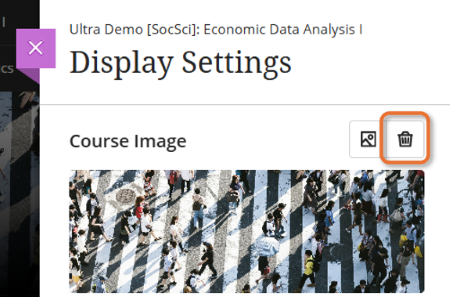
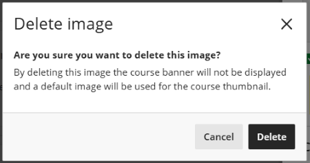
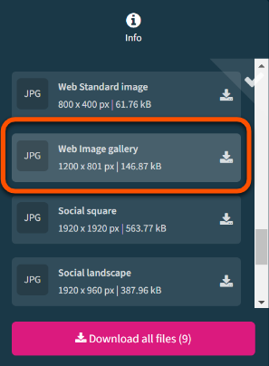

---
tags:
    - Ultra
---

# Course images

!!! Summary

    The Course Image is a customisable site banner image that appears within sites and as a thumbnail on the Courses page.

!!! principle "Relevant [VLE site design principles](../ultra/site-design-principles.md)"

    - 2.3 Essential: Design and images adhere to the UoY brand.

## Updated navigation: January 2026

An updated navigation system is coming in January 2026. This will make it easier to move around the Ultra system and between sites, and makes better use of screen space.

As part of this, the Course Image (banner) becomes full width, with the site name overlaid. If no Course Image is set, a plain placeholder banner is used.

**The advice and images below have been updated to reflect this new navigation.**

---

## Banner & thumbnails

Within sites, the Course Image is full-width site banner. The site name and Ycode are overlaid on the bottom portion of the banner.

The Course image also appears as thumbnails on the Courses page (tiled view) and the recent Courses list:

## Add or update the course image

!!! Tip

    Avoid including text in your Course Image; banners should be purely decorative and text may be obscured by resizing to fit different screen sizes.

To add or update the Course Image:

1. Click the **edit/pencil icon** on the banner, or click **Edit display settings** under *Course Image* in the *Details &  Actions* panel.
  
2. In the *Display settings* panel, click the **image icon** above the image preview.
  
3. On the *Insert image* panel, there are two ways to add an image:
    - **Upload from Device**: drag and drop an image file or click **Upload file** and select an image (must be at least 1200x2400 pixels).
    - Under *Image Source*, select **Stock images from Unsplash** and choose an image.
  
4. Preview the image and click **Next**.
5. Position and zoom the image as required. Consider how the image will be resized to fit screen sizes; the central portion of the grid will always be shown. Click **Save**.
 
6. Check that the **Course Image** toggle is set to **On**.
7. By default, the banner image is marked as decorative; leave this ticked.
 
8. Click **Save**.

## Remove the course image

!!! Tip

    If you hide or delete the course image, a default plain placeholder image is used instead.

To **hide** the course image in the site but keep it in the thumbnails:

1. Click the **edit/pencil icon** on the banner, or click **Edit display settings** under *Course Image* in the *Details &  Actions* panel.
2. In the *Display settings* panel, set the *Course Banner* toggle to **Off**.
 

To completely **delete** the course image and use a default image in the Courses list thumbnail:

1. Click the **edit/pencil icon** on the banner, or click **Edit display settings** under *Course Image* in the *Details &  Actions* panel.
2. In the *Display settings* panel, click the **bin icon** above the image preview.
   
3. On the *Delete image* panel, click **Delete**.
 

## Sourcing images

!!! Warning

    You must not use copyrighted material for site images.

Images should be high quality: use the [University’s photo library](https://brand.york.ac.uk/account/dashboard/) or [Unsplash.com](https://unsplash.com/) to source copyright-free images.

Download images at a resolution that meets the minimum requirements for Ultra. The **Web Image gallery** size on the University's photo library meets these requirements.

