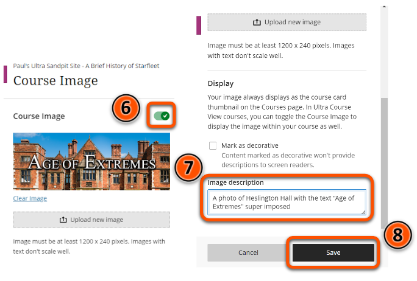

---
tags:
# Delete to leave only relevant tags
    - Foundation
    - Advanced
    - Administration
    - Ultra
---

# Course images

!!! Summary

    Each Ultra site has an optional course image that displays as a banner above the **Course Content** area and as a thumbnail in the **Courses** section of the VLE homepage.

!!! principle "Relevant [VLE site design principles](https://vle-support.york.ac.uk/ultra/site-design-principles)"

    - 2.3 Essential: Design and images adhere to the UoY brand.

## Quick Start Guide

### Video Steps

Below is an embedded video detailing how to set up Course Images in Ultra. Alternatively, you can [open the video in a new browser tab](https://youtu.be/O0B4R8RyBYU).

<!-- PASTE YOUTUBE EMBED (should look like this:) -->
<iframe width="560" height="315" src="https://www.youtube.com/embed/O0B4R8RyBYU" title="YouTube video player" frameborder="0" allow="accelerometer; autoplay; clipboard-write; encrypted-media; gyroscope; picture-in-picture" allowfullscreen></iframe>

### Text Steps

<!-- Clear and concise: Click **Submit**, not Click on the **Submit button** -->
<!-- Use **bold** to highight key tasks and features -->

Course images need to be at least 1200 × 240 pixels.

To set up your Ultra site's Course Image:

1. Open your Ultra site and click **Edit display settings** under **Course Image** in the left hand menu.
2. Click **Upload new image**.
3. Select the desired image from the browser.
4. Position the image as required, adjusting the zoom if necessary.
5. Click **Done**.
6. Ensure that the **Course Image** toggle is set to the **On** position.
7. Add a description of the image to the **Image description** box.
8. Click **Save**.

## More Details and Troubleshooting 

Any content that needs to be always visible should be restricted to a 550 × 150 pixel area in the centre of the course image - see template below.

You can download this as a PNG file by right clicking on the image and clicking on **Save image as**.

!!! Tip

	If you want to use a course image larger than 1200 × 240 pixels, maintain the same 5:1 aspect ratio.

Avoid using any copyrighted material when creating your site’s course image.

You can use the [university’s photo library](https://brand.york.ac.uk/account/dashboard/) to download images owned by the university, or [Unsplash](https://unsplash.com/) for copyright-free images.

Download images at a resolution that meets the minimum requirements for Ultra. The **Web Image gallery** size on the photo library meets these requirements.

<!-- More info here as needed. -->