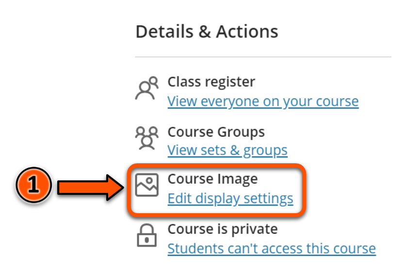
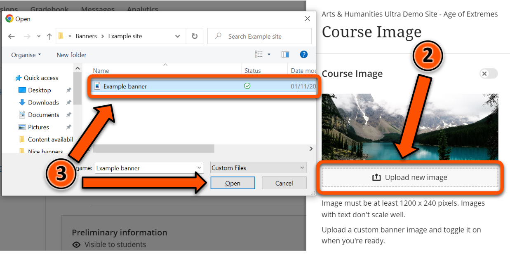
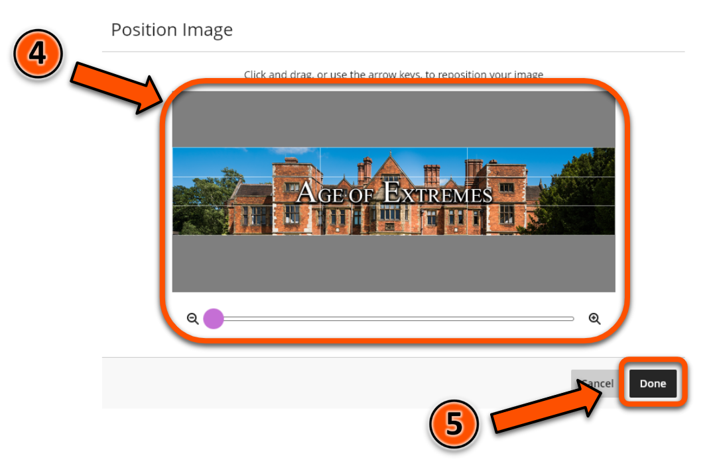
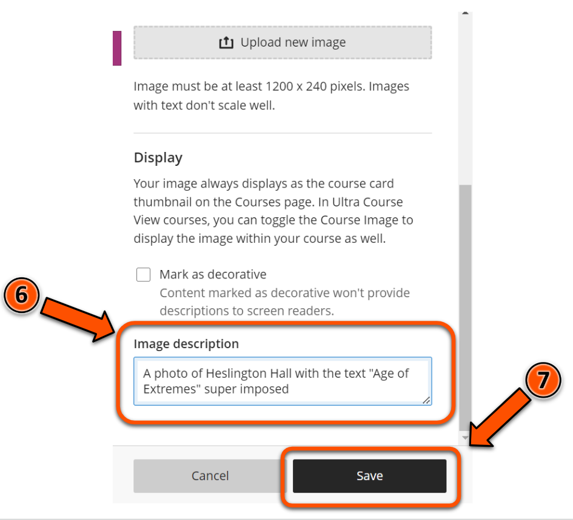

---
tags:
# Delete to leave only relevant tags
    - Foundation
    - Advanced
    - Administration
    - Ultra
---

# Course images

!!! Summary

    Each Ultra site has an optional course image that displays as a banner above the **Course Content** area and as a thumbnail in the **Courses** section of the VLE homepage. 

## Quick Start Guide

### Video Steps

Below is an embedded video detailing how to DO THE THING. Alternatively, you can [open the video in a new browser tab](VIDEO URL).

<!-- PASTE YOUTUBE EMBED (should look like this:) -->
<iframe width="560" height="315" src="VIDEO EMBED URL" title="YouTube video VIDEO TITLE" frameborder="0" allow="accelerometer; autoplay; clipboard-write; encrypted-media; gyroscope; picture-in-picture" allowfullscreen></iframe>

### Text Steps

<!-- Clear and concise: Click **Submit**, not Click on the **Submit button** -->
<!-- Use **bold** to highight key tasks and features -->

Your Ultra site’s Course Image will display as a banner above the **Course Content** area of your site, and also as the course card thumbnail in the **Courses** section of the VLE homepage.

Course images need to be at least 1200 × 240 pixels.

To set up your Ultra site's Course Image:

1. Open your Ultra site and click **Edit display settings** under **Course Image** in the left hand menu.
2. Click **Upload new image**.
3. Select the desired image from the browser.
4. Position the image as required, adjusting the zoom if necessary. Note that if your image is sized correctly at 1200 × 240 there should be no need to adjust the position or zoom.
5. Click **Done**.
6. Add a description of the image to the **Image description** box.
7. Click **Save**.

## More Details and Troubleshooting 

Any content that needs to be always visible should be restricted to a 550 × 150 pixel area in the centre of the course image. Anything outside of this area will not be visible when the course image is displayed as a thumbnail, and may be cropped when the course image is displayed as a banner on mobile devices, or in certain size windows on desktop. We would therefore recommend that all text is kept within this 550 × 150 pixel area.

!!! Tip

	You may wish to use a course image larger than 1200 × 240 pixels. If you do this, it is a good idea to maintain the same 5:1 aspect ratio - for example, 2400 × 480 pixels. Also please note that no matter how large your course image is, only the central 550 × 150 pixels will be guaranteed to be visible at all times.

A template course image sized at 1200 × 240 pixels, with the central 550 × 150 pixel area highlighted, is shown below. You can download this as a PNG file by right clicking on the image and clicking on **Save image as**.

Avoid using any copyrighted material when creating your site’s course image. You can use the [university’s photo library](https://brand.york.ac.uk/account/dashboard/) to download images owned by the university, or [Unsplash](https://unsplash.com/) for copyright-free images.

When downloading images from the university photo library (or any other source), be sure to download the image at a resolution that meets the minimum requirements for Ultra. The **Web Image gallery** size on the photo library meets the minimum requirements for Ultra.

<!-- More info here as needed. -->