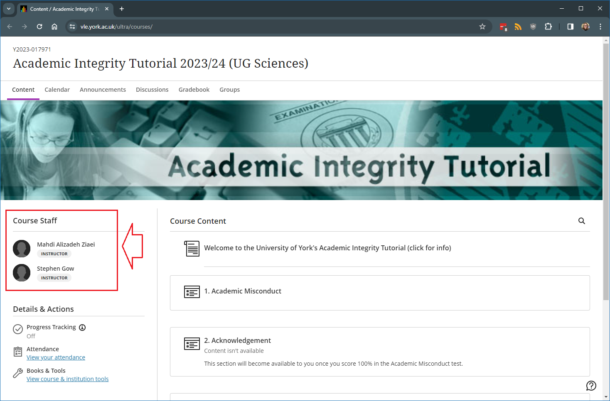

---
tags:
   - Key guide - admin
   - Ultra 
---

# Course staff

!!! Summary
 
    Most users are enrolled automatically, but you can also manually enrol users on a Learn Ultra course or organisation if needed.

## A Note About The "Course Staff" Pane
By default, instructors are listed in the module under the 'Course staff' header in alphabetical order. To ensure that the module leader or core teaching team members are displayed first, you can allocate 'primary instructor' status to one or more instructors using the steps below.

1. Select the 'View everyone on your course' link under the 'Class register' item in the 'Details & Actions' menu.
2. Find the instructor in the list to whom you would like to allocate primary instructor status and click on 'Edit member information' from the contextual menu link alongside their name.
3. Select the 'Primary instructor checkbox and 'Save'.

Primary instructors will be moved to the top of the course staff list, and the rest will be moved out of sight.
