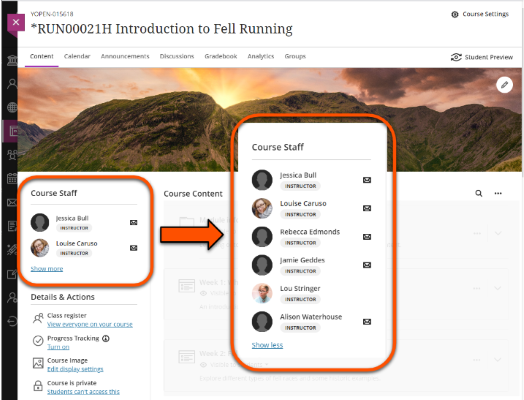
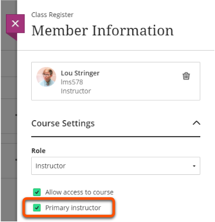

---
tags:
   - Key guide - admin
   - Ultra 
---

# Course staff

!!! Summary
 
    You can 

!!! principle "Relevant [VLE site design principles](https://vle-support.york.ac.uk/ultra/site-design-principles)"

    - 1.3 Essential: Provide module staff details and communication expectations.

The Course staff section lists all Instructors enrolled on the module site alphabetically by surname. By default, the first two Instructors are shown in the summary view, with the full list available by clicking 'Show more'.

If there are more than two Instructors on the site (eg. multiple teaching staff, or your department enrolls staff on all sites), it can be difficult for students to identity the correct module teaching staff from the Course Staff list.

In this case, use the **Primary Instructor** setting to display the module leader or core teaching team members first:

Inside the relevant Learn Ultra site:

1. Under **Details & Actions** on the left, select **Class register/View everyone on your course**. 

2. Locate the relevant Instructor using the search function or by finding them in the list.
3. Click the three dots to the right of the user's name and select **Edit member information**. 

4. Tick **Primary Instructor** and **Save**. 

Primary Instructors are now shown alphabetically at the top of the list. If more than one Primary Instructor is set, the top two are shown in the summary view.
