---
tags:
    - Key guide - teaching
    - Key guide - admin
    - Ultra
---

# Courses list

!!! Summary

    A list of your Courses (sites) that you can customise, search and filter.

The Courses list is accessed through the main VLE navigation menu, and is where you can access your sites:

- module sites
- other academic-adjacent sites, eg. a departmental skills hub
- for students: Academic Integrity Tutorial and Turnitin Tutorial

You may also be enrolled on some non-academic sites, which appear on the [Communities list](#communities-non-academic-sites).

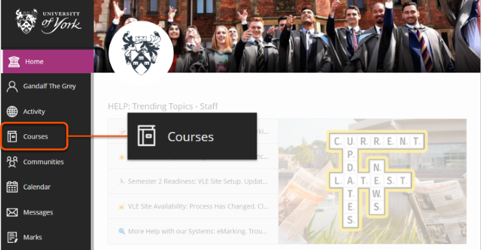

## Layout

In the menu above the course list, use the **layout icon** to change the display format:

- *list*: sites displayed as a simple full-width bar.
- *grid*: sites displayed as a block with the course image thumbnail. Blocks are arranged in rows that resize to fit the display.

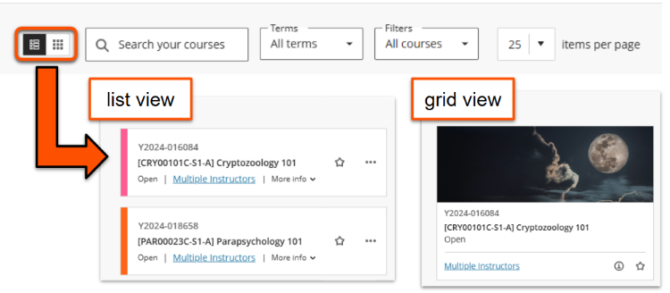

You can also adjust the **Items per page** to display 25, 50 or 100 sites per page.

## Search and filter

There are various ways that you can customise, search and filter your Courses list and quickly access your important sites.

!!! Tip

    Settings and filters on the Courses page are maintained across log-ins and different devices, so you don't have to repeat them every time.

    You can also bookmark sites in your internet browser for easy access.

### Search

Search sites by name, SITS module code, Ycode (eg. Y2024-010101) or keyword.

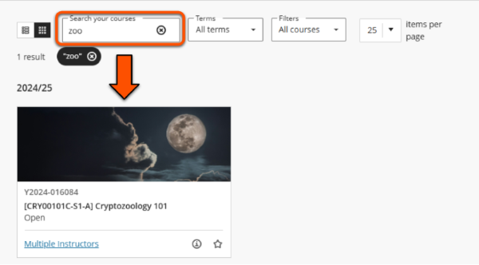

### Terms

!!! Tip

    Sites with an ID starting 'YOPEN' are generally not associated with a specific Term, and so are only viewable in *All terms*.
    
View all courses (sub-categorised by academic year), or only courses from a specific year.

### Filters

Filter sites based on your role in the site or the course access status.

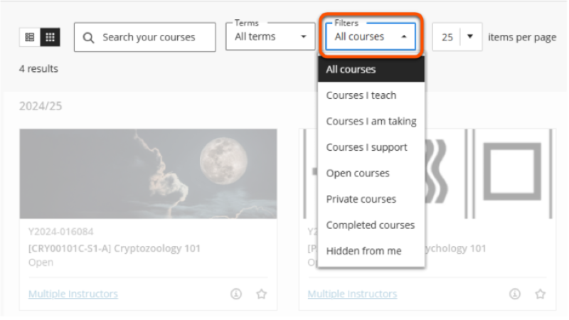

Depending on your enrollments and settings, you may see filter options including: 

- *All courses*: all the sites that you are enrolled on
- *Courses I teach*: sites where you are an Instructor
- *Courses I am taking*: sites where you are a Student
- *Courses I support*: sites where you are a Teaching Assistant, Course Builder or Marker
- *Open courses*: sites that students *can* access
- *Private courses*: sites that students *cannot* access
- *Completed courses*: this feature is not used at UoY
- *Hidden from me*: sites that you have hidden from your list view

### Remove search & filter criteria

The search and filter criteria applied are shown under the menu bar. To remove a criteria, click the **cross icon** on the relevant criteria pill.

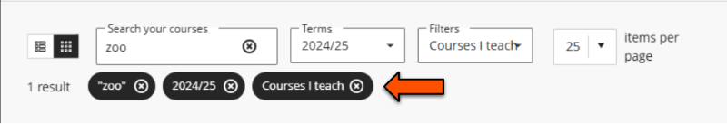

## Favourite sites

Click the **star icon** to move a site from its usual year-based category to a *Favourites* section at the top of the list. Any search or filter criteria are also applied to favourited sites.

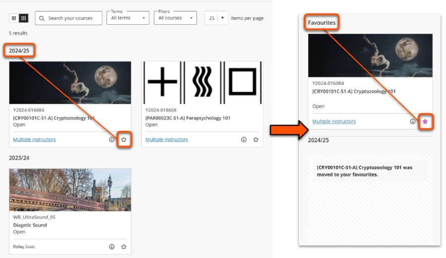

## Edit site properties

Some site properties can be edited by clicking the **three dots icon**. In grid view, hover over the site to show the icon.

### Edit course image

1. Set the Courses list to the **Grid layout**.
2. Click the **three dots icon** for the relevant site, then click **Edit Course Image**.
 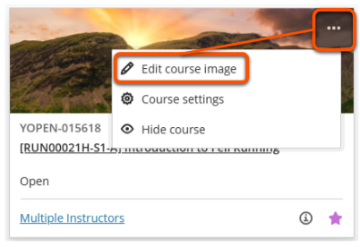
3. Update the image as required.

For more details, see our [Course Image guide](../ultra/course-image.md).

### Make course open/private

!!! Tip

    This setting controls student access to a site.

1. Click the **three dots icon** for the relevant site, then click **Course Settings**.
 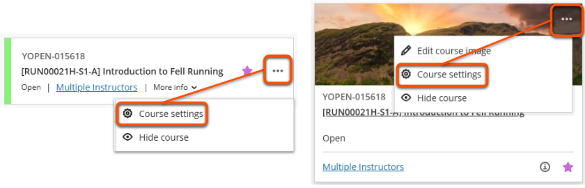
2. Set site access:
    - *To make a course private* (ie. students cannot access it): turn *on* the **Close Course** toggle.
    - *To make a course open* (ie. students can access it): turn *off* the **Close Course** toggle.

For more details, see our [Site Availability guide](../ultra/site-availability.md).

### Hide/show sites from your own view

!!! Tip

    This setting hides a site from the user's own default view of the Courses list. It **does not change** their enrollment, or affect site visibility or access for other users. 

Staff can hide sites from their own view of the Courses list and any search or filter results (and show them again). For example, this might be useful for sites that you are enrolled on but rarely need to visit.

- To hide a course *(from your own view)*: 
 Click the **three dots icon** for the relevant site, then click **Hide course**. The course is removed from your main Courses list.
 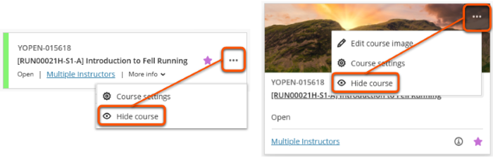
- To show a course again *(in your own view)*: 
 On the *Filters* drop-down menu, select **Hidden from me**. Click the **three dots icon** for the relevant site, then click **Show course**. It will appear on your main Courses list again.
 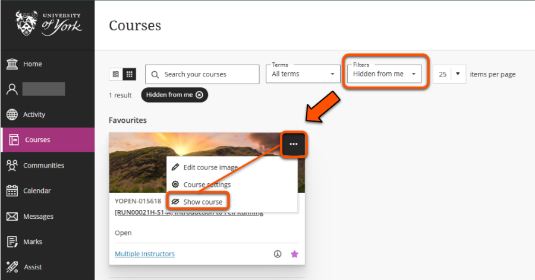

## Troubleshooting

If you can't see a site that you expect to, the issue may be:

- You are not enrolled on the site. Contact the module convenor/site owner or your departmental administrators to enrol you.
- The site doesn't meet your search or filter criteria: edit the criteria and try again.
- The site is [hidden from your view](#hideshow-sites-from-your-own-view).
- The site you are looking for is a [Community site](#communities-non-academic-sites) rather than a Course.

## Communities: non-academic sites

Non-academic sites are generally accessed on the **Communities** list, although in some cases you may see them in Courses. This could include sites such as:

- careers information
- departmental induction sites
- programme handbook sites
- student rep sites

The Communities list is also accessed from the main VLE navigation menu, and is searchable and filterable in the same way.

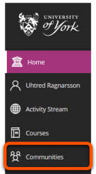

