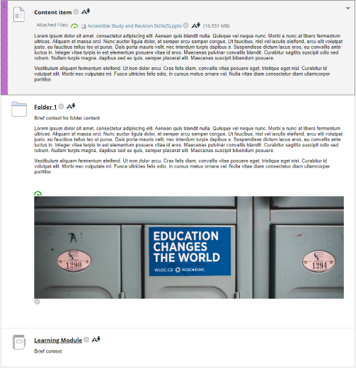

!!! Note

    This content will be updated for 24/25

# Key differences between Original and Ultra sites

!!! Summary

    Most differences between Original (‘old’) and Ultra (‘new’) sites are cosmetic, but there are some key differences in structure, content presentation and functionality.

Some differences between the site types have implications for recreating Original structure and content in Ultra sites. More specific advice is given in our [guide to reusing Original content in Ultra](https://vle-support.york.ac.uk/ultra/reuse-original-content/).

## Changes to content type availability or functionality

A few rarely-used Original content types aren't available in Ultra. To reuse affected content in Ultra, you will need to use an alternative method; PDLT can advise if needed.

Original content types that aren't available in Ultra:

- **Blog**: alternatives include [Padlet](https://vle-support.york.ac.uk/padlet/) (for shared and/or collaborative work) or the Ultra Journal (for private work).
- some **Test question** types: Jumbled sentence, Either/Or, File Response, Opinion Scale, Likert, Ordering, Quiz Bowl and Short Answer questions are not available in Ultra. Alternatives include other question types and Google Forms.
- **Wiki**: depending on the purpose of the Wiki, alternatives could include [Padlet](https://vle-support.york.ac.uk/padlet/), Google Docs or a Google Site.
- **Survey**: alternatives include Google Forms or Qualtrics, which can both be embedded in an Ultra site.

There are also some Original content types that are available but work differently in Ultra:

- **Learning Modules**: function like a Folder with improved navigation for students. Content may need some restructuring.
- **Discussions**: improved functionality and much simpler to set up. There are also new 'Class Conversations' which are discussions attached to specific content items.

## Anonymous assessment

The current Anonymous Assessment tool is not supported in Ultra. Instead we will move to an alternative online assessment tool. Information on this wll be communicated to departments.

## Structure: reduced nesting in Ultra

Original sites could contain unlimited levels of content nesting (folder within folder within folder within folder…). This often made it hard to find specific content.

Ultra sites have a maximum of two levels of nesting (folder within folder), so sites are easier to navigate.

To reuse content, if your Original site used more than two levels of nesting you’ll need to restructure this to fit the new Ultra structure. The new Ultra template will help you do this.

## Site content displays differently in Ultra

Original displayed simple site content like text, images, uploaded files and embedded items in Content Items on the same page with more complex content like Folders, Learning Modules Discussions and Tests. Many of these complex content items could also contain large amounts of text and images etc. in the description of the item. This could get quite cluttered and make the site hard to navigate.

Ultra displays site content in separate Document items. These are similar to Original pages, but only contain text, images, files, embedded items and similar content. This content isn't displayed directly on the Course Content area or within a container; instead users open the Document to view the content. Each item can display only a short, text-based summary of content without opening it. This makes it much easier to navigate the site, especially on a small screen or mobile device.

To reuse content, you may need to adapt Original pages so that the information displays appropriately in Ultra. To help with this, you could treat each Original page as a Folder; each item within it would appear as a separate item in Ultra that must be clicked on to show the content.

## New Ultra module site templates
New departmental Ultra module site templates have been developed based on [VLE site design principles](../ultra/site-design-principles.md/). These have a pre-built structure with sections for module information, assessment and weekly/topic materials. 23/24 sites will be a copy of this template ready for staff to populate with module content.

To reuse content, consider how your Original content fits into the Ultra template structure. Within template sections, you can adapt the structure to meet your module’s needs, but sites should maintain the overall structure to give students a consistent experience across modules.

Explore the Ultra template:
<iframe width="560" height="315" src="https://www.youtube.com/embed/dkLWyI1UuRE" title="Ultra template introduction" frameborder="0" allow="accelerometer; autoplay; clipboard-write; encrypted-media; gyroscope; picture-in-picture; web-share" allowfullscreen></iframe>
[Video: Ultra template introduction](https://youtu.be/dkLWyI1UuRE)