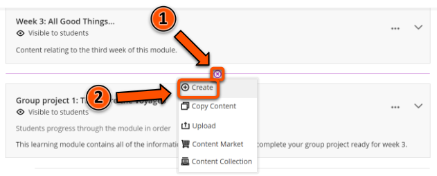
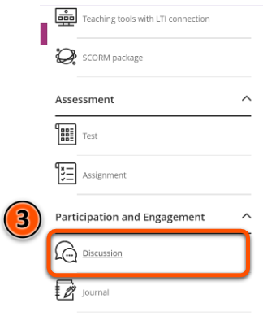
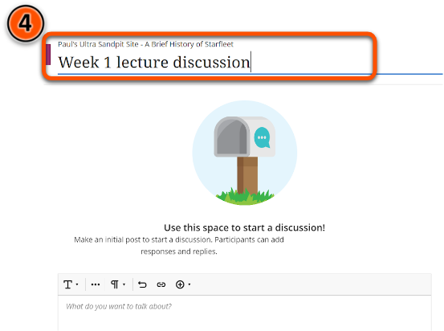
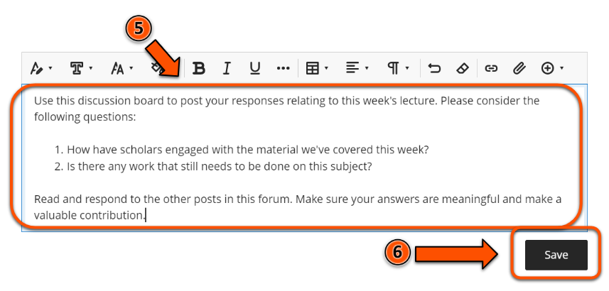
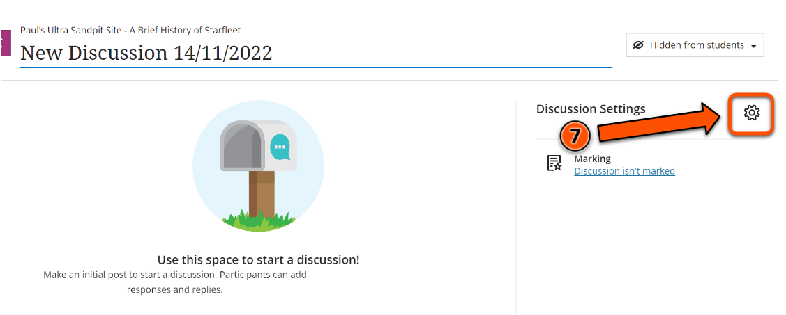
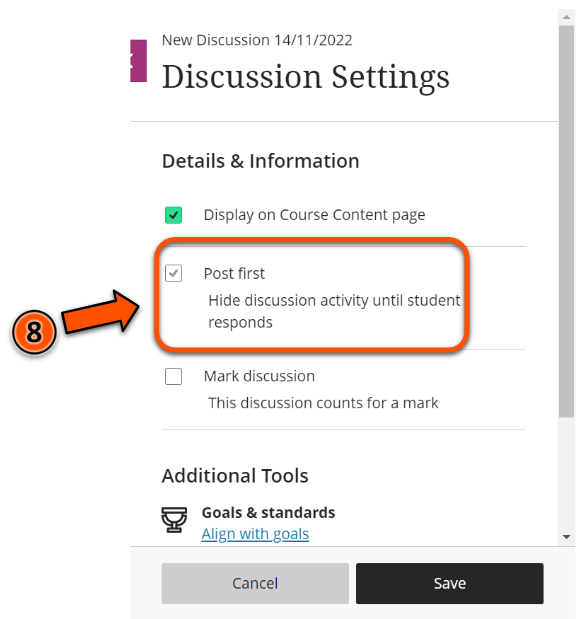
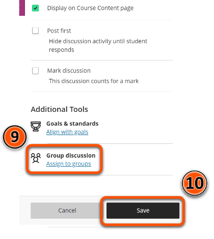

---
tags:
# Delete to leave only relevant tags
    - Advanced
    - Teaching
    - Administration
    - Ultra
---

# Discussions - setup

<!-- This guide needs a link to the Discussions - Uses guide which is currently WIP -->

!!! Summary

    Discussion boards in Ultra provide a public forum for students to communicate directly with teaching staff and also with each other.

## Quick Start Guide

### Video Steps

Below is an embedded video detailing how to set up discussions in Ultra. Alternatively, you can [open the video in a new browser tab](https://youtu.be/Q404ODzUS5w).

<!-- PASTE YOUTUBE EMBED (should look like this:) -->
<iframe width="560" height="315" src="https://www.youtube.com/embed/Q404ODzUS5w" title="YouTube video player" frameborder="0" allow="accelerometer; autoplay; clipboard-write; encrypted-media; gyroscope; picture-in-picture" allowfullscreen></iframe>

### Text Steps

<!-- Clear and concise: Click **Submit**, not Click on the **Submit button** -->
<!-- Use **bold** to highight key tasks and features -->

To create a Discussion board in your Ultra site:

1. Hover over the grey divider where you want your discussion to appear, then click the purple plus icon.
2. Click on **Create**.
3. Click on **Discussion** under **Participation and Engagement**.
4. Click on the discussion title at the top of the page and add a title for your Discussion board.
5. Make an initial post to start the discussion in the box labelled **What do you want to talk about?**
6. Click **Save**.
7. Click on the **Gear** icon labelled **Discussion Settings**.
8. If you want existing discussion posts to be invisible to students until they have posted, click on the checkbox labelled **Post first**.
9. If you want to assign the discussion to particular groups of students, click **Assign to groups**.
10. Click **Save**.

## More Details and Troubleshooting

<!-- For guidance on creating meaningful conversations in your course’s discussion boards, and information on the different uses of discussion boards, please refer to the Discussions - uses guide. ADD A LINK HERE! -->

For more information on setting up groups, refer to the [Groups - Setup](https://vle-support.york.ac.uk/ultra/groups-setup/) guide.

<!-- More info here as needed. -->