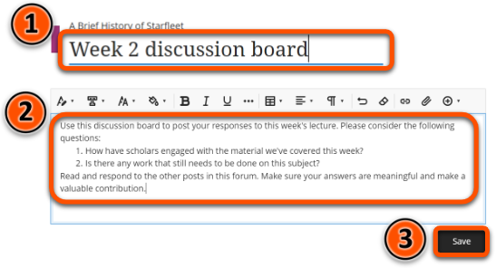
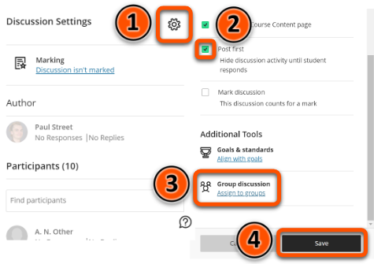

---
tags:
# Delete to leave only relevant tags
    - Advanced
    - Teaching
    - Administration
    - Ultra
---

# Discussions

<!-- This guide needs a link to the Discussions - Uses guide which is currently WIP -->

!!! Summary

    Discussion boards in Ultra provide a public forum for students to communicate directly with teaching staff and also with each other.

## Quick Start Guide

### Video Steps

<!-- PASTE YOUTUBE EMBED (should look like this:) -->
<iframe width="560" height="315" src="https://www.youtube.com/embed/Q404ODzUS5w" title="Setting up discussions in Ultra" frameborder="0" allow="accelerometer; autoplay; clipboard-write; encrypted-media; gyroscope; picture-in-picture" allowfullscreen></iframe>

Video: [Setting up Discussions in Ultra](https://youtu.be/Q404ODzUS5w).

### Text Steps

<!-- Clear and concise: Click **Submit**, not Click on the **Submit button** -->
<!-- Use **bold** to highight key tasks and features -->

To create a Discussion board in your Ultra site:

1. Hover over the grey divider where you want your discussion to appear, then click the plus icon.
2. Click **Create**.   
3. Click **Discussion** under **Participation and Engagement**.  

4. Click the discussion title and add a title for your Discussion board.
5. Click **What do you want to talk about?** and type instructions for the discussion. 
6. Click **Save**.   
7. Click the **Discussion Settings** gear icon.
8. If you want existing discussion posts to be invisible to students until they have posted, click **Post first**.
9. If you want to assign the discussion to particular groups of students, click **Assign to groups**.
10. Click **Save**.   

## More Details

<!-- For guidance on creating meaningful conversations in your course’s discussion boards, and information on the different uses of discussion boards, please refer to the Discussions - uses guide. ADD A LINK HERE! -->

For more information on setting up groups, refer to the [Groups](https://vle-support.york.ac.uk/ultra/groups/) guide.

<!-- More info here as needed. -->