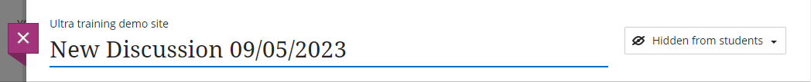
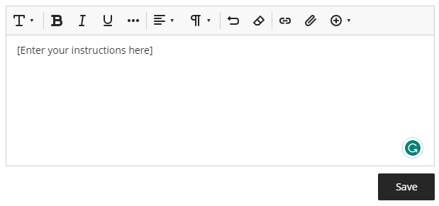
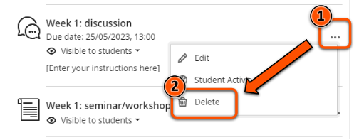
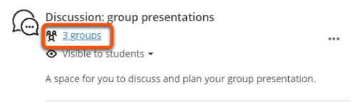
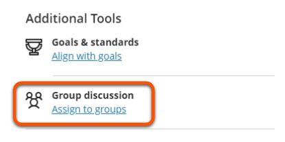
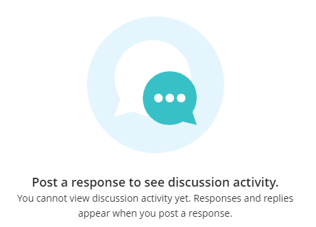
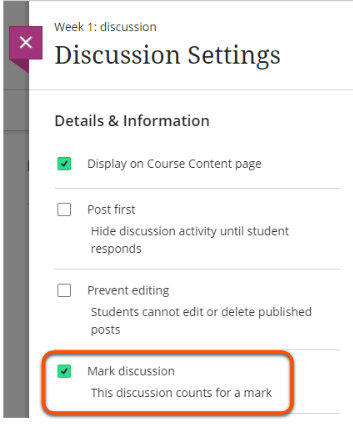
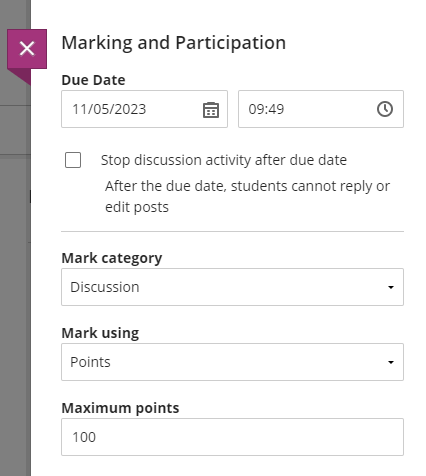

---
tags:
    - Communication
    - Interactive content
    - Ultra
---

# Discussions

!!! Summary

    Discussions let students communicate asynchronously with each other and teaching staff on a particular topic.

!!! Warning
    It's not currently possible to **subscribe** for notifications of when posts are made. However, this feature will be available in the future (expected some time later in 2024). For now we recommend using a [Padlet](../other-tools/padlet.md) board for discussions you need to subscribe to.

## Create a discussion

1. In the Course Content area, hover where the discussion should appear. Click the plus icon then Create. Click the **plus icon** then **Create**. 

2. Under **Participation and Engagement**, select **Discussion**. 

3. Click the default "New Discussion" title and name the discussion. 

4. Add instructions and/or a first post using the text editor.

5. Click the **cog icon** to open Settings (eg. allow anonymous posts)
6. Click **Save**.

Watch a demonstration of creating a Discussion:
<iframe width="560" height="315" src="https://www.youtube.com/embed/Q404ODzUS5w" title="Setting up discussions in Ultra" frameborder="0" allow="accelerometer; autoplay; clipboard-write; encrypted-media; gyroscope; picture-in-picture" allowfullscreen></iframe>
[Setting up discussions in Ultra [YouTube]](https://youtu.be/Q404ODzUS5w)

## Access a discussion

Users can access discussions in two locations:

- In the **Course Content area** where it was created. For example in a weekly materials section. 

- In the dedicated **Discussions area** reached from the top navigation bar. You can also create a discussion here. 

## Delete a discussion

1. Click the three dots to the right of the discussion name.
2. Select **Delete**. 

3. When prompted, press **Delete** again.
4. Go to the Discussions area and check that the discussion does not appear here too. If it does, repeat this process.

## Using discussions anonymously
Set up:

1. Open a Discussion and click the **settings icon** towards the top right of the screen
2. Tick **Allow anonymous responses...**
3. Click **Save**.

Posting anonymously:
Posts will not automatically be anonymous, but users will have the *option* to make their post anonymous before they post it.

1. Type out your response
2. Tick the **post anonymously** box below the text pane
3. Click **Respond**

You can also use [Padlet](../other-tools/padlet.md) for anonymous discussions.

## Using discussions to support teaching

Discussions can be set up in various ways to support different teaching and learning activities.

### Assign to groups

You can split a discussion for different groups of students. For example, to:

- make a discussion easier to manage for large student cohorts.
- provide a discussion space for each seminar group.
- support project or collaborative work.

To assign a discussion to groups:

1. Create and set up the discussion (only one is needed for all groups).
2. Click the **Discussion Settings** cog icon.
3. Under **Additional tools**, click **Group discussion/Assign to groups**. 

4. Assign students by setting up new groups (see our [Groups guide](../ultra/course-groups.md) for details) or reusing existing groups.
5. Click **Save**.

To view each group's discussion:

1. Open the discussion.
2. Select the group name from the drop-down menu below the instructions.

You can also limit discussion visibility using **Release Conditions**. However, this method requires a separate discussion for each group, so it needs more care to set up and manage. See our [Release conditions guide](../ultra/release-conditions.md) for details.

### Post first

You can require students to post a reply before they can see other students' posts. For example, students could:

- summarise a topic/key points from a reading before they see other students' ideas.
- create multiple choice questions for other students to test their understanding.
- create their own discussion question before responding to other questions.

To set up post first:

1. Open the discussion and click the **Discussion Settings** cog icon.
2. Tick the **Post first** option. 

3. Click **Save**.

### Mark discussion

You can also grade discussions. This could be useful to:

- use performance/completion as a release condition for other materials
- use a discussion as a summative assessment
- show students you've reviewed their formative response
- use a marking rubric to grade and give feedback

To mark a discussion:

1. Open the discussion and click the **Discussion Settings** cog icon.
2. Click **Mark discussion**. 

3. In the **Marking and Participation** section, set the due date and how the discussion is marked. 

4. If desired, **Add marking rubric**. You can create a rubric here or reuse a rubric already in your site. 

5. Click **Save**.