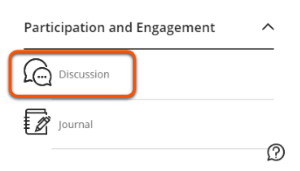
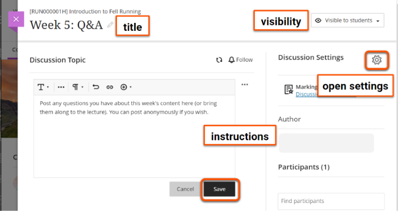
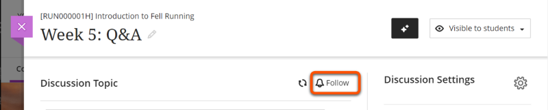
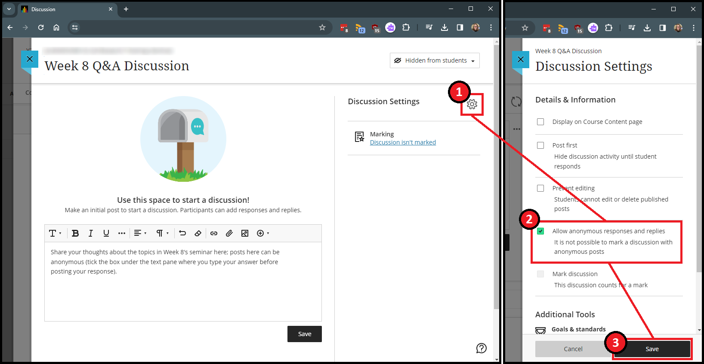
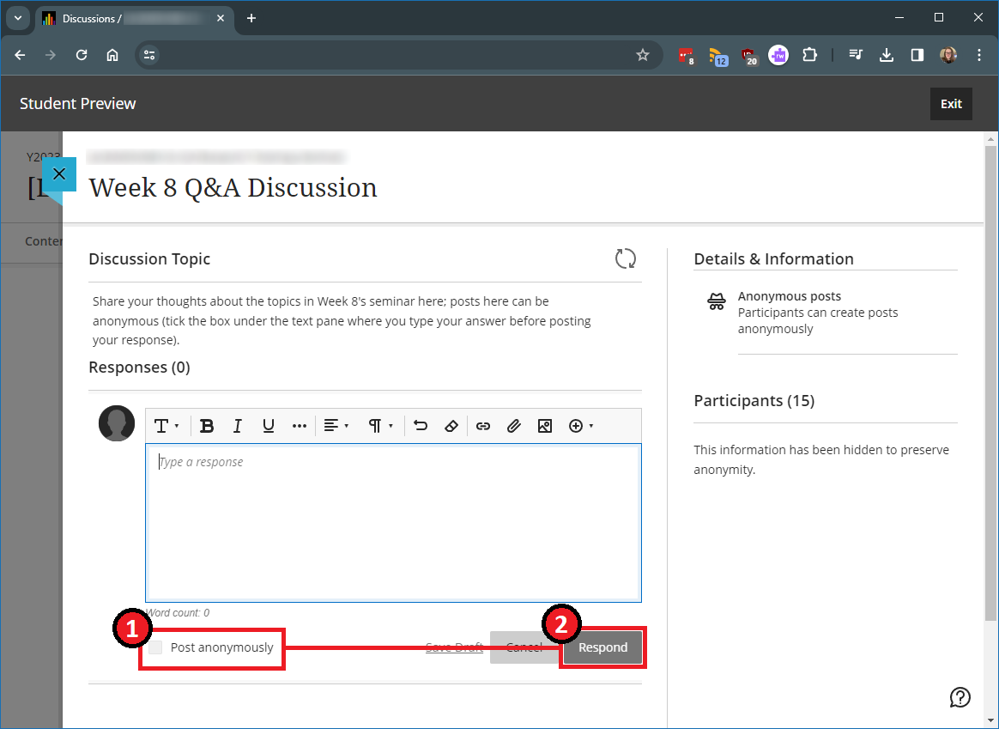
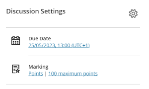
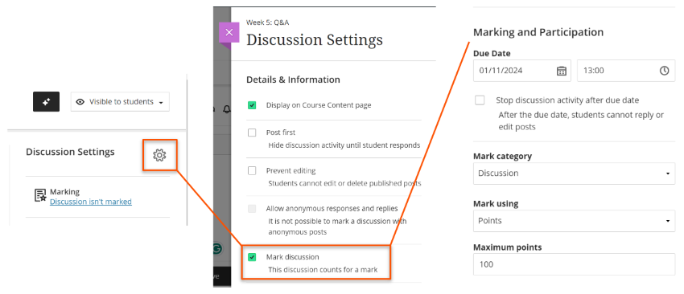
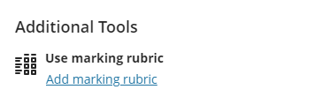

---
tags:
    - Communication
    - Interactive content
    - Ultra
---

# Discussions

!!! Summary

    Discussions let students communicate asynchronously with each other and teaching staff on a particular topic.

## Create a discussion

1. In the Course Content area, hover where the discussion should appear. Click the plus icon then Create. Click the **plus icon** then **Create**. 

2. Under **Participation and Engagement**, select **Discussion**. 

3. Add a title and instructions/first post, and [set the appropriate visbility](../ultra/content-visibility.md).
4. Optionally, click the **cog icon** to open Settings (eg. allow anonymous posts)
5. Click **Save**.
 

Watch a demonstration of creating a Discussion:
<iframe width="560" height="315" src="https://www.youtube.com/embed/Q404ODzUS5w" title="Setting up discussions in Ultra" frameborder="0" allow="accelerometer; autoplay; clipboard-write; encrypted-media; gyroscope; picture-in-picture" allowfullscreen></iframe>
[Setting up discussions in Ultra [YouTube]](https://youtu.be/Q404ODzUS5w)

## Access a discussion

Users can access discussions in two locations:

- In the **Course Content area**, for example in a weekly materials section. 

- In the dedicated **Discussions area** reached from the top navigation bar. You can also create and organise Discussions here. 

!!! Tip

    Deleting a Discussion in the Course Content area may only delete the link to the discussion. Check the Discussions area to make sure it is deleted fully.

## Follow (subscribe to) Discussions

You can follow a Discussion to receive notifications of new activity. Currently these are only in the Activity Stream, with email notifications coming in a future release.

1. Open the Discussion and click **Follow**. 

2. The default followed Discussions settings are to receive notifications of new replies and new responses to your posts. You can change this in your [notification settings](../ultra/notifications.md).

## Anonymous discussions
Set up:

1. Open a Discussion and click the **settings icon** towards the top right of the screen
2. Tick **Allow anonymous responses...**
3. Click **Save**.

Posting anonymously:
Posts will not automatically be anonymous, but users will have the *option* to make their post anonymous before they post it.

1. Type out your response
2. Tick the **post anonymously** box below the text pane
3. Click **Respond**

You can also use [Padlet](../other-tools/padlet.md) for anonymous discussions.

## Using discussions to support teaching

Discussions can be set up in various ways to support different teaching and learning activities.

### Assign to groups

You can split a discussion for different groups of students. For example, to:

- make a discussion easier to manage for large student cohorts.
- provide a discussion space for each seminar group.
- support project or collaborative work.

Set up:

1. Create and set up the discussion as above (only one is needed for all groups).
2. Click the **Discussion Settings** cog icon.
3. Under **Additional tools**, click **Assign to groups**.
4. Assign students by setting up new groups (see our [Groups guide](../ultra/course-groups.md) for details) or reusing existing groups and save.
5. Back in the Discussions settings, the assigned groups are now shown. Click **Save** to finish. 

To view each group's discussion:

1. Open the discussion.
2. Select the relevant group name from the drop-down menu below the instructions.

You can also limit discussion visibility using **Release Conditions**. However, this method requires a separate discussion for each group, so it needs more care to set up and manage. See our [Release conditions guide](../ultra/content-visibility.md) for details.

### Post first

You can require students to post a reply before they can see other students' posts. For example, students could:

- summarise a topic/key points from a reading before they see other students' ideas.
- create multiple choice questions for other students to test their understanding.
- create their own discussion question before responding to other questions.

To set up post first:

1. Open the discussion and click the **Discussion Settings** cog icon.
2. Tick the **Post first** option. 

3. Click **Save**.

### Mark discussion

You can also grade discussions. This could be useful to:

- use performance/completion as a release condition for other materials
- use a discussion as a summative assessment
- show students you've reviewed their formative response
- use a marking rubric to grade and give feedback

To mark a discussion:

1. Open the discussion and click the **Discussion Settings** cog icon.
2. Select **Mark discussion**. 
3. In the **Marking and Participation** section, set the due date and how the discussion is marked. 

4. If desired, **Add marking rubric**. You can create a rubric here or reuse a rubric already in your site. 

5. Click **Save**.