---
tags:
    - Communication
    - Interactive content
    - Ultra
---

# Discussions

!!! Summary

    Discussions let students communicate asynchronously with each other and teaching staff on a particular topic.

## Create a discussion

1. In the Course Content area, hover where the discussion should appear. Click the **plus icon** then **Create**. 
2. Under **Participation and Engagement**, select **Discussion**. 
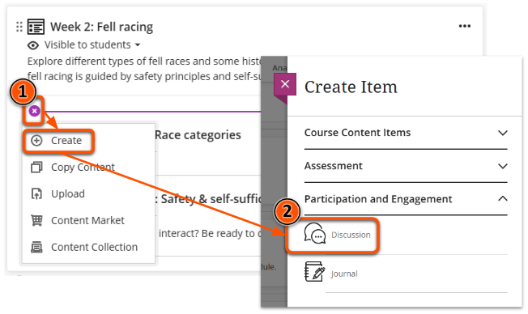
3. Enter a descriptive **discussion title** at the top left. 
4. Enter instructions or an initial post in the text editor box and click **Save**, or select **Auto-generate discussion** to [use AI to generate a discussion prompt](../ultra/ai-da.md#task-prompts). This will also be shown to students as the item description on the course content page.
 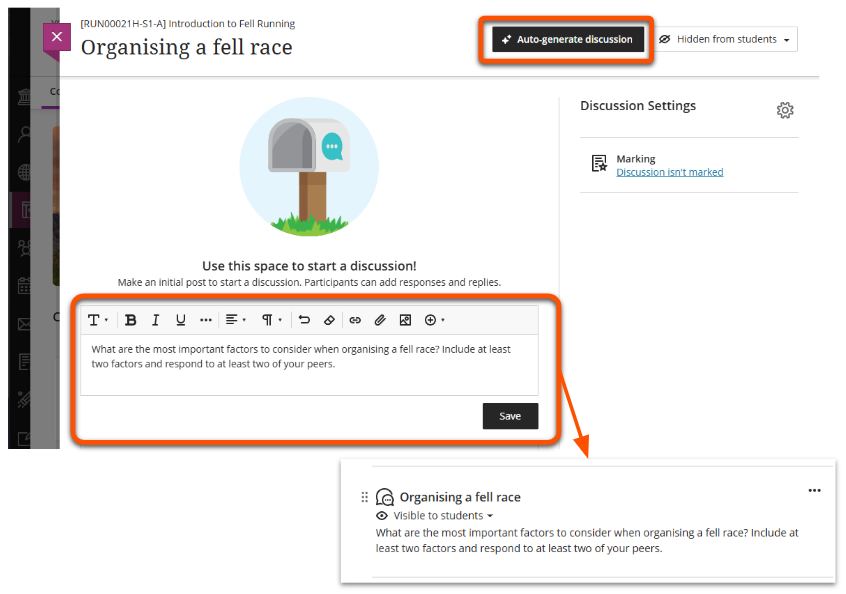
5. To [follow/subscribe to the discussion](#follow-subscribe-to-discussions), click the **Follow** bell icon adjacent to Discussion Topic (shown after a prompt is saved).
6. Optionally, click the **cog icon** to open Settings, including:
    - student posting & editing settings (including [allow anonymous posts](#anonymous-discussions))
    - [assign the discussion to groups](#assign-to-groups)
    - [mark the discussion](#mark-discussion)
7. Set the discussion as **Visible to students** or specify  **Release conditions** in the top right (see our guide to [Content visibility](../ultra/content-visibility.md) for more detail).
 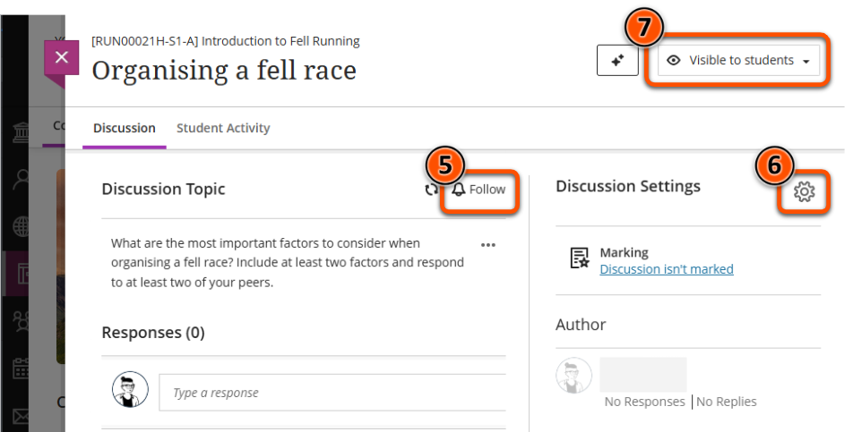

Watch a demonstration of creating a Discussion:
<iframe width="560" height="315" src="https://www.youtube.com/embed/Q404ODzUS5w" title="Setting up discussions in Ultra" frameborder="0" allow="accelerometer; autoplay; clipboard-write; encrypted-media; gyroscope; picture-in-picture" allowfullscreen></iframe>
[Setting up discussions in Ultra [YouTube]](https://youtu.be/Q404ODzUS5w)

## Access a discussion

Users can access discussions in two locations:

- In the **Course Content area**, for example in a weekly materials section. 
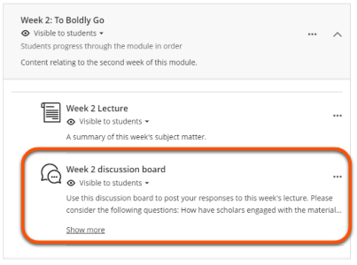
- In the dedicated **Discussions area** reached from the top navigation bar. You can also create and organise Discussions here. 
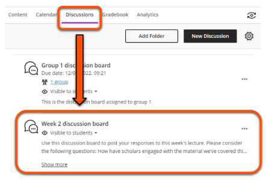

!!! Tip

    Deleting a Discussion in the Course Content area may only delete the link to the discussion. Check the Discussions area to make sure it is deleted fully.

## Follow a discussion

You can follow (subscribe to) a discussion to receive notifications of responses, replies and other activity by email and/or in the Activity Stream.

Notifications contain the site and discussion name, but not the post itself, so you'll need to visit the Discussion to read it. A *new* label shows new activity since your last visit.

<figure markdown>
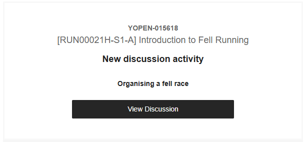
<figcaption>Email notification of new discussion activity</figcaption>
</figure>
<figure markdown>
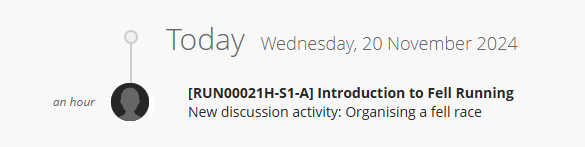
<figcaption>Activity stream notification of new discussion activity</figcaption>
</figure>

To follow a discussion, open the Discussion item and click the **Follow** bell icon adjacent to Discussion Topic.

Your [system notification settings](../ultra/notifications.md) also need to be configured for Discussions:

- **Email notifications - Email me straight away**: tick the *Discussion activity* box, or expand to select specific actions. You will receive an email immediately for all selected activity.
- **Email notifications - Email me once a day**: tick the *New discussion messages* box. You will receive an email at the end of the day for new and unseen messages (ie. you won't receive notifications for posts that day that you have already read in the site).
- **Activity Stream notifications**: tick the *Discussion activity* box, or expand to select specific actions. You will receive these notifications straight away.

## Discussion options

Discussions can be set up in various ways to support different teaching and learning activities.

### Anonymous posting

You may wish to allow users to post and reply anonymously, for example to encourage participation in a Q&A forum.

To do this:

1. Open a Discussion and click the **settings icon** towards the top right of the screen
2. Tick **Allow anonymous responses and replies**
3. Click **Save**.
4. An anonymous posting label will now display on the discussion and the participants list is hidden.

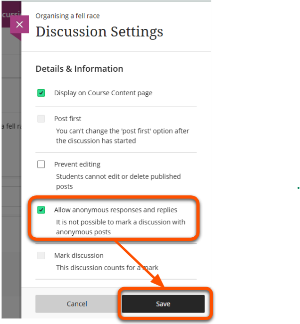

Posts are not automatically anonymous - users must  tick **Post anonymously** before they submit a response.

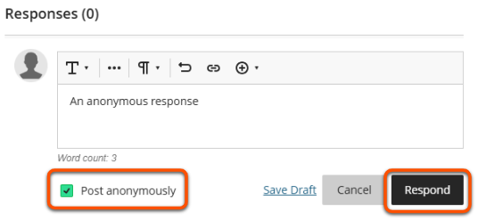

You can also use [Padlet](../other-tools/padlet.md) for anonymous discussions.

### Assign to groups

You can split a discussion for different groups of students. For example, to:

- make a discussion easier to manage for large student cohorts.
- provide a discussion space for each seminar group.
- support project or collaborative work.

Set up:

1. Create and set up the discussion as above (only one is needed for all groups).
2. Click the **Discussion Settings** cog icon.
3. Under **Additional tools**, click **Assign to groups**.
4. Assign students by setting up new groups (see our [Groups guide](../ultra/course-groups.md) for details) or reusing existing groups and save.
5. Back in the Discussions settings, the assigned groups are now shown. Click **Save** to finish. 
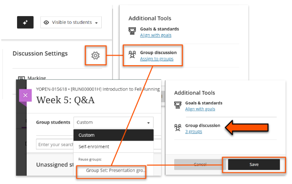

To view each group's discussion:

1. Open the discussion.
2. Select the relevant group name from the drop-down menu below the instructions.
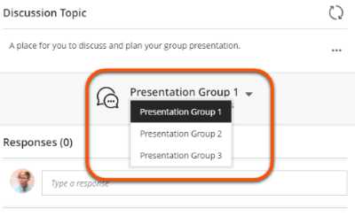

You can also limit discussion visibility using **Release Conditions**. However, this method requires a separate discussion for each group, so it needs more care to set up and manage. See our [Release conditions guide](../ultra/content-visibility.md#release-conditions) for details.

### Post first

You can require students to post a reply before they can see other students' posts. For example, students could:

- summarise a topic/key points from a reading before they see other students' ideas.
- create multiple choice questions for other students to test their understanding.
- create their own discussion question before responding to other questions.

To set up post first:

1. Open the discussion and click the **Discussion Settings** cog icon.
2. Tick the **Post first** option. 
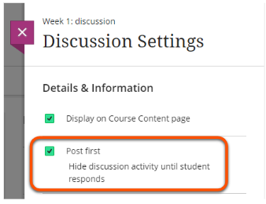
3. Click **Save**.

### Mark discussion

You can also grade discussions. This could be useful to:

- set making a post as a release condition for other materials
- use a discussion as a summative assessment
- show students you've reviewed their formative response
- use a marking rubric to grade and give feedback

!!! Note

    You cannot mark discussions that allow anonymous posting.

To mark a discussion:

1. Open the discussion and click the **Discussion Settings** cog icon.
2. Select **Mark discussion**. 
3. In the **Marking and Participation** section, set the due date and how the discussion is marked. 

4. If desired, **Add marking rubric**. You can create a rubric here or reuse a rubric already in your site. 
5. Click **Save**.