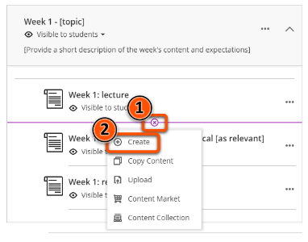
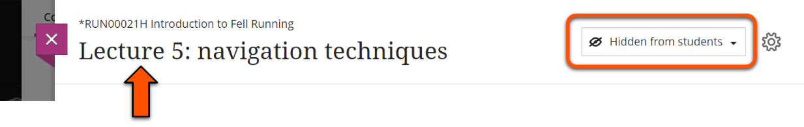
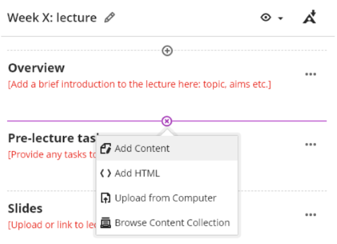
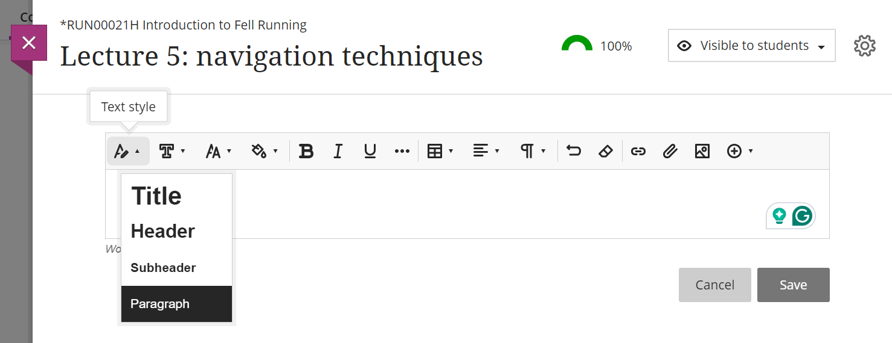

---
tags:
    - Key guide - teaching
    - Ultra
---

# Document

!!! Summary

    Documents are the main 'page' content type where you can add text, images, files and more.  

!!! principle "Relevant [VLE site design principles](../ultra/site-design-principles.md)"

    - 3.4 Essential: Site and materials content is accessible.
    - 3.6 Essential: Links and materials titles describe the destination or content.
    - 5.1 Recommended: Ensure that students can see and access module materials and content.

## Create a Document

Documents can be created inside Learning Modules and Folders (recommended for module materials), or created directly within the Course Content area.

1. Hover where the Document should appear. Click the **plus icon** then **Create**.
  
2. Under **Course Content Items**, select **Document**.
  
3. Enter a descriptive title for the Document (eg. *Lecture 5: navigation techniques*) and set the [item visibility](../ultra/content-visibility.md).
  
4. Optionally, click the **cog icon** to open the settings pane. Here you can add a brief **description** that will display in the Course Content area, or choose to **Allow class conversation** to attach a Discussion to the Document. Click **Save**.
  

Watch a demonstration of creating a Document:
<iframe width="560" height="315" src="https://www.youtube.com/embed/qUl2fAfqCrg" title="YouTube video player" frameborder="0" allow="accelerometer; autoplay; clipboard-write; encrypted-media; gyroscope; picture-in-picture; web-share" allowfullscreen></iframe>
[Creating Documents in Ultra [YouTube]](https://youtu.be/qUl2fAfqCrg).

## Add content to a Document

1. Hover where you want to add content and click **plus icon** (not needed on a blank Document).
2. Select a content type:
    - Add Content (for most content: text, images etc.)
    - Add HTML (to manually embed items)
    - Upload from Computer (files etc.)
    - Browse Content Collection (not recommended)

### Add text

Follow the steps above and select **Add content** to open the text editor.

Accessible text tips:
- Use the default formatting settings for font, text size, colour and alignment (Open Sans, 14pt, black, left-aligned). This is important to maximise readabilty.
- Use the **Text Style** menu to add headings - don't just format text. This is important for navigating with a screenreader.

### Add LaTeX

Insert standard LaTeX into text within double dollar signs, and it will render when the text chunk is saved.

### Add other content

See our dedicated guides to adding other content types to a Document:

- [Files](../ultra/files.md) (eg. lecture slides)
- [Images](../ultra/images.md)
- [Panopto videos](../panopto/embed-panopto-ultra.md)
- [YouTube videos](../ultra/youtube.md)
- [Other embedded content](../ultra/embed-content.md) (eg. Padlet, Xerte)