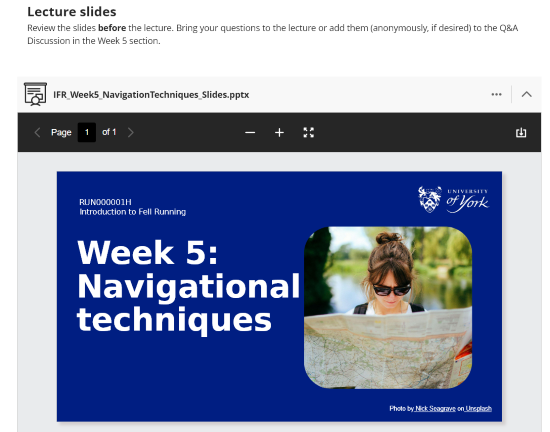

---
tags:
    - Key guide - teaching
    - Ultra
---

# Document

!!! Summary

    Documents are the main 'page' item for providing site content. 
    
!!! principle "Relevant [VLE site design principles](../ultra/site-design-principles.md)"

    - 3.4 Essential: Site and materials content is accessible.
    - 3.6 Essential: Links and materials titles describe the destination or content.
    - 5.1 Recommended: Ensure that students can see and access module materials and content.

Documents are used to provide most site materials. They have a flexible drag-and-drop layout using content blocks to easily add a wide range of materials, including:

- text
- links
- images
- files (eg. lecture slides)
- embedded videos: Panopto, YouTube etc.
- embedded interactive items: Padlet, Mentimeter, Xerte etc.
- formative knowledge check questions

## Create a Document

1. Hover where the Document should appear. Click the **plus icon** then **Create**.
2. Under **Course Content Items**, select **Document**.
  
3. Enter a descriptive title for the Document (eg. *Lecture 5: navigation techniques*) and set the [item visibility](../ultra/content-visibility.md).
4. Optionally, click the **cog icon** and add a brief **description** to display in the Course Content area. Click **Save**.
  

## Content blocks

Documents are built from drag-and-drop content blocks. :

=== "Content (text editor)"

    Use this block to add a range of content via the text editor, including:

    - text: headings, lists, code snippets, [LaTeX](../ultra/maths.md) etc.
    - data tables (note: don't use tables for layout only)
    - [links](../ultra/links.md)
    - [upload files](../ultra/files.md) (for user download only, files added this way can't be viewed in the site directly)
    - [images](../ultra/images.md)
    - embed [Panopto recordings](../panopto/embed-panopto-ultra.md) (via the Content Market) or [YouTube videos](../ultra/youtube.md)

    

    
    

=== "HTML"

    Use this block to add HTML code to [embed content](../ultra/embed-content.md) from third-party tools, such as:
    
    - [interactive Xerte objects](../other-tools/xerte.md)
    - [Padlet pinboards](../other-tools/padlet.md)
    - [asynchronous Mentimeter surveys](../other-tools/mentimeter/asynchronous-use.md)
    - manually embed Panopto or YouTube videos

    !!! Warning

        Only use the HTML content block for embedding third-party content. For other HTML uses, see our [Upload HTML guide](../ultra/html-objects.md).

=== "File upload"

    Use this block to add PDF, Word, Powerpoint (etc.) files:

    

    

    1. Select the relevant file from your device.
    2. Ensure *Display name* meaningfully describes the contents without having to open the file.
    3. Set *File Options* to **View and download**.
    4. Click Save.
    

    
    

    
    Users can preview the file directly within the site, or download it in the original or an alternative format.

    <figure markdown>
    
    <figcaption>Previewing the slides directly within the Document</figcaption>
    </figure>
    See our dedicated [guide to uploading files](../ultra/files) for more detail on this and other methods of adding files.

=== "Content Collection"

    The Content Collection is a storage method that is not generally used at UoY, so you are unlikely to need this block. You can achieve everything the Content Collection offers by adding content directly to your site.

=== "Convert a File"

    Use this block to convert a PDF, Word or PowerPoint file on your device to a Learn Ultra Document format.

    This conversion is a step in content development, not a final product. Conversion quality will depend on the type of content in the file. Simple text-based files will be easiest to convert, but more complex formatting and layout may be lost. Careful checking is needed to tidy up the conversion.

    Currently only available through the *hover to add* method.

## Adding blocks

Depending on the desired location, there are two methods to add a content block:

- **Hover to add**: hover in the location to add, then click the **small plus icon** and select the block needed. A block can be added before or after any existing row.
 
- **Block left panel**: click the **boxed plus icon** in the top left, and select the block needed. The block will be added after the last existing row.
 

## Layout

Content blocks can be arranged in rows up to 4 columns based on 25%, 50% or 75% widths. Each row has its own column layout, giving a lot of flexibility. Rows are responsive to screen size and will wrap on small screens.

For example, a layout for some video resources could use:

- a full-width row with some context on how to use the resources
- a row with two 50% width columns each containing an embedded video

!!! Tip

    - Blocks are created in a new row, and then can be moved into a column in another row.
    - Rows are always only one block deep, meaning blocks can't be stacked vertically within the same column.

### Move a whole row

Hover over the row and either:

1. hold the six dots icon to the left of the row to drag and drop to the desired location.
2. click the six dots icon and select from options to move up or down.

### Create columns within a row

Hover over the block until the filled purple border and top icons appear and either:

1. click the six dots icon at the top and choose the relevant size or location option.
2. use the arrow icons on the left and right borders to resize and place the block within the columns.

### Move block into a column

Create the block in a new row, hover over it until the filled purple border and top icons appear and either:

1. Click the six dots icon and choose the relevant size or location option.
2. Hold the six dots icon at the top and drag and drop into the desired position

