---
tags:
    - Key guide - teaching
    - Ultra
---

# Document

!!! Summary

    Documents are the main 'page' item for providing site content. 
    
!!! principle "Relevant [VLE site design principles](../ultra/site-design-principles.md)"

    - 3.4 Essential: Site and materials content is accessible.
    - 3.6 Essential: Links and materials titles describe the destination or content.
    - 5.1 Recommended: Ensure that students can see and access module materials and content.

Documents are the best way to provide most site materials. They use content block and a flexible drag-and-drop layout to easily add a wide range of materials. 


## Create a Document

1. Hover where the Document should appear. Click the **plus icon** then **Create**.
2. Under **Course Content Items**, select **Document**.
</br> 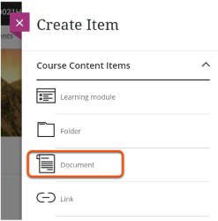
3. Enter a descriptive title for the Document (eg. *Lecture 5: navigation techniques*) and set the [item visibility](../ultra/content-visibility.md).
4. Optionally, click the **cog icon** and add a brief **description** to display in the Course Content area. Click **Save**.
</br> 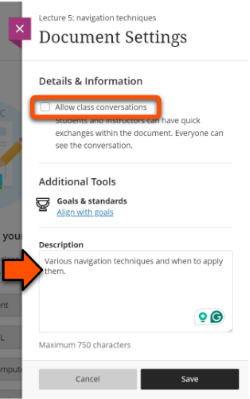

## Content blocks

Documents are built from drag-and-drop content blocks.

<div markdown class="centered-image">
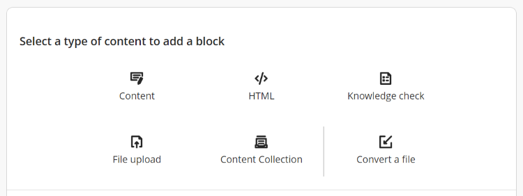
</div>

There are two methods to add a content block:

- **Hover to add**: hover in the location to add, then click the **small plus icon** and select the block needed. A block can be added before or after any existing row.
</br>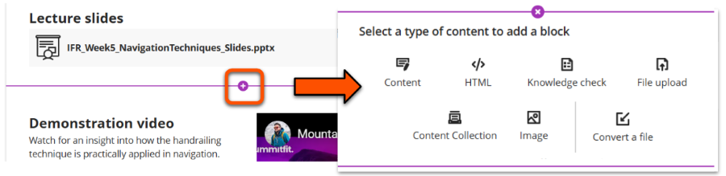
- **Block left panel**: click the **boxed plus icon** in the top left, and select the block needed. The block is added after the last existing row.
</br>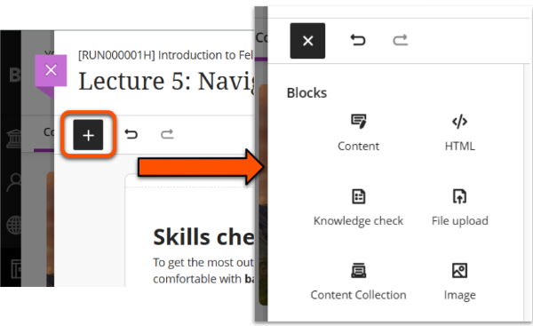


### Block: Content (text editor)

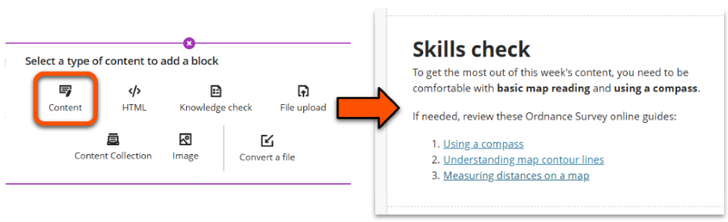

Use this block to add a range of content via the text editor, including:

Best for text-based content. 


- text: headings, lists, code snippets, [LaTeX](../ultra/maths.md) etc.
- data tables (note: don't use tables for layout only)

- [images](../ultra/images.md)
- embed [Panopto recordings](../panopto/embed-panopto-ultra.md) (via the Content Market) or [YouTube videos](../ultra/youtube.md)

It's technically possible to upload files and images via the text editor, but we strongly recommend using the dedicated File Upload and Image blocks instead.

<div markdown class="centered-image">
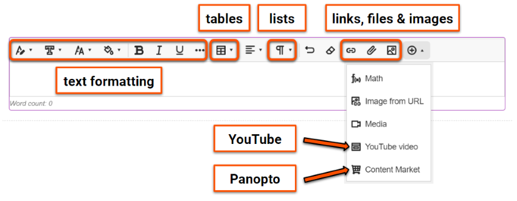
</div>

### Block: HTML

!!! principle "Relevant [VLE site design principles](../ultra/site-design-principles.md)"

    - 3.7 Essential: Direct, descriptive links are given to open embedded content (eg. video, Padlet or Xerte objects) in full screen.
    - 5.1 Recommended: Ensure that students can see and access module materials and content.

!!! Warning

    The HTML block is only for embedding third-party content. See our [Upload HTML guide](../ultra/html-objects.md) for other uses.

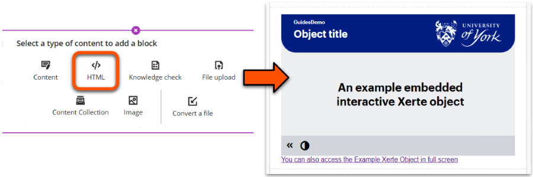

Use the HTML block to embed third-party content, such as [interactive Xerte objects](../other-tools/xerte.md#embed-xerte-objects), [Padlet pinboards](../other-tools/padlet.md#embed-a-padlet) or [asynchronous Mentimeter surveys](../other-tools/mentimeter/asynchronous-use.md#embed-in-another-platform). You can also manually embed Panopto or YouTube videos this way.

Make sure that the sharing settings of the third-party object allow your students to view the item.

To embed an object:

1. Copy the third-party content embed code. It will look something like this:
</br>```<iframe src="CONTENT URL HERE" width="802" height="602" frameborder="0" style="position:relative; top:0px; left:0px; z-index:0;"></iframe>```
2. Add a HTML block in the desired location and paste the embed code into the HTML box.
</br>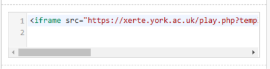
3. *Optional*: embed codes generally include a fixed pixel width. The object might display better if you update this to resize to fill the block instead; within the embed code, scroll to find the width (eg. ```width="802"```) and update to ```width="100%"```.
</br>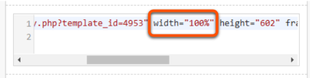
4. Add a direct link to open the object in full screen.
    - Copy and paste this line into the box below the embed code:
```</br><a href="[PASTE URL HERE]" style="font-family: sans-serif">You can also access [OBJECT NAME] in full screen</a>```
    - Return to the third-party content and copy the URL.
    - In the HTML box, replace ```[PASTE URL HERE]``` with your URL, and ```[OBJECT NAME]``` to describe the object.
    </br>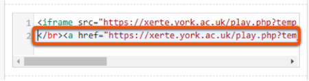
5. When you have finished editing the Document, click **Save** in the top right.

### Block: Knowledge check

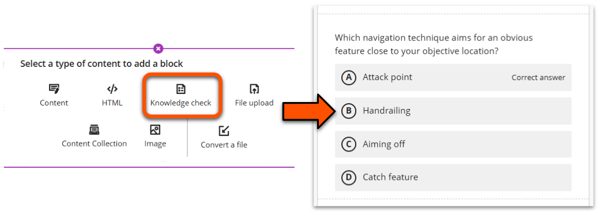

Use this block to add a multiple choice question into the Document so students can check their understanding.

<div markdown class="grid">
<div markdown>
To create a knowledge check multiple choice question:

1. In the question entry panel, enter the question text.
2. Enter answer options and tick the correct answer(s). Set the order to present options (this is fixed and can't be randomised).
3. *Optional*: enter custom feedback messages.
4. Click **Save** in the question entry panel.
5. When you have finished editing the Document, click **Save** in the top right.
</div>
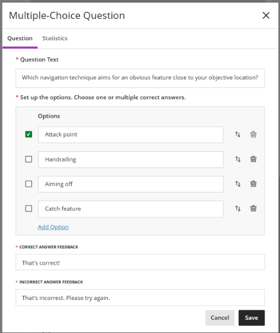
</div>

Results are available once students have attempted the knowledge check (this is not visible to students). This is accessible from two locations:

- above the question in Document view mode (ie. Save the Document first)
- on the Statistics tab of the question entry panel

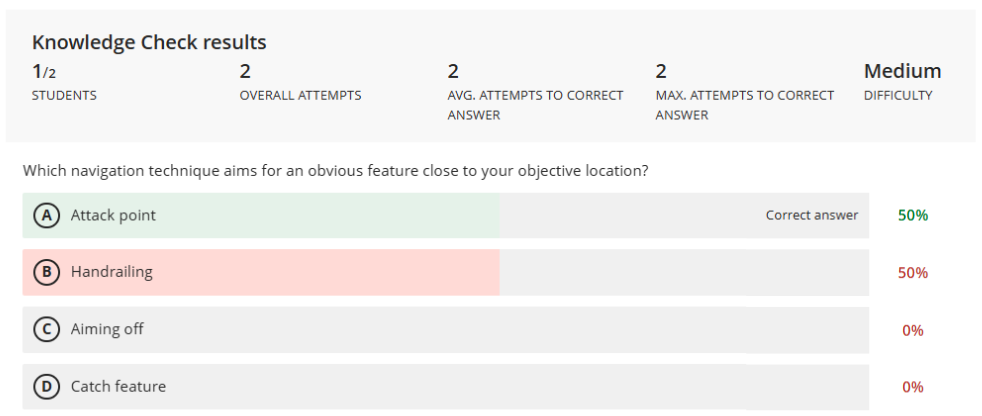

??? Abstract "Example: knowledge check multiple choice question"

    **Question input panel** 
    *Question Text* Which navigation technique aims for an obvious feature close to your objective location?
    
    *Options*:

    - Attack point (ticked to show correct answer)
    - Handrailing
    - Aiming off
    - Catch feature

    There is also a link to add more options and icons to move or delete each option.

    Default feedback text
    
    - *Correct answer feedback*: That's correct!
    - *Incorrect answer feedback*: That's incorrect. Please try again.

    **Knowledge check results/Statistics**

    Contains data about attempts made and answers selected. 

    - Students (1/2)
    - Overall attempts (2)
    - Average attempts to correct answer (2)
    - Maximum attempts to correct answer (2)
    - Difficulty rating (Medium)
    - Breakdown of options selected by students (correct option 50%, one incorrect option 50%, other two options 0%) - not shown on the Statistics panel

To add more complex knowledge checks or practice quizzes as a separate content item, see our [guide to the Test tool](../ultra/test.md).

### Block: File upload

!!! principle "Relevant [VLE site design principles](../ultra/site-design-principles.md)"
    - 3.6 Essential: Links and materials titles describe the destination or content.


Use this block to add PDF, Word, Powerpoint (etc.) files to your Document. This is especially useful for lecture slides and other files that students will use during weekly teaching.

To upload a file:

<div markdown class="grid">
<div markdown>
1. Select the relevant file from your device.
2. In the *File Options panel*, enter a  **Display name** that meaningfully describes the contents without having to open the file.
3. Set *File Options* to **View and download**.
4. Click Save in the File Options panel.
5. When you have finished editing the Document, click **Save** in the top right.
</div>
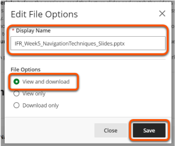
</div>

In Document view mode, users can:

- click the **three dots icon** to download the original file. 
- click the **chevron icon** to preview the file directly within the site.
- use the Ally tool to download the file in various alternative formats (students only).

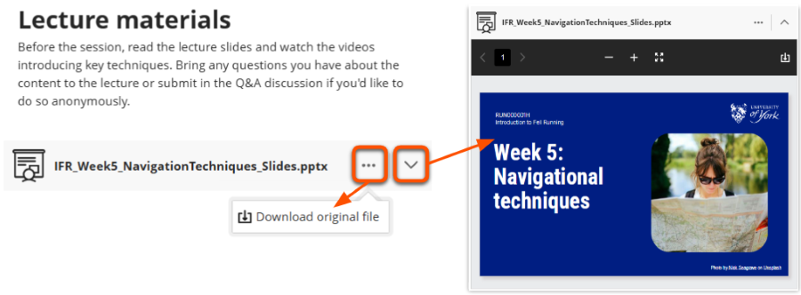

To upload a file as a standalone content item, see our [guide to Files](../ultra/files.md.)

### Block: Content Collection

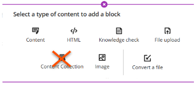

**Don't use this block**. The Content Collection is a storage method that is not generally used at UoY. You can achieve everything the Content Collection offers by adding content directly to your site.

### Block: Image

!!! Note

    The image block will be available from early February 2025.

!!! principle "Relevant [VLE site design principles](../ultra/site-design-principles.md)"

    - 2.3 Essential: Design and images adhere to the UoY Brand.
    - 3.4 Essential: Site and materials content is accessible.

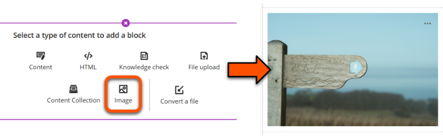

Use this block to upload an image, source an image from Unsplash or generate an image using the [AI Design Assistant](../ultra/ai-da.md). It's also possible to add images using the text editor in the content block type, but this is a bit more fiddly and results are not as neat.

To add an image:

1. Add an Image block, or a Content block and then select the image icon in the text editor. These both open the **Insert image panel**.
</br>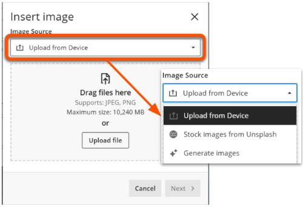
2. Choose your image:
    - *Upload an image*: drag a file into the box or click **Upload File** to manually select a file on your device. The file must be a .jpg or .png and less than 10,240MB. Click **Next**.
    - *Unsplash image*: open the Image Source menu and select **Stock images from Unsplash**. This automatically searches based on the Document title, or you can enter your own terms then click **Search**. Select an image and click **Next**.
    - *Generate AI image*: open the Image Source menu and select **Generate images**. This automatically generate images  based on the Document title, or you can enter your own terms then click **Generate**. Select an image and click **Next**.
    </br>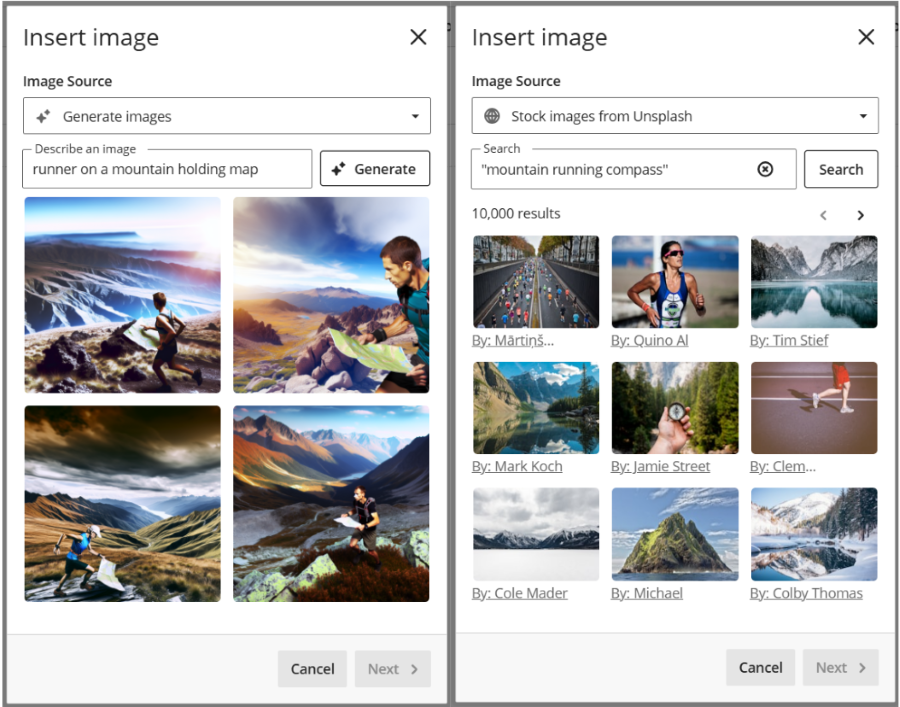
3. Set the zoom or aspect ratio as needed and click **Save**.
4. In the Edit File Options panel, adjust the **Display name** (ie. file name) as needed. Provide appropriate **ALT text** or mark the image as decorative. Leave the **File Options** as *View and download*. Click **Save**.
</br>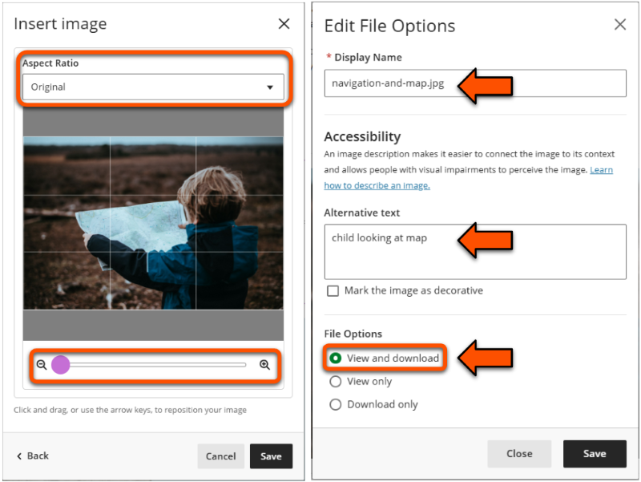
5. To edit the image after closing the panel, click the **three dots icon** in the top right of the image and select **Edit image**.

??? Abstract "Example: Generated and Unsplash images"

    Option 1. Generate images
    
    **Describe an image:** runner on a mountain holding map

    **Images generated:** four square images in a hyper-realistic style, all clearly AI generated but relevant to the description. Each has a single runner in Lake District-esque mountain terrain holding a map. One runner has an elongated arm and one has a very large map, but all could reasonably be used.

    ---

    Option 2. Stock images from Unsplash

    **Search terms:** mountain running compass

    **Search results:** 9 images shown on first page (of 10,000 results). None are particularly relevant to the combined search terms: one shows a compass held up in front of pine trees, five show mountain scenes but no people, and three show other types of runners.


### Block: Convert a File

!!! ai "Using the file converter effectively"

    Converting a file is a step in content development, not a final product. Careful checking is always needed.

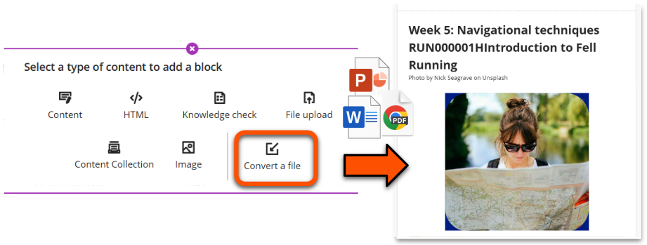

Use this block to convert a PDF, Word or PowerPoint file on your device to include the content directly within a Document. Conversion quality will depend on the type of content in the file. Simple text-based files will be easiest to convert, but more complex formatting and layout may be lost. 

To convert a file:

1. Use the *hover to add* method and select the **Convert a File** block.
2. Select the relevant file from your device.
3. Wait while the file content is converted. Depending on the size of the file, this could take a few minutes.
4. Carefully check and adapt the content and formatting as necessary.

## Layout

Content blocks can be arranged in rows up to 4 columns based on 25%, 50% or 75% widths. Each row has its own column layout, giving a lot of flexibility. Rows are responsive to screen size and will wrap on small screens.

For example, a layout for some video resources could use:

- a full-width row with some context on how to use the resources
- a row with two 50% width columns each containing an embedded video

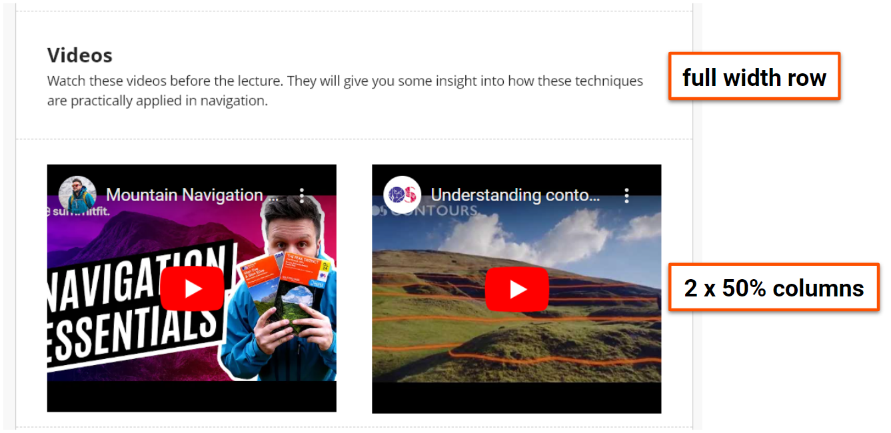

!!! Tip

    - Blocks are created in a new row, and then can be moved into a column in another row.
    - Rows are always only one block deep, meaning blocks can't be stacked vertically within the same column.

### Move a whole row

Hover over the row and either:

1. hold the six dots icon to the left of the row to drag and drop to the desired location.
2. click the six dots icon and select from options to move up or down.

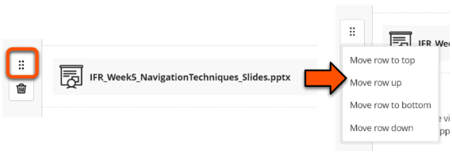

### Create columns within a row

Hover over the block until the filled purple border and top icons appear and either:

1. click the six dots icon at the top and choose the relevant size or location option.
2. use the arrow icons on the left and right borders to resize and place the block within the columns.

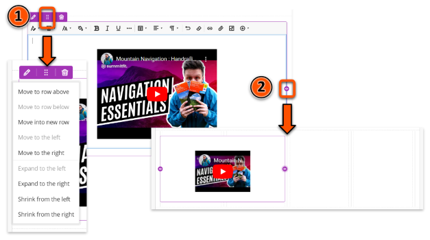

### Move block into a column

Create the block in a new row, hover over it until the filled purple border and top icons appear and either:

1. Click the six dots icon and choose the relevant size or location option.
2. Hold the six dots icon at the top and drag and drop into the desired position

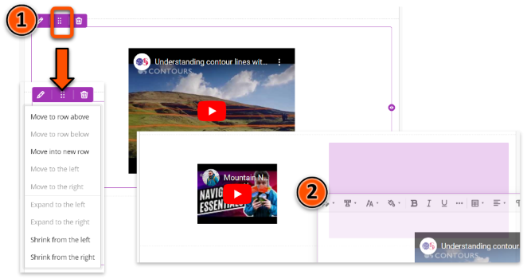