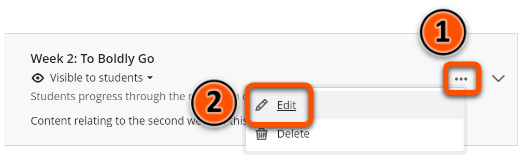
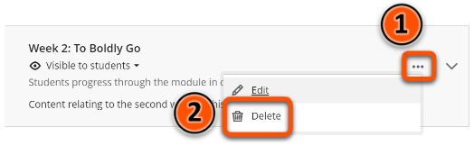
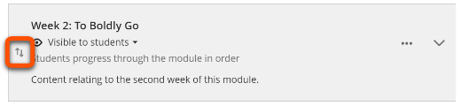

---
tags:
# Delete to leave only relevant tags
    - Foundation
    - Teaching
    - Ultra
---

# Editing, deleting & moving content

!!! Summary

    You can edit, move, or delete items in your Ultra site from the **Course Content** area.

## Quick Start Guide

### Video Steps

<!-- PASTE YOUTUBE EMBED (should look like this:) -->

<iframe width="560" height="315" src="https://www.youtube.com/embed/j01vTLdXef8" title="YouTube video player" frameborder="0" allow="accelerometer; autoplay; clipboard-write; encrypted-media; gyroscope; picture-in-picture; web-share" allowfullscreen></iframe>

Video: [Editing, Moving and Deleting Items in Ultra](https://www.youtube.com/watch?v=j01vTLdXef8)

### Text Steps

<!-- Clear and concise: Click **Submit**, not Click on the **Submit button** -->
<!-- Use **bold** to highight key tasks and features -->

#### Editing items

1. Click **three dots icon** on the right hand side of the item.
2. Click **Edit**.   
3. Edit your item.
4. Click **Save**.

#### Deleting items

1. Click the **three dots icon** on the right hand side of the item.
2. Click **Delete**.   
3. Confirm by clicking **Delete** in the box that appears.

!!!Warning

    If you delete a folder or learning module the items within will also be deleted.

#### Moving items

1. Hover your mouse over the item you want to move, then click and hold the **up/down arrows** that appear.   
2. Move the item up or down as desired by dragging with your mouse.
3. Release the mouse button to drop the item.