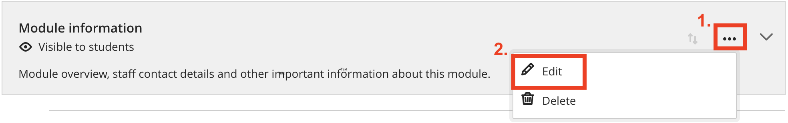
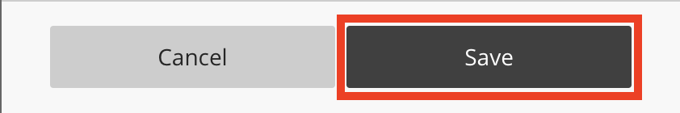
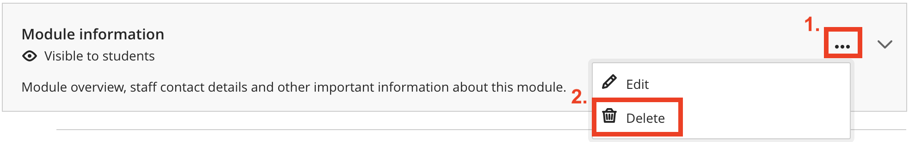
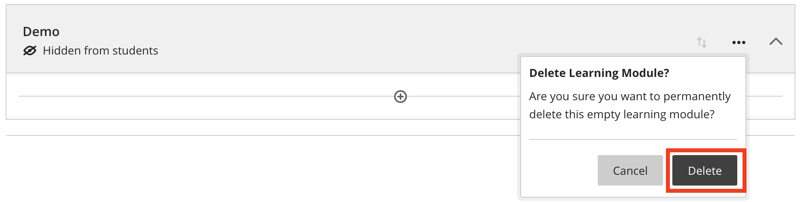
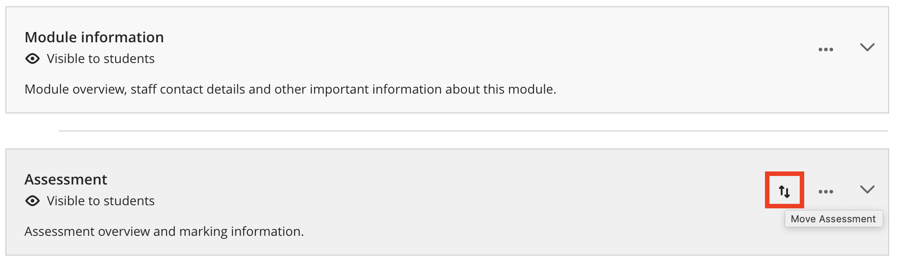

---
tags:
# Delete to leave only relevant tags
    - Foundation
    - Teaching
    - Ultra
---

# Editing, deleting & moving content

!!! Summary

    In Ultra, you can easily make changes to existing content and change where they appear on your **Course Content page**. This guide will show you simple ways to do such tasks.

## Quick Start Guide

### Video Steps

Below is an embedded video detailing **how to edit, delete and move items**. Alternatively, you can [open the video in a new browser tab](https://www.youtube.com/watch?v=oEH0Z2ptpqk).

<!-- PASTE YOUTUBE EMBED (should look like this:) -->

<iframe width="560" height="315" src="https://www.youtube.com/embed/oEH0Z2ptpqk" title="YouTube video Editing, deleting and moving items" frameborder="0" allow="accelerometer; autoplay; clipboard-write; encrypted-media; gyroscope; picture-in-picture" allowfullscreen></iframe>

### Text Steps

<!-- Clear and concise: Click **Submit**, not Click on the **Submit button** -->
<!-- Use **bold** to highight key tasks and features -->

#### **Edit items**

1. Click **the three dots icon** on the right hand side of the item.
2. Click **Edit**.

    

3. **Edit** your item.
4. Confirm by clicking **Save** at the end of the box that appears.

    

#### **Delete items**
1. Click **the three dots icon** on the right hand side of the item.
2. Click **Delete**.

    

3. Confirm by clicking **Delete** in the box that appears.

     

!!! Tip

    If you want to preserve the information but don’t want the student to see it yet, use **“Hidden from students”** in the visibility control, instead of deleting it. Students can't access hidden items on the Course Content page. 

!!!Warning

    If you delete a folder or learning module that has content, the content is also removed from the Course Content page.

#### **Move items**
1. Hover your mouse next to the three dots icon on the item you want to move, you will see** the Move button with up-side-down arrows**.

     

2. **Press the Move icon and move it to a new location.** You can also move content into a folder. Expand the folder and move the item to the area below the folder's title.

!!! Tip

    With your keyboard, you can move an item to a new location:

    1. Tab to an item's move icon.
    2. Press Enter to activate move mode.
    3. Use the arrow keys to choose a location.
    4. Press Enter to drop the item in the new location.