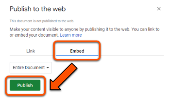
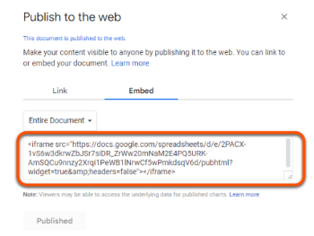
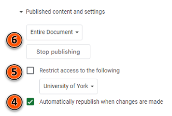

---
tags:
    - Interactive content
    - Ultra
    - Other tools
---

# Embed third-party content

!!! Summary

    Embed content from third-party tools (eg. Padlet, Xerte) using a HTML embed code.

!!! principle "Relevant [VLE site design principles](../ultra/site-design-principles.md)"

    - 3.7 Essential: Direct, descriptive links are given to open embedded content (eg. video, Padlet or Xerte objects) in full screen.

## Embed with HTML embed code

1. Copy the HTML embed code for the content to embed (see below for how to find this in key tools).
2. In your Ultra site, hover where you want the embedded content to appear.
3. Click the **plus icon** then **Add HTML**.
 
4. Paste the embed code into the HTML editor and then click **Save**.
  
5. Click the plus icon above your embedded content and then **Add content**. Add in some contextual text for the embedded content, including a [hyperlink](../ultra/links.md/#integrated-hyperlink) to open the content directly.
  
6. Click **Save**.

Watch a demonstration:
<iframe width="560" height="315" src="https://www.youtube.com/embed/HI9D7IhNLi0" title="Embedding content in Ultra" frameborder="0" allow="accelerometer; autoplay; clipboard-write; encrypted-media; gyroscope; picture-in-picture; web-share" allowfullscreen></iframe>
[Embedding content in Ultra [YouTube]](https://youtu.be/HI9D7IhNLi0)

!!! Warning

    Only use the HTML content block for embedding third-party content. For other HTML uses, see our [Upload HTML guide](../ultra/html-objects.md).

## Where to find HTML embed codes

### Padlet

1. Open the Padlet in your browser and click the **Share** icon.
2. Click **Embed in your blog or your website**.
3. Click **Copy**.
4. To copy a link to your Padlet, return to the **Share** menu and click **Copy link to clipboard**.   

### Xerte

1. Open Xerte in your browser and click the name of the Xerte object you want to embed.
2. In the **Project Details** box, copy the embed code from the **Embed Code** text box.
3. When creating the link to your Xerte item, copy the **URL** above the **Embed code** text box.   

### Google Docs, Sheets, Slides & Forms

Changes to a Google file will be updated in the embedded document, so this can be a good option for sharing the same content in multiple VLE sites.

!!! Warning

    To embed a Google file you must publish it to the web first, which makes it widely accessible. Before doing this, review [Google's guide to publishing and embedding files](https://support.google.com/docs/answer/183965?sjid=4495254535868291123-EU) and consider if this is an appropriate choice for your file.

    As an alternative, you can [link](../ultra/links.md) to a Google file instead of embedding to maintain sharing settings.

1. Open the Google file you want to embed and click **File** > **Share** > **Publish to the web**.
2. In the pop-up window, click **Embed**, select any options for that file type and click **Publish** and **Ok** in the confirmation pop-up.
 
3. Copy the embed code that appears.
 
4. Make sure that **Automatically republish when changes are made** is ticked.
5. Optional: to restrict access to the published file, click **Published content and settings** and tick **Restrict access to the following**, making sure that University of York is shown in the drop-down.
6. If you want to stop publishing and fully restrict access in the future, click **Stop publishing**.
 