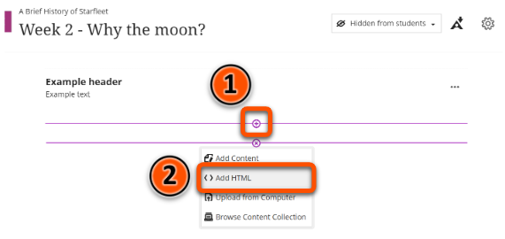
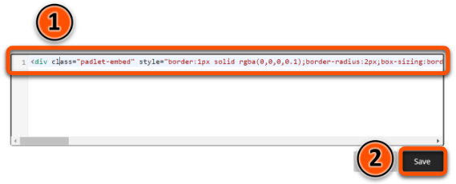
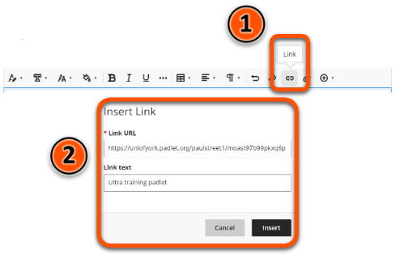
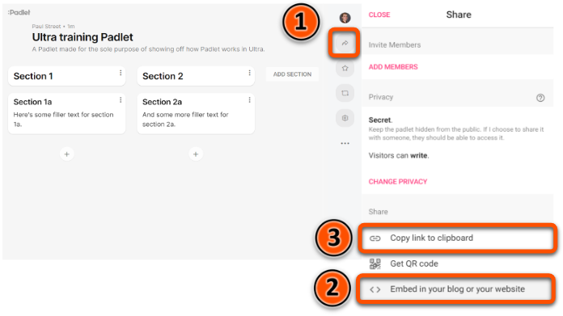

---
tags:
# Delete to leave only relevant tags
    - Advanced
    - Teaching
    - Ultra
    - Panopto
    - Xerte
    - Padlet
---

# Embedding Content

!!! Summary

    Content from external tools such as Padlet and Xerte can be embedded in your Ultra site using HTML. 

!!! principle "Relevant [VLE site design principles](../ultra/site-design-principles.md)"

    - 3.7 Essential: Direct, descriptive links are given to open embedded content (eg. video, Padlet or Xerte objects) in full screen.

## Quick Start Guide

### Video Steps

Below is an embedded video detailing how to embed content in an Ultra site. 

<!-- PASTE YOUTUBE EMBED (should look like this:) -->
<iframe width="560" height="315" src="https://www.youtube.com/embed/HI9D7IhNLi0" title="Embedding content in Ultra" frameborder="0" allow="accelerometer; autoplay; clipboard-write; encrypted-media; gyroscope; picture-in-picture; web-share" allowfullscreen></iframe>

Video: [Embedding content in Ultra](https://youtu.be/HI9D7IhNLi0)

### Text Steps

<!-- Clear and concise: Click **Submit**, not Click on the **Submit button** -->
<!-- Use **bold** to highight key tasks and features -->

#### Creating an HTML embed in your Ultra site

To create an HTML embed you will first need to copy the HTML embed code to your clipboard (see below for details of where to find these). 

!!! Warning

    The **Add HTML** function in Ultra should only be used for embedding content from external tools.

Once you have the embed code:

1. Navigate to the document in your Ultra site where you want the embedded content to appear.
2. Click the plus icon and then **Add HTML**.   
3. Paste the embed code into the HTML editor and then click **Save**.   
4. Click the plus icon above your embedded content and then **Add content**.
5. Create a descriptive link to your content.   
6. Click **Save**.

!!! Tip

    For instructions on creating links in Ultra, please refer to the [Links](https://vle-support.york.ac.uk/ultra/links/) guide.

#### Where to find HTML embed codes

##### Padlet

1. Open the Padlet in your browser and click the **Share** icon.
2. Click **Embed in your blog or your website**.
3. Click **Copy**.
4. To copy a link to your Padlet, return to the **Share** menu and click **Copy link to clipboard**.   

##### Xerte

1. Open Xerte in your browser and click the name of the Xerte object you want to embed.
2. In the **Project Details** box, copy the embed code from the **Embed Code** text box.
3. When creating the link to your Xerte item, copy the **URL** above the **Embed code** text box.   