---
tags:
# Delete to leave only relevant tags
    - Advanced
    - Teaching
    - Ultra
    - Panopto
    - Xerte
    - Padlet
---

# Embedding Content

!!! Summary

    Ultra allows video to be embedded from YouTube. Content from external sources such as Panopto/Replay, Padlet and Xerte can be added to your site using HTML. 

!!! principle "Relevant [VLE site design principles](https://vle-support.york.ac.uk/ultra/site-design-principles)"

    - 3.7 Essential: Direct, descriptive links are given to open embedded content (eg. video, Padlet or Xerte objects) in full screen.

## Quick Start Guide

### Video Steps

Below is an embedded video detailing how to embed content in an Ultra site. Alternatively, you can [open the video in a new browser tab](https://youtu.be/HxQHXfG41WU).

<!-- PASTE YOUTUBE EMBED (should look like this:) -->
<iframe width="560" height="315" src="https://www.youtube.com/embed/HxQHXfG41WU" title="YouTube video player" frameborder="0" allow="accelerometer; autoplay; clipboard-write; encrypted-media; gyroscope; picture-in-picture; web-share" allowfullscreen></iframe>

### Text Steps

<!-- Clear and concise: Click **Submit**, not Click on the **Submit button** -->
<!-- Use **bold** to highight key tasks and features -->

#### Padlet

To embed a Padlet on your Ultra site:

1. Open the Padlet in your web browser, click the **Share** icon in the right hand menu, then click **Embed in your blog or your website**.
2. Click **Copy**.
3. Navigate to the Document in your Ultra site where you want to embed the Padlet, click the plus icon, then click **Add HTML**.
4. Press Ctrl + V to paste the embed code into the HTML editor, then click **Save**.
5. Open the Padlet in your web browser, click the **Share** icon in the right hand menu, then click **Copy link to clipboard**.
6. Return to your Ultra Document, click the plus icon above your embedded Padlet, then click **Add content**.
7. Click the **Insert link** icon. 
8. Paste the URL in the **Link URL** box. Type descriptive link text into the **Link text** box, then click **Insert**.

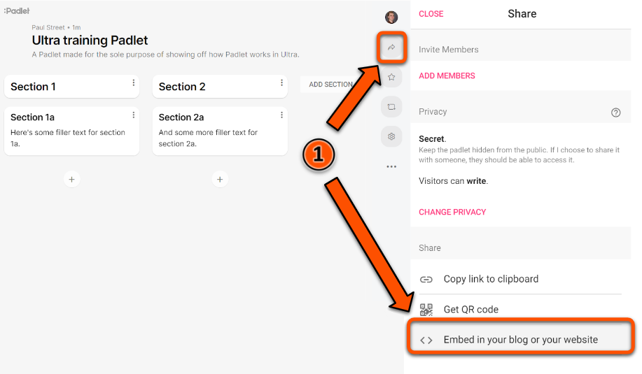
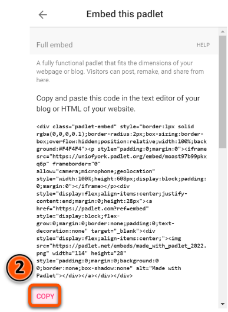

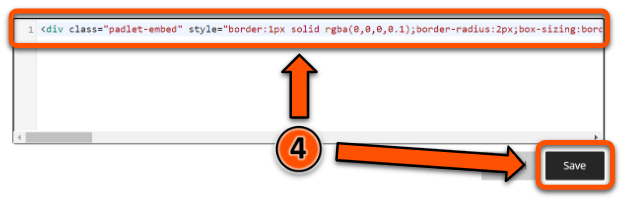
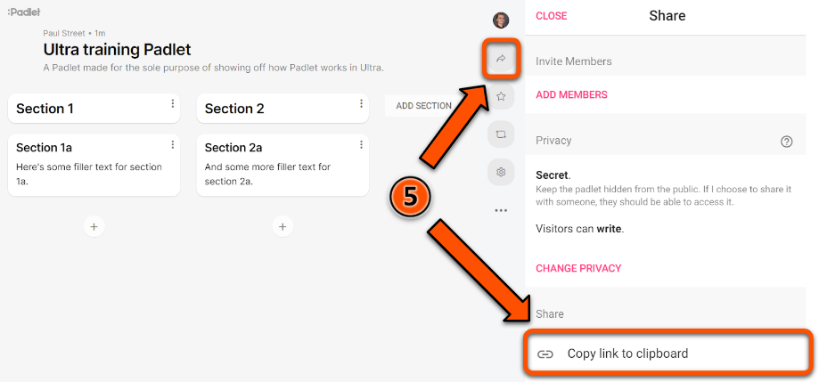

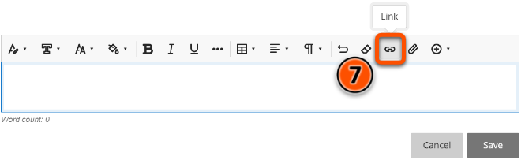
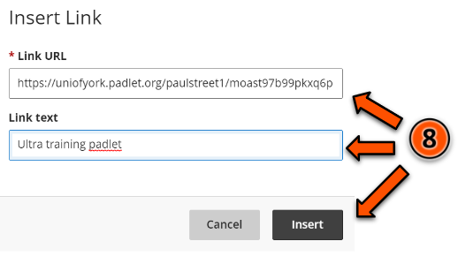

#### Xerte

To embed a Xerte object on your Ultra site:

1. Copy the embed code for your Xerte object from the **Project Details** section of the Xerte homepage.
2. Navigate to the Document in your Ultra site where you want to embed the Xerte object, then click the plus icon.
3. Click **Add HTML**.
4. Press Ctrl + V to paste the embed code into the HTML editor.
5. Click **Save**.
6. Return to the **Project Details** section of the Xerte homepage and copy the Xerte object's URL.
7. In your Ultra Document, click the plus icon above your embedded Xerte object, then click **Add content**.
8. Click the **Insert link** icon. 
9. Paste the URL in the **Link URL** box. Type descriptive link text into the **Link text** box, then click **Insert**.

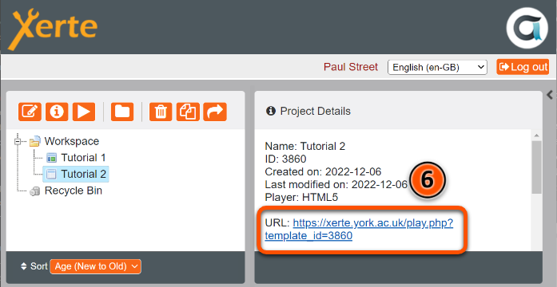
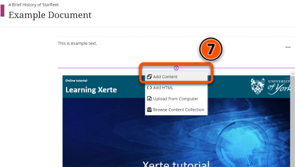
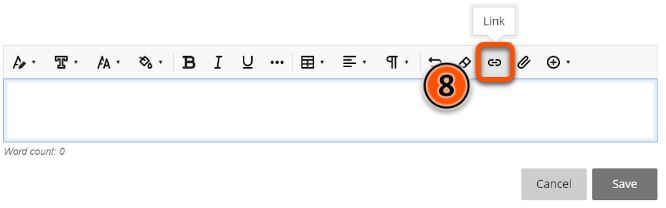
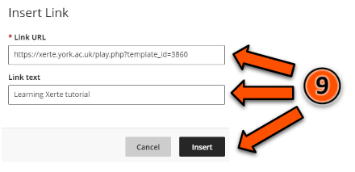

#### Panopto/Replay

To embed a Panopto/Replay video on your Ultra site:

1. Open the desired Panopto video in your web browser, then click the **Share** icon in the menu at the top of the screen.
2. Click **Embed**, then click **Copy Embed Code**.
3. Navigate to the Document in your Ultra site where you want to embed the Panopto video, then click the plus icon.
4. Click **Add HTML**.
5. Press Ctrl + V to paste the embed code into the HTML editor, then click **Save**.
6. Return to Panopto and click the **Share** icon in the menu at the top of the screen.
7. Click **Link** and then **Copy Link**.
8. In your Ultra Document, click the plus icon above your embedded Panopto video, then click **Add content**.
9. Click the **Insert link** icon. 
10. Paste the URL in the **Link URL** box. Type descriptive link text into the **Link text** box, then click **Insert**.

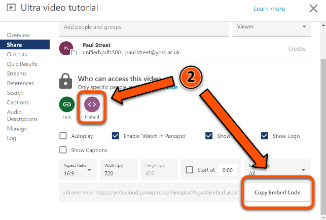
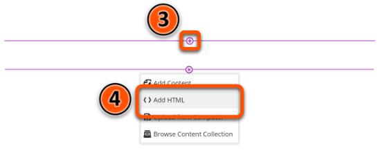
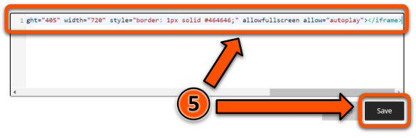
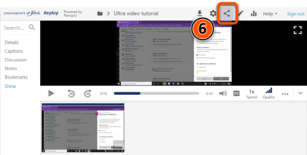
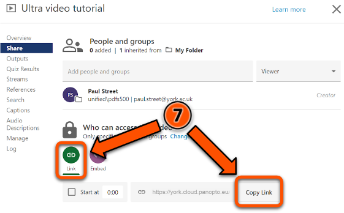
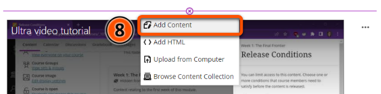
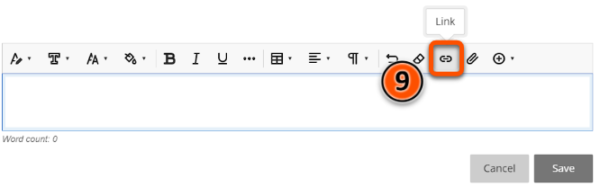
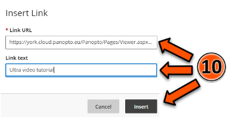

#### YouTube video

To add a YouTube video to your Ultra site:

1. Open a Document in your Ultra site, then click **Add Content**.
2. Click the plus icon (**Insert Content**) button in the text editor.
3. Click **YouTube video**.
4. Type your search terms into the box labelled **Search for a video**, then click **Search**.
5. Click **Select** next to the video you would like to embed.
6. Add **Alternative Text** that describes the video.
7. Click **Insert**.

!!! Tip

    If you already know the URL for the YouTube video you want to embed, you can paste this URL into the search box at step 4 below.

